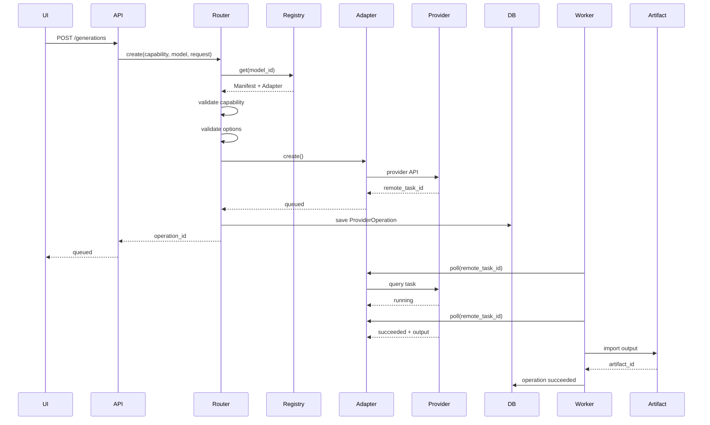

# DramaForge 模型能力插件化架构设计与开发规范

> 文档状态：Proposed  
> 适用阶段：P0 → P1  
> 适用模块：`backend/app/providers`、生成任务 API、Worker、Production Graph、模型设置 UI  
> 推荐文件：`docs/模型能力插件化架构设计与开发规范.md`

---

# 1. 文档目的

DramaForge 需要同时支持多种 AI 模型与执行环境，包括：

- LLM
- 文生图
- 图片编辑
- 文生视频
- 图生视频
- 首尾帧视频
- TTS
- 后续可能出现的音乐、音效、LipSync、Upscale 等能力
- 云端 Provider
- 聚合 Provider
- 本地 GPU Runtime

不同模型存在明显差异：

1. API Endpoint 不同。
2. 鉴权方式不同。
3. 请求参数不同。
4. 返回结构不同。
5. 有同步模型，也有异步模型。
6. 有些模型支持取消任务，有些不支持。
7. 不同模型支持的输入类型不同。
8. 不同模型具有厂商独占高级参数。
9. 同一个 Provider 可能提供多个模型。
10. 同一个模型能力可能通过不同 Provider 获得。

因此，DramaForge 不应让 Production Graph、Shot、Agent、前端页面直接依赖某一家模型 API。

本设计目标是建立：

**Capability Driven Model Plugin Architecture**

即：

> 业务层依赖“能力”，模型通过 Manifest 注册能力，Adapter 消化模型差异，Provider Client 处理通信，Router 完成模型选择和调度。

---

# 2. 核心目标

完成后应满足以下调用关系：

```text
Production Graph
      │
      │ 请求能力
      ▼
CapabilityRequest
      │
      ▼
CapabilityRouter
      │
      ▼
ModelRegistry
      │
 ┌────┼───────────────┐
 ▼    ▼               ▼
Seedance            Hailuo           Wan Local
 │                    │                │
 ▼                    ▼                ▼
ModelAdapter       ModelAdapter     ModelAdapter
 │                    │                │
 ▼                    ▼                ▼
VolcengineClient   MiniMaxClient   LocalRuntime
 │                    │                │
 ▼                    ▼                ▼
Cloud API           Cloud API        Local GPU
```

业务层只需要知道：

```text
video.image_to_video
```

而不需要知道：

```text
Seedance API 怎么调用
MiniMax API 怎么调用
Wan 怎么加载
某字段在某厂商里叫什么
某 API 是同步还是异步
```

---

# 3. 非目标

P0 阶段暂时不实现以下能力：

- 自动在线下载第三方 Python 插件
- 插件市场
- 动态加载任意不可信代码
- 基于 AI 的自动模型决策
- 复杂价格优化算法
- 自动跨 Provider 套利
- Kubernetes GPU 调度
- 多机 GPU Scheduler
- 自动探测所有厂商 API 参数
- 完整插件版本依赖解决器

P0 的“插件化”定义为：

> 新增一个模型时，不修改 Production Graph 核心逻辑，不在业务代码增加厂商判断，只需要增加 ModelManifest + Adapter，并完成 Plugin 注册。

---

# 4. 设计原则

## 4.1 Capability 是业务稳定接口

业务层禁止依赖：

```python
seedance_generate()
minimax_generate()
kling_generate()
```

必须依赖：

```python
router.create(
    capability=Capability.VIDEO_IMAGE_TO_VIDEO,
    ...
)
```

---

## 4.2 Provider、Model、Capability 必须分离

三个概念分别表示：

### Provider

谁提供计算/API。

例如：

```text
volcengine
minimax
openai
agnes
local
```

### Model

具体使用什么模型。

例如：

```text
volcengine/seedance-x
minimax/hailuo-x
local/wan-x
```

### Capability

业务需要完成什么任务。

例如：

```text
video.text_to_video
video.image_to_video
image.generate
image.edit
audio.tts
```

三者不得混为一个字段。

---

# 5. 总体分层

建议采用六层：

```text
┌───────────────────────────────┐
│  1. Production / Agent Layer  │
│  Shot / Graph / Agent         │
└───────────────┬───────────────┘
                │
                ▼
┌───────────────────────────────┐
│  2. Capability Contract       │
│  ImageToVideoRequest          │
│  TextToVideoRequest           │
│  ImageGenerateRequest         │
└───────────────┬───────────────┘
                │
                ▼
┌───────────────────────────────┐
│  3. Capability Router         │
│  model selection / policy     │
└───────────────┬───────────────┘
                │
                ▼
┌───────────────────────────────┐
│  4. Model Registry            │
│  ModelManifest + Adapter      │
└───────────────┬───────────────┘
                │
                ▼
┌───────────────────────────────┐
│  5. Model Adapter             │
│  参数映射 / 响应标准化          │
└───────────────┬───────────────┘
                │
                ▼
┌───────────────────────────────┐
│  6. Provider Client / Runtime │
│  HTTP / Auth / Retry / GPU    │
└───────────────────────────────┘
```

---

# 6. Capability 定义

创建：

```text
backend/app/providers/capabilities.py
```

第一版：

```python
from enum import StrEnum


class Capability(StrEnum):
    TEXT_GENERATE = "text.generate"

    IMAGE_GENERATE = "image.generate"
    IMAGE_EDIT = "image.edit"

    VIDEO_TEXT_TO_VIDEO = "video.text_to_video"
    VIDEO_IMAGE_TO_VIDEO = "video.image_to_video"
    VIDEO_FIRST_LAST_FRAME = "video.first_last_frame"

    AUDIO_TTS = "audio.tts"
```

不要一开始只设计：

```text
video.generate
```

因为：

```text
文生视频
图生视频
首尾帧视频
```

虽然最终产物都是 Video，但输入 Contract 不一样。

能力枚举应该表达：

> 业务语义。

而不是：

> 某厂商 Endpoint 名称。

---

# 7. Capability Contract

目录：

```text
providers/
└── contracts/
    ├── __init__.py
    ├── common.py
    ├── image.py
    ├── video.py
    ├── audio.py
    └── text.py
```

---

# 8. ArtifactRef

模型输入禁止直接在业务 Contract 中大量传播：

```text
C:\xxx\image.png
https://provider.xxx/temp/xxx
/minio/xxx
```

统一定义：

```python
from pydantic import BaseModel


class ArtifactRef(BaseModel):
    artifact_id: str
```

业务层：

```python
ArtifactRef(
    artifact_id="01JXXX..."
)
```

Adapter/Artifact Service 再负责解析为：

```text
signed URL
base64
multipart
本地文件
对象存储 URI
```

这样模型能力层不会和存储实现绑定。

---

# 9. 通用 Generation Options

创建：

```python
class CommonGenerationOptions(BaseModel):
    seed: int | None = None

    aspect_ratio: str | None = None
    resolution: str | None = None

    duration_seconds: float | None = None

    negative_prompt: str | None = None
```

注意：

并不是所有 Capability 都应该使用所有字段。

具体 Request 根据自己的能力挑选适用字段。

不要创建一个包含 100 个 optional 字段的：

```python
UniversalGenerateRequest
```

否则最终仍然会退化成弱类型 API。

---

# 10. 视频请求 Contract

## 10.1 TextToVideoRequest

```python
class TextToVideoRequest(BaseModel):
    prompt: str

    duration_seconds: float | None = None
    resolution: str | None = None
    aspect_ratio: str | None = None
    seed: int | None = None

    native_options: dict[str, Any] = Field(
        default_factory=dict
    )
```

---

## 10.2 ImageToVideoRequest

```python
class ImageToVideoRequest(BaseModel):
    prompt: str

    image: ArtifactRef

    duration_seconds: float | None = None
    resolution: str | None = None
    aspect_ratio: str | None = None
    seed: int | None = None

    native_options: dict[str, Any] = Field(
        default_factory=dict
    )
```

---

## 10.3 FirstLastFrameVideoRequest

```python
class FirstLastFrameVideoRequest(BaseModel):
    prompt: str

    first_frame: ArtifactRef
    last_frame: ArtifactRef

    duration_seconds: float | None = None
    resolution: str | None = None

    native_options: dict[str, Any] = Field(
        default_factory=dict
    )
```

---

# 11. 为什么需要 native_options

这是整个抽象能够长期扩展的关键。

模型参数分成两类：

```text
             Model Parameters
                    │
           ┌────────┴────────┐
           ▼                 ▼
    Common Options      Native Options
     DramaForge标准       模型原生能力
```

例如通用请求：

```json
{
  "duration_seconds": 5,
  "resolution": "1080p",
  "aspect_ratio": "16:9"
}
```

某模型还有自己的特殊参数：

```json
{
  "native_options": {
    "example_camera_control": true
  }
}
```

另一个模型：

```json
{
  "native_options": {
    "example_prompt_optimizer": true
  }
}
```

以上字段仅用于说明架构，不代表任何具体厂商当前真实 API 参数。

目标是：

```text
大部分常用参数
→ DramaForge Common Contract

厂商独占高级参数
→ native_options
```

这样可以同时避免两个极端：

### 极端 A

所有参数都塞进：

```python
dict[str, Any]
```

结果没有统一协议。

### 极端 B

为了统一，只保留：

```python
prompt
```

结果模型高级能力全部丢失。

---

# 12. native_options 不能裸透传

禁止：

```python
payload.update(request.native_options)
```

直接无验证发给 Provider。

必须经过：

```text
native_options
       ↓
ModelManifest Schema
       ↓
validation
       ↓
Adapter
       ↓
Provider Payload
```

未知参数应该直接拒绝。

例如：

```text
422 MODEL_OPTION_UNSUPPORTED
```

而不是静默忽略。

静默忽略会导致用户认为某项能力已经生效，但实际没有生效。

---

# 13. ModelManifest

创建：

```text
backend/app/providers/manifest.py
```

Manifest 描述：

> 这个模型是谁、能做什么、支持什么参数。

建议：

```python
from pydantic import BaseModel, Field


class ParameterSpec(BaseModel):
    type: str

    title: str | None = None
    description: str | None = None

    required: bool = False

    default: Any | None = None

    enum: list[Any] | None = None

    minimum: float | None = None
    maximum: float | None = None

    ui_component: str | None = None


class ModelManifest(BaseModel):
    id: str

    provider_id: str
    model_name: str

    display_name: str

    capabilities: set[Capability]

    execution_mode: Literal["sync", "async"]

    supports_cancel: bool = False

    common_options: dict[str, ParameterSpec] = Field(
        default_factory=dict
    )

    native_options: dict[str, ParameterSpec] = Field(
        default_factory=dict
    )

    metadata: dict[str, Any] = Field(
        default_factory=dict
    )
```

---

# 14. Model ID 规范

统一：

```text
<provider_id>/<model_name>
```

例如：

```text
volcengine/seedance-example
minimax/hailuo-example
agnes/video-example
local/wan-example
```

禁止只存：

```text
seedance
kling
wan
```

因为模型名称未来可能冲突。

---

# 15. ModelManifest 示例

以下只作为架构示例：

```python
VIDEO_MODEL_A = ModelManifest(
    id="provider-a/video-model-a",

    provider_id="provider-a",
    model_name="video-model-a",

    display_name="Video Model A",

    capabilities={
        Capability.VIDEO_TEXT_TO_VIDEO,
        Capability.VIDEO_IMAGE_TO_VIDEO,
    },

    execution_mode="async",

    supports_cancel=True,

    common_options={
        "duration_seconds": ParameterSpec(
            type="number",
            title="时长",
            enum=[5, 10],
        ),
        "resolution": ParameterSpec(
            type="string",
            title="分辨率",
            enum=["720p", "1080p"],
        ),
    },

    native_options={
        "special_feature": ParameterSpec(
            type="boolean",
            title="模型高级功能",
            default=False,
        )
    },
)
```

Manifest 不负责：

- HTTP 请求
- API Key
- 上传文件
- 创建任务
- Poll

Manifest 只负责描述能力。

---

# 16. Provider Client

Provider Client 表示：

> 如何与一个服务商通信。

例如：

```text
VolcengineClient
MiniMaxClient
OpenAIClient
AgnesClient
```

职责：

```text
Authentication
Base URL
HTTP
Headers
Timeout
Retry
Rate Limit
错误响应解析
Provider 原始 API 调用
```

不负责：

```text
Production Graph
Shot
业务模型选择
UI
Agent
```

---

# 17. ProviderClient 示例

```python
class ExampleProviderClient:

    def __init__(
        self,
        *,
        api_key: str,
        base_url: str,
    ):
        self.api_key = api_key
        self.base_url = base_url

    async def create_video(
        self,
        payload: dict[str, Any],
    ) -> dict[str, Any]:
        ...

    async def get_video_task(
        self,
        task_id: str,
    ) -> dict[str, Any]:
        ...

    async def cancel_video_task(
        self,
        task_id: str,
    ) -> dict[str, Any]:
        ...
```

---

# 18. ModelAdapter

ProviderClient 解决：

> 怎么通信。

ModelAdapter 解决：

> DramaForge 的统一 Request 如何变成这个模型认识的请求。

创建：

```text
backend/app/providers/base.py
```

逐步将旧：

```python
ProviderAdapter
```

升级为：

```python
class ModelAdapter(Protocol):

    provider_id: str
    model_id: str

    @property
    def manifest(self) -> ModelManifest:
        ...

    async def create(
        self,
        capability: Capability,
        request: CapabilityRequest,
        context: ExecutionContext,
    ) -> ProviderCreateResult:
        ...

    async def poll(
        self,
        remote_task_id: str,
        context: ExecutionContext,
    ) -> ProviderPollResult:
        ...

    async def cancel(
        self,
        remote_task_id: str,
        context: ExecutionContext,
    ) -> ProviderCancelResult:
        ...

    async def fetch_cost(
        self,
        remote_task_id: str,
        context: ExecutionContext,
    ) -> ProviderCostResult:
        ...
```

---

# 19. ExecutionContext

不要把用户、项目、Credential 等信息不停加入函数参数。

建立：

```python
class ExecutionContext(BaseModel):
    project_id: str | None = None
    user_id: str | None = None

    credential_id: str | None = None

    trace_id: str
    operation_id: str | None = None
```

后续可以扩展：

```text
workspace_id
tenant_id
request_id
generation_policy
```

---

# 20. 标准返回结构

逐步淘汰：

```python
dict[str, Any]
```

建立明确类型。

## Create

```python
class ProviderCreateResult(BaseModel):
    status: GenerationStatus

    remote_task_id: str | None = None

    artifact_uri: str | None = None

    provider_metadata: dict[str, Any] = Field(
        default_factory=dict
    )
```

---

## Poll

```python
class ProviderPollResult(BaseModel):
    status: GenerationStatus

    progress: float | None = None

    artifact_uri: str | None = None

    error_code: str | None = None
    error_message: str | None = None

    provider_metadata: dict[str, Any] = Field(
        default_factory=dict
    )
```

---

# 21. GenerationStatus

```python
class GenerationStatus(StrEnum):
    QUEUED = "queued"
    RUNNING = "running"

    SUCCEEDED = "succeeded"
    FAILED = "failed"

    CANCELLED = "cancelled"
```

所有 Provider 返回状态必须 Adapter 内标准化。

例如 Provider 返回：

```text
pending
processing
done
complete
success
error
```

Adapter 必须映射成 DramaForge 状态。

业务层禁止处理厂商状态。

---

# 22. Model Adapter 参数转换

例如业务层：

```python
ImageToVideoRequest(
    prompt="人物慢慢转头",
    image=ArtifactRef(
        artifact_id="artifact-123"
    ),
    duration_seconds=5,
    resolution="1080p",
)
```

模型 A Adapter：

```python
class VideoModelAAdapter:

    async def create(
        self,
        capability,
        request,
        context,
    ):
        image_url = await self.artifact_resolver.resolve_url(
            request.image
        )

        payload = {
            "prompt": request.prompt,
            "image": image_url,
            "duration": request.duration_seconds,
            "resolution": request.resolution,
        }

        native = self.validate_native_options(
            request.native_options
        )

        payload.update(
            self.map_native_options(native)
        )

        raw = await self.client.create_video(payload)

        return self.normalize_create_result(raw)
```

模型 B 即使要求：

```text
first_frame_image
length
quality
```

也只需要在自己的 Adapter 内转换。

业务层仍然是：

```text
image
duration_seconds
resolution
```

---

# 23. Adapter 边界

Adapter 可以包含：

```text
模型参数映射
Capability → Endpoint 选择
Artifact → Provider Input
Native Options 转换
Provider Status 标准化
Provider Error 标准化
Provider Result 标准化
```

Adapter 禁止包含：

```text
Shot 业务逻辑
剧情逻辑
Production Graph 状态机
UI 判断
用户权限
Agent Prompt
数据库事务编排
```

---

# 24. ModelRegistry

创建：

```text
backend/app/providers/registry.py
```

结构：

```python
@dataclass
class RegisteredModel:
    manifest: ModelManifest
    adapter: ModelAdapter


class ModelRegistry:

    def __init__(self):
        self._models: dict[str, RegisteredModel] = {}

    def register(
        self,
        manifest: ModelManifest,
        adapter: ModelAdapter,
    ) -> None:

        if manifest.id in self._models:
            raise DuplicateModelError(manifest.id)

        self._models[manifest.id] = RegisteredModel(
            manifest=manifest,
            adapter=adapter,
        )

    def get(
        self,
        model_id: str,
    ) -> RegisteredModel:
        ...

    def list_models(self):
        ...

    def find_by_capability(
        self,
        capability: Capability,
    ):
        return [
            item
            for item in self._models.values()
            if capability in item.manifest.capabilities
        ]
```

Registry 不调用模型。

Registry 只负责：

```text
注册
查询
索引
能力过滤
```

---

# 25. ProviderPlugin

定义：

```python
class ProviderPlugin(Protocol):

    provider_id: str

    def register(
        self,
        registry: ModelRegistry,
    ) -> None:
        ...
```

---

# 26. 插件注册示例

```python
class ExampleProviderPlugin:

    provider_id = "provider-a"

    def __init__(
        self,
        settings: Settings,
    ):
        self.settings = settings

    def register(
        self,
        registry: ModelRegistry,
    ) -> None:

        client = ExampleProviderClient(
            api_key=self.settings.api_key,
            base_url=self.settings.base_url,
        )

        registry.register(
            manifest=VIDEO_MODEL_A,
            adapter=VideoModelAAdapter(
                client=client
            ),
        )
```

应用启动：

```python
registry = ModelRegistry()

plugins = [
    AgnesPlugin(settings),
    VolcenginePlugin(settings),
    MiniMaxPlugin(settings),
    LocalPlugin(settings),
]

for plugin in plugins:
    plugin.register(registry)
```

---

# 27. Plugin 的真正含义

这里的插件不是简单：

```text
providers/seedance.py
providers/minimax.py
```

真正插件化必须满足：

```text
Provider Plugin
       │
       ├── 注册 Model
       ├── 注册 Manifest
       └── 提供 Adapter
```

核心系统不应该出现：

```python
from providers.seedance import ...
from providers.minimax import ...
```

散落在几十个业务文件中。

这些 import 应集中在：

```text
providers/bootstrap.py
```

或插件 discovery 层。

---

# 28. CapabilityRouter

创建：

```text
backend/app/providers/router.py
```

这是生成能力统一入口。

```python
class CapabilityRouter:

    def __init__(
        self,
        registry: ModelRegistry,
        selector: ModelSelector,
    ):
        self.registry = registry
        self.selector = selector

    async def create(
        self,
        *,
        capability: Capability,
        request: CapabilityRequest,
        context: ExecutionContext,
        model_id: str | None = None,
        policy: GenerationPolicy | None = None,
    ) -> ProviderCreateResult:

        model = self.resolve_model(
            capability=capability,
            model_id=model_id,
            policy=policy,
        )

        self.ensure_capability(
            model,
            capability,
        )

        self.validate_request(
            model,
            capability,
            request,
        )

        return await model.adapter.create(
            capability,
            request,
            context,
        )
```

---

# 29. Router 职责

Router 只负责：

```text
确定 Capability
寻找 Model
验证 Model 是否支持 Capability
应用选择策略
调用 Adapter
处理 fallback
```

绝对禁止：

```python
if provider == "seedance":
    ...

elif provider == "minimax":
    ...

elif provider == "kling":
    ...
```

这种代码应该全部存在于具体 Adapter 中。

否则 Router 最终必然退化成巨型 `if/else`。

---

# 30. ModelSelector

Router 和模型选择策略继续分离。

创建：

```text
providers/selector.py
```

P0：

```python
class DefaultModelSelector:

    def select(
        self,
        *,
        capability: Capability,
        models: list[RegisteredModel],
        requested_model: str | None,
        policy: GenerationPolicy | None,
    ) -> RegisteredModel:

        if requested_model:
            return self._get_requested_model(
                requested_model,
                models,
            )

        return self._get_default_model(
            capability,
            models,
        )
```

---

# 31. P0 Default Model

配置：

```python
DEFAULT_MODELS = {
    Capability.IMAGE_GENERATE:
        "provider-a/image-model-a",

    Capability.VIDEO_IMAGE_TO_VIDEO:
        "provider-a/video-model-a",

    Capability.AUDIO_TTS:
        "azure/tts-model",
}
```

P0 不需要做智能路由。

---

# 32. P1 GenerationPolicy

后续扩展：

```python
class GenerationPolicy(BaseModel):
    prefer: Literal[
        "quality",
        "speed",
        "cost",
        "local",
    ] | None = None

    max_cost: Decimal | None = None

    allow_cloud: bool = True
    allow_local: bool = True

    fallback_enabled: bool = True
```

以后：

```text
用户没有指定模型
        ↓
ModelSelector
        ↓
Capability candidates
        ↓
Policy filter
        ↓
模型排序
        ↓
选择执行模型
```

---

# 33. Fallback

P0 建议只做有限 Fallback。

例如：

```text
preferred:
provider-a/video-model-a

fallback:
provider-b/video-model-b
```

只有以下错误允许自动 fallback：

```text
Provider unavailable
Rate limited
Temporary timeout
Model temporarily disabled
```

以下情况禁止 fallback：

```text
INVALID_REQUEST
UNSUPPORTED_OPTION
CONTENT_POLICY
USER_CANCELLED
INSUFFICIENT_CREDIT
```

否则可能出现：

> 用户明确选择 A 模型，失败后系统偷偷使用 B 模型生成。

必须保证可追踪。

---

# 34. 错误模型

创建：

```text
providers/errors.py
```

```python
class ProviderErrorCode(StrEnum):

    INVALID_REQUEST = "invalid_request"

    AUTH_FAILED = "auth_failed"

    RATE_LIMITED = "rate_limited"

    PROVIDER_UNAVAILABLE = "provider_unavailable"

    MODEL_UNAVAILABLE = "model_unavailable"

    UNSUPPORTED_CAPABILITY = "unsupported_capability"

    UNSUPPORTED_OPTION = "unsupported_option"

    CONTENT_POLICY = "content_policy"

    TIMEOUT = "timeout"

    UNKNOWN = "unknown"
```

Adapter 把厂商错误转换成统一错误。

---

# 35. ProviderOperation 继续作为审计事实

现有 Operation 思路不需要推翻。

每次真实模型调用至少记录：

```text
requested_capability

requested_model

actual_provider

actual_model

status

remote_task_id

request_fingerprint

request_summary

cost

started_at

finished_at

error_code

error_message
```

如果发生 fallback：

```text
requested_model = A

actual_model = B

fallback_reason = provider_unavailable
```

必须保存。

---

# 36. 请求指纹

不要将敏感 Prompt/API Key 全量记录到日志。

建议：

```python
fingerprint = sha256(
    canonical_request_json.encode()
).hexdigest()
```

数据库保留：

```text
request_fingerprint
request_summary
```

敏感内容根据已有审计规范处理。

绝对禁止：

```text
API Key
完整 Credential
Authorization Header
```

进入普通日志。

---

# 37. Provider 与 Credential 分离

不要：

```python
VolcengineAdapter(
    api_key="..."
)
```

由业务层创建。

应该：

```text
ExecutionContext
       │
 credential_id
       ↓
CredentialResolver
       ↓
ProviderClient
```

这样未来支持：

```text
系统默认 Key
BYOK
Workspace Key
User Key
```

不会污染 Production Graph。

---

# 38. API 设计

推荐新增统一生成 API。

## 查询 Capability

```http
GET /api/v1/capabilities
```

返回：

```json
{
  "items": [
    {
      "id": "video.image_to_video",
      "display_name": "图生视频"
    }
  ]
}
```

---

# 39. 查询支持某能力的模型

```http
GET /api/v1/models?capability=video.image_to_video
```

返回：

```json
{
  "items": [
    {
      "id": "provider-a/video-model-a",
      "provider_id": "provider-a",
      "display_name": "Video Model A",
      "capabilities": [
        "video.text_to_video",
        "video.image_to_video"
      ]
    }
  ]
}
```

---

# 40. 查询 ModelManifest

```http
GET /api/v1/models/{model_id}
```

返回：

```json
{
  "id": "provider-a/video-model-a",

  "provider_id": "provider-a",

  "display_name": "Video Model A",

  "capabilities": [
    "video.image_to_video"
  ],

  "common_options": {
    "resolution": {
      "type": "string",
      "enum": [
        "720p",
        "1080p"
      ]
    }
  },

  "native_options": {
    "special_feature": {
      "type": "boolean",
      "default": false
    }
  }
}
```

---

# 41. 创建 Generation

```http
POST /api/v1/generations
```

请求：

```json
{
  "capability": "video.image_to_video",

  "model_id": "provider-a/video-model-a",

  "input": {
    "prompt": "人物缓慢转过头",
    "image": {
      "artifact_id": "artifact-123"
    }
  },

  "options": {
    "duration_seconds": 5,
    "resolution": "1080p"
  },

  "native_options": {
    "special_feature": true
  }
}
```

---

# 42. Generation 返回

```json
{
  "operation_id": "op-123",

  "status": "queued",

  "requested_capability":
    "video.image_to_video",

  "requested_model":
    "provider-a/video-model-a",

  "actual_provider":
    "provider-a",

  "actual_model":
    "video-model-a"
}
```

这里不建议直接把 Provider 原始 response 返回前端。

---

# 43. 查询任务

```http
GET /api/v1/generations/{operation_id}
```

返回：

```json
{
  "operation_id": "op-123",

  "status": "running",

  "progress": 0.42
}
```

成功：

```json
{
  "operation_id": "op-123",

  "status": "succeeded",

  "progress": 1,

  "artifact": {
    "artifact_id": "artifact-video-456"
  }
}
```

---

# 44. 取消任务

```http
POST /api/v1/generations/{operation_id}/cancel
```

统一由：

```text
Operation
   ↓
Registry
   ↓
Adapter.cancel()
```

决定具体实现。

如果模型不支持 cancel：

```text
409 CANCEL_NOT_SUPPORTED
```

而不是伪造：

```text
cancelled
```

---

# 45. Worker 调用

异步模型执行链：

```text
POST /generations
        ↓
CapabilityRouter.create
        ↓
ModelAdapter.create
        ↓
remote_task_id
        ↓
ProviderOperation
        ↓
ARQ Worker
        ↓
ModelAdapter.poll
        ↓
running
        ↓
再次 poll
        ↓
succeeded
        ↓
Artifact Import
        ↓
MinIO
        ↓
Artifact
        ↓
NodeRun/Shot 更新
```

---

# 46. 同步模型处理

例如模型调用一次立即得到结果：

```python
ProviderCreateResult(
    status=GenerationStatus.SUCCEEDED,
    artifact_uri="..."
)
```

上层无需区别同步/异步。

Router/Worker 根据：

```text
status == succeeded
```

直接进入 Artifact Import。

---

# 47. 前端模型选择

禁止硬编码：

```typescript
if (model === "seedance") {
    showXxx();
}

if (model === "minimax") {
    showYyy();
}
```

前端流程应该是：

```text
用户进入图生视频
        ↓
GET /models
?capability=video.image_to_video
        ↓
显示支持模型
        ↓
用户选择模型
        ↓
获取 ModelManifest
        ↓
根据 Schema 构造参数 UI
```

---

# 48. 前端参数结构

页面：

```text
模型
────────────────────
[ Video Model A ▼ ]

基础参数
────────────────────
时长
[ 5 秒 ▼ ]

分辨率
[ 1080p ▼ ]

画幅
[ 16:9 ▼ ]

高级参数
────────────────────
模型高级能力
[ ✓ ]
```

切换另一个 Model 后：

```text
高级参数
```

自动根据 Manifest 改变。

---

# 49. 不建议前端完全无脑渲染 JSON Schema

P0 可以支持有限控件：

```text
boolean
→ Switch

enum string
→ Select

number
→ NumberInput / Slider

string
→ Input

text
→ Textarea
```

因此 `ParameterSpec` 可以包含：

```python
ui_component: Literal[
    "switch",
    "select",
    "number",
    "slider",
    "input",
    "textarea",
] | None
```

Manifest 可以辅助前端渲染，但最终视觉组件由 DramaForge 控制。

---

# 50. 本地模型

本地模型不应该设计成第二套系统。

例如：

```text
provider_id:
local

model_id:
local/wan-example

capability:
video.image_to_video
```

结构：

```text
Production
     ↓
CapabilityRouter
     ↓
ModelRegistry
     ↓
LocalModelAdapter
     ↓
LocalRuntime
     ↓
GPU
```

对于上层来说：

```text
云端 Seedance 类模型
云端 MiniMax 类模型
本地 Wan 类模型
```

全部都是 Model。

ComfyUI 即使保留，也只应作为一种可选 Runtime/Adapter，而不是 DramaForge 模型架构的核心依赖。

---

# 51. LocalRuntime

建议建立：

```text
providers/local/
    runtime.py
```

接口：

```python
class LocalRuntime(Protocol):

    async def submit(
        self,
        *,
        model_id: str,
        inputs: dict[str, Any],
    ) -> LocalTask:
        ...

    async def poll(
        self,
        task_id: str,
    ) -> LocalTaskStatus:
        ...

    async def cancel(
        self,
        task_id: str,
    ) -> None:
        ...
```

未来底层可以接：

```text
Diffusers
Transformers
自定义 inference server
ComfyUI
独立 GPU Worker
```

但上层接口不变。

---

# 52. 推荐目录结构

最终：

```text
backend/app/providers/

├── __init__.py
│
├── capabilities.py
├── base.py
├── manifest.py
├── registry.py
├── router.py
├── selector.py
├── errors.py
├── bootstrap.py
│
├── contracts/
│   ├── __init__.py
│   ├── common.py
│   ├── text.py
│   ├── image.py
│   ├── video.py
│   └── audio.py
│
├── agnes/
│   ├── __init__.py
│   ├── client.py
│   ├── plugin.py
│   ├── image.py
│   └── video.py
│
├── volcengine/
│   ├── __init__.py
│   ├── client.py
│   ├── plugin.py
│   ├── seedance.py
│   └── seedream.py
│
├── minimax/
│   ├── __init__.py
│   ├── client.py
│   ├── plugin.py
│   └── hailuo.py
│
├── openai/
│   ├── __init__.py
│   ├── client.py
│   ├── plugin.py
│   └── models.py
│
└── local/
    ├── __init__.py
    ├── plugin.py
    ├── runtime.py
    ├── wan.py
    └── flux.py
```

---

# 53. bootstrap.py

所有 Provider 的装配集中处理：

```python
def build_model_registry(
    settings: Settings,
) -> ModelRegistry:

    registry = ModelRegistry()

    plugins: list[ProviderPlugin] = []

    if settings.agnes_enabled:
        plugins.append(
            AgnesPlugin(settings)
        )

    if settings.volcengine_enabled:
        plugins.append(
            VolcenginePlugin(settings)
        )

    if settings.minimax_enabled:
        plugins.append(
            MiniMaxPlugin(settings)
        )

    if settings.local_models_enabled:
        plugins.append(
            LocalPlugin(settings)
        )

    for plugin in plugins:
        plugin.register(registry)

    return registry
```

注意：

这里允许：

```python
if provider_enabled
```

因为这是基础设施装配。

但 Production Graph 中禁止出现厂商 `if`。

---

# 54. 推荐依赖方向

必须保持：

```text
production
      ↓
capability contracts
      ↓
router
      ↓
registry
      ↓
adapter
      ↓
provider client
```

禁止反向：

```text
provider
      ↓
production
```

Provider Adapter 绝不能 import：

```text
ShotService
ProductionGraph
StoryService
AgentRuntime
```

---

# 55. 推荐模块依赖规则

```text
contracts
  不依赖其他 provider 模块

manifest
  → capabilities

base
  → capabilities
  → contracts
  → manifest

registry
  → base
  → manifest

selector
  → registry

router
  → registry
  → selector
  → contracts

provider/*
  → base
  → manifest
  → contracts
```

---

# 56. 完整调用时序



---

# 57. 参数校验流程

```text
HTTP Request
      ↓
Capability Contract Validation
      ↓
ModelManifest
      ↓
Capability Supported?
      ↓
Common Option Supported?
      ↓
Native Option Supported?
      ↓
Adapter Mapping
      ↓
Provider Request
```

任何阶段失败都必须在调用 Provider 前返回错误。

---

# 58. Common Option 支持规则

存在一个容易踩坑的问题：

DramaForge 定义：

```text
seed
```

不意味着每个模型都支持 seed。

因此：

```text
Capability Contract
```

表示：

> 这个能力可能拥有该概念。

而：

```text
ModelManifest.common_options
```

表示：

> 当前模型真正支持哪些通用参数。

例如 Request：

```json
{
  "seed": 123
}
```

但 Manifest 不支持 seed：

应该：

```text
422 OPTION_NOT_SUPPORTED_BY_MODEL
```

不能：

```text
偷偷删除 seed
```

---

# 59. Capability Compatibility

例如用户发送：

```text
capability:
video.first_last_frame

model:
某个只支持 image_to_video 的模型
```

Router 必须直接拒绝：

```text
MODEL_CAPABILITY_MISMATCH
```

不能让 Adapter 自己猜。

---

# 60. Model Availability

Manifest 描述：

```text
静态能力
```

还需要运行时状态：

```python
class ModelAvailability(BaseModel):
    model_id: str

    enabled: bool
    configured: bool
    healthy: bool | None = None

    reason: str | None = None
```

这样可以区分：

```text
支持这个模型
但用户没配 API Key
```

和：

```text
系统根本没有这个模型
```

---

# 61. GET /models 返回可用状态

例如：

```json
{
  "id": "provider-a/video-model-a",

  "enabled": true,

  "configured": false,

  "available": false,

  "reason": "credential_missing"
}
```

前端就可以显示：

```text
Video Model A
需要配置 API Key
```

而不是直接隐藏模型。

---

# 62. Model Capability Snapshot

生成任务开始时建议保存当时的：

```text
model_id
provider_id
capability
manifest_version
```

原因是：

以后模型 Manifest 会更新。

旧项目重新打开时，需要知道：

> 当时生成这个镜头使用的是哪一版能力定义。

---

# 63. Manifest Version

建议：

```python
class ModelManifest(BaseModel):
    schema_version: str = "1"
    manifest_version: str
```

例如：

```text
schema_version:
1

manifest_version:
2026-08-11
```

以后 Schema 自己升级：

```text
schema_version 2
```

与某模型配置修改：

```text
manifest_version
```

分开。

---

# 64. Provider Plugin Version

P1 可以增加：

```python
plugin_version: str
```

用于审计：

```text
模型生成结果
是通过哪个 Adapter 版本产生的
```

对可复现性有帮助。

---

# 65. Observability

每一次调用建立：

```text
trace_id
operation_id
provider_id
model_id
capability
duration_ms
provider_latency_ms
status
retry_count
cost
```

日志：

```text
generation.create.started
generation.provider.submitted
generation.poll.running
generation.artifact.imported
generation.completed
generation.failed
```

不要把日志散成：

```text
calling model...
success...
```

使用结构化日志。

---

# 66. Metrics

后续可建立：

```text
generation_requests_total

generation_success_total

generation_failure_total

generation_latency_seconds

provider_latency_seconds

provider_rate_limit_total

generation_cost_total
```

Labels：

```text
provider
model
capability
status
```

注意避免用户 ID 等高基数字段直接进入 metrics label。

---

# 67. 测试体系

模型插件必须至少通过四层测试：

```text
Contract Test
Adapter Unit Test
Provider Mock Test
Router Integration Test
```

---

# 68. Contract Test

测试：

```text
缺 prompt
→ reject

缺 image
→ reject

duration 类型错误
→ reject

未知 native option
→ reject
```

---

# 69. Adapter Unit Test

给：

```python
ImageToVideoRequest(...)
```

断言 Adapter 构造出的 Provider Payload 正确。

不要真正请求外部 API。

例如：

```python
def test_image_to_video_payload():

    payload = adapter.build_payload(request)

    assert payload["prompt"] == "..."
```

---

# 70. Provider Mock Test

使用 HTTP Mock：

```text
POST create
→ queued

GET task
→ processing

GET task
→ completed
```

验证：

```text
queued
running
succeeded
```

状态标准化。

---

# 71. Router Integration Test

至少测试：

```text
能力匹配成功

Capability 不支持

Model 不存在

模型未配置

native option 不支持

指定模型

默认模型

Provider temporary failure

fallback

取消任务
```

---

# 72. 最重要的架构验收测试

必须存在一组：

```text
Architecture Boundary Tests
```

目标：

Production 模块不得引用具体厂商。

例如静态扫描：

```text
backend/app/production/**
```

禁止出现：

```text
SeedanceAdapter
MiniMaxAdapter
KlingAdapter
VolcengineClient
```

允许：

```text
Capability
CapabilityRouter
GenerationRequest
```

---

# 73. 插件验收标准

一个新的 Video Model 接入时：

允许新增：

```text
provider/new_provider/client.py

provider/new_provider/plugin.py

provider/new_provider/model_x.py

对应测试
```

允许修改：

```text
bootstrap 插件列表
配置定义
```

不允许修改：

```text
Production Graph

Shot Service 核心逻辑

Generation API Contract

其他模型 Adapter

Worker 核心状态机

前端模型 if/else
```

如果新增模型必须修改上述核心业务模块：

说明插件抽象失败。

---

# 74. Seedance + MiniMax 类模型作为第一组验收样例

第一阶段不要同时接十几个模型。

选择两个：

```text
Provider A Video Model

Provider B Video Model
```

要求它们：

```text
都支持 video.image_to_video

但参数结构明显不同
```

然后验证：

```text
同一个 CapabilityRequest
        ↓
Model A Adapter
        ↓
Payload A


同一个 CapabilityRequest
        ↓
Model B Adapter
        ↓
Payload B
```

如果 Production 层无需修改，而且两个模型各自高级参数仍可使用：

第一阶段架构验收通过。

---

# 75. 迁移策略

不能直接把现在所有 Provider 删除重写。

采用渐进式迁移。

---

# 76. Phase 1：建立核心类型

新增：

```text
capabilities.py

contracts/

manifest.py

errors.py
```

暂时不改旧业务执行流程。

验收：

```text
mypy
pytest
ruff
```

全部通过。

---

# 77. Phase 2：ModelAdapter v2

保留原：

```python
create
poll
cancel
fetch_cost
```

生命周期。

把：

```python
dict[str, Any]
```

逐步改成：

```text
CapabilityRequest
ProviderCreateResult
ProviderPollResult
ProviderCancelResult
ProviderCostResult
```

---

# 78. Phase 3：Registry

新增：

```text
registry.py
bootstrap.py
```

先把现有 Agnes Adapter 注册进去。

目标：

```python
registry.get(...)
```

可以拿到：

```text
Manifest
Adapter
```

---

# 79. Phase 4：实现 Router

把现在的 Router Shell 实现为：

```text
resolve
validate
dispatch
```

暂时只做：

```text
明确 model_id
+
默认 model
```

不要做复杂智能调度。

---

# 80. Phase 5：重构 Agnes

当前这种：

```text
Agnes Hub Client
+
Image/Video Adapter
```

拆成：

```text
agnes/client.py

agnes/plugin.py

agnes/image_model.py

agnes/video_model.py
```

Provider 应表达真实 transport：

```text
agnes
```

而不是使用下游模型类别伪装 Provider。

---

# 81. Phase 6：接入第一家直接视频 Provider

实现：

```text
client
manifest
adapter
plugin
tests
```

确保：

```text
video.image_to_video
```

可以完整工作。

---

# 82. Phase 7：接入第二家差异明显的 Provider

要求：

```text
同一 Capability
不同参数

不同返回格式

不同任务状态
```

验证 Adapter 是否真正隔离差异。

---

# 83. Phase 8：前端动态 Manifest

实现：

```text
GET /models
GET /models/{id}
```

移除模型高级参数硬编码。

---

# 84. Phase 9：Production Graph 切换

原本：

```text
Production
      ↓
get_xxx_adapter
```

修改为：

```text
Production
      ↓
CapabilityRouter
```

从此 Production 不再直接依赖具体模型。

---

# 85. Phase 10：旧 Adapter 退役

当所有现有模型均注册完成后：

删除：

```text
legacy direct adapter getter
```

但：

```text
create
poll
cancel
fetch_cost
```

生命周期继续保留。

---

# 86. 建议开发任务拆分

## CAP-001

建立 Capability Enum。

完成条件：

```text
text
image
video
audio

第一批 Capability 已定义
```

---

## CAP-002

建立 Capability Contracts。

完成：

```text
TextToVideoRequest
ImageToVideoRequest
FirstLastFrameVideoRequest
ImageGenerateRequest
ImageEditRequest
TTSRequest
```

---

## CAP-003

建立强类型 Result。

---

## CAP-004

建立 ModelManifest / ParameterSpec。

---

## CAP-005

建立 ModelRegistry。

---

## CAP-006

建立 ProviderPlugin。

---

## CAP-007

建立 CapabilityRouter。

---

## CAP-008

建立 DefaultModelSelector。

---

## CAP-009

迁移 Agnes。

---

## CAP-010

接入 Video Provider A。

---

## CAP-011

接入 Video Provider B。

---

## CAP-012

Generation API。

---

## CAP-013

Worker Poll 统一。

---

## CAP-014

Model Manifest API。

---

## CAP-015

前端动态模型选择。

---

## CAP-016

高级参数动态 UI。

---

## CAP-017

Architecture Boundary Test。

---

# 87. P0 验收条件

模型能力插件化 P0 完成必须同时满足：

### 1

至少存在：

```text
2 个不同 Provider 的视频模型
```

---

### 2

二者共同支持：

```text
video.image_to_video
```

---

### 3

二者存在不同 Native Options。

---

### 4

业务层只调用：

```text
CapabilityRouter
```

---

### 5

Production 中不存在：

```text
if seedance
if minimax
if kling
```

---

### 6

前端模型列表来自：

```text
ModelRegistry / API
```

---

### 7

前端高级参数来自：

```text
ModelManifest
```

---

### 8

每次调用能够记录：

```text
requested_capability
requested_model
actual_provider
actual_model
operation_id
status
cost
```

---

### 9

同步和异步模型使用统一生命周期。

---

### 10

本地 Runtime 可以以 ModelPlugin 形式进入 Registry。

---

# 88. P0 明确禁止出现的实现

禁止：

```python
def generate_video(
    provider,
    **kwargs
):
```

内部：

```python
if provider == "seedance":
    ...

elif provider == "minimax":
    ...

elif provider == "kling":
    ...
```

---

禁止：

```python
class UniversalVideoRequest:
    prompt: str

    # 几十家模型所有参数全部堆进来
    seedance_xxx: ...
    minimax_xxx: ...
    kling_xxx: ...
```

---

禁止：

```python
request: dict[str, Any]
```

成为整个系统长期公共 Contract。

内部 Provider Payload 可以是 dict。

公共接口不应该是。

---

禁止：

```text
Provider == Model
```

---

禁止：

```text
Model UI 硬编码具体厂商字段
```

---

禁止：

```text
模型不支持一个字段时偷偷忽略
```

---

# 89. P1 扩展方向

完成 P0 后，可以继续：

```text
Model Health

Dynamic Pricing

Quality Score

Average Latency

Model Capability Discovery

Fallback Chain

Model Preference

Local-first Policy

Cost-first Policy

Quality-first Policy

Workspace Model Policy

Provider Quota

Concurrency Control
```

最终 Router 可以实现：

```text
Capability
       ↓
Candidate Models
       ↓
Availability Filter
       ↓
Credential Filter
       ↓
Policy Filter
       ↓
Cost / Speed / Quality Ranking
       ↓
Selected Model
```

---

# 90. P2 插件发现机制

P0：

```python
plugins = [
    AgnesPlugin(),
    VolcenginePlugin(),
    MiniMaxPlugin(),
]
```

足够。

P2 如果确实需要外部扩展，再考虑：

```text
Python Entry Points
```

例如：

```toml
[project.entry-points."dramaforge.providers"]
volcengine = "xxx:VolcenginePlugin"
```

启动时动态 discovery。

但是 P0 不建议提前实现。

---

# 91. 最终架构模型

DramaForge 的模型系统应该形成：

```text
                    DramaForge
                         │
                         │
                  Business Intent
                         │
                         ▼
                    Capability
                         │
                         ▼
                 CapabilityRequest
                         │
                         ▼
                CapabilityRouter
                         │
                         ▼
                   ModelSelector
                         │
                         ▼
                   ModelRegistry
                  /       |       \
                 /        |        \
                ▼         ▼         ▼
             Model A    Model B   Local Model
                │         │          │
                ▼         ▼          ▼
             Adapter    Adapter    Adapter
                │         │          │
                ▼         ▼          ▼
           Provider A Provider B LocalRuntime
                │         │          │
                ▼         ▼          ▼
              Cloud     Cloud       GPU
```

---

# 92. 架构判断标准

判断这套设计是否成功，只需要问四个问题。

### 问题一

新增一个视频模型时，Production Graph 需要修改吗？

正确答案：

```text
不需要。
```

### 问题二

新增模型独有参数时，统一接口必须修改吗？

正确答案：

```text
通常不需要。
通过 Manifest + native_options 扩展。
```

### 问题三

业务代码需要知道某个参数在 Provider API 中叫什么吗？

正确答案：

```text
不需要。
Adapter 负责转换。
```

### 问题四

本地 GPU 模型和在线 API 能不能通过同一个 Capability 调用？

正确答案：

```text
可以。
```

四项都成立时，DramaForge 才真正实现了模型能力插件化。

---

# 93. 最终技术决策

DramaForge 模型能力层正式采用：

```text
Capability
+
Typed Capability Contract
+
ModelManifest
+
ModelRegistry
+
ModelAdapter
+
ProviderClient
+
ProviderPlugin
+
CapabilityRouter
+
ProviderOperation
```

作为核心架构。

其中：

```text
Capability
```

负责定义：

> 要做什么。

```text
Capability Contract
```

负责定义：

> DramaForge 如何表达这个任务。

```text
ModelManifest
```

负责定义：

> 模型能做什么、支持什么参数。

```text
ModelRegistry
```

负责定义：

> 当前系统有哪些模型。

```text
ModelAdapter
```

负责定义：

> 通用请求如何转换为模型请求。

```text
ProviderClient
```

负责定义：

> 如何与模型服务商通信。

```text
ProviderPlugin
```

负责：

> 将 Provider 提供的模型注册进系统。

```text
CapabilityRouter
```

负责：

> 根据业务能力找到并调用正确模型。

```text
ProviderOperation
```

负责：

> 保存一次真实模型调用的执行事实和审计信息。

最终原则：

> **业务依赖 Capability，不依赖 Provider。**

> **Model 通过 Registry 插入系统，不侵入业务核心。**

> **公共能力保持强类型，模型独占能力通过受 Manifest 约束的 Native Options 扩展。**

> **所有 Provider 差异终止于 Adapter 层。**

> **云模型与本地模型统一进入同一个模型能力体系。**

这就是 DramaForge 模型能力插件化的目标架构。