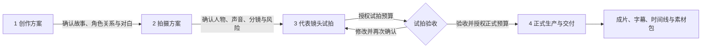

# DramaForge 总开发文档

**状态：ACTIVE / 项目唯一总纲**

**版本：v2.0**

**冻结日期：2026-08-12**

**当前实现审计基线：`dev@5df1332f1c4f002dd7b3d20d771a9dc65b9f8db1`**

**目标发布日期：2026-09-15**

> 本文是产品与研发的最高层事实源。它取代旧 P0 规划、`01` 至 `06` 冻结合同及其他历史汇报材料的执行权威，但不删除其追溯价值。详细合同只从 [`docs/current/`](docs/current/) 进入。

## 1. 一句话结论

DramaForge 第一版不是“万能 AI 影视平台”，而是：

> **面向零基础个人创作者的开源 AI 导演工作台，引导用户从一个想法完成一部 15–30 秒、真人写实风格、角色对白驱动的多镜头短剧；在花费媒体生成成本前给出可理解的方案、风险与试拍证据，失败后能解释原因并局部修复。**

产品的核心体验不是“接了多少模型”或某个自动分数多高，而是用户能否：

1. 不懂剧本和分镜也能开始创作；
2. 感到主题、人物动机和结局属于自己；
3. 在付费生成前知道方案、风险、成本和预期；
4. 先用代表性镜头验证人物、声音、口型与风格；
5. 失败时知道为什么、怎么修、要多花多少，而不是重新抽卡；
6. 最终导出一部愿意保存、展示或发布的完整作品。

## 2. 已冻结的产品选择

| 维度 | 第一版决定 |
|---|---|
| 首要用户 | 有表达欲、缺少编剧和影视经验的零基础个人创作者 |
| 首个作品模板 | 真人写实风格、角色对白驱动、15–30 秒、多镜头短剧 |
| 创作入口 | 没有想法、一句话创意、导入本人有权使用的剧本 |
| 用户必须决定 | 故事内核、人物动机、核心冲突、情绪与结局；AI 可给方案但不能替用户暗改 |
| AI 主要代劳 | 剧本结构化、对白润色、角色方案、分镜、提示词、选模、质检、修复和组装 |
| 核心交互 | 四阶段工作区 + AI 导演侧栏；聊天不是主界面 |
| 运行时 | 一个受控 AI 导演按版本化模板调用原子 Skill；不采用自由聊天式多 Agent |
| 媒体来源 | BYOK 云模型和插件式 Provider；本地模型在核心体验冻结后接入同一能力合同 |
| 部署 | 自托管 Docker；默认单用户 Owner；不建设托管 SaaS、充值或平台支付 |
| 合规边界 | 第一版不上传真人参考照片，不做声音克隆；只使用虚构角色和有明确使用权的内置/自配声音 |
| 开源 | Apache License 2.0；未来收入来自企业私有部署、适配、定制与支持 |
| 稳定语言 | 简体中文；其他语言为实验性能力 |
| 平台 | Linux/AIOS 与 Windows 11 为一等支持；macOS 为二等支持，不承诺相同本地模型能力 |

详细发布合同见 [`docs/current/01-产品与发布契约.md`](docs/current/01-产品与发布契约.md)。

## 3. 第一版的用户流程

快速模式对用户只有四个阶段，不要求理解底层模型和节点：



四个硬确认点是：

1. **创作方案确认**：故事、人物关系、完整对白方向正确；
2. **拍摄方案确认**：人物形象、声音、分镜、画幅、风险和推荐模型方案可试拍；
3. **试拍授权**：允许在明确预算上限内生成代表镜头；
4. **试拍验收与正式生产授权**：看过真实证据后，允许在预算上限内完成全片。

所有自然语言修改必须先转成结构化“变更预览”，展示将改变什么、哪些结果失效、哪些资产可复用、预计新增成本与时间，用户确认后才能生成新版本。任何额外付费修复都再次询问。

## 4. 产品差异化与壁垒假设

### 4.1 第一层：可马上验证的产品优势

- 从“模型工具箱”变成“AI 导演带我完成作品”；
- 把成本授权放在媒体请求之前，不让小白盲抽；
- 用代表性镜头先验证高风险内容，再批量生产；
- 失败后给出 2–3 个有证据、有成本、有影响范围的修复方案；
- 只重跑受影响的镜头或节点，保留可复用资产和版本血缘；
- 专业模式让进阶用户查看并接管参数，但快速模式不暴露供应商 JSON。

### 4.2 第二层：需要长期积累的数据资产

每次实际生成都记录“创作意图 → 有效请求 → 模型版本/能力 → 参考资产 → 结果 → 质量证据 → 人工选择 → 修复动作”。持续积累后，DramaForge 才可能形成：

- 某类镜头在哪类模型上更容易成功的能力档案；
- 哪些风险能在生成前预测、哪些只能试拍验证；
- 哪种修复对何种失败最有效；
- 面向小白的审美指导与创作偏好记忆。

这些数据闭环比单个 Prompt、单个检测器或模型适配器更难复制。但在没有真实数据前，它只是待验证假设，不能作为已经存在的壁垒宣传。

## 5. 当前代码的真实判断

现有 P0 **有可复用的工程底座，但还不是目标产品**。

### 保留

- Production Graph 的版本化、物化和依赖执行；
- NodeRun、ProviderOperation、Artifact 及其血缘；
- Transactional Outbox、Dispatcher、Redis/Arq Worker、失败恢复；
- Provider Plugin、Model Manifest、Production Profile 和原生参数透传能力；
- 对象存储、FFmpeg 组装、交付包、成本与审核基础设施；
- 项目和工作空间的数据边界。

### 改造

- `Brief → 固定 10 Shot → 全生产` 改为四阶段 Director Workflow；
- 三种 Agent 操作扩展为版本化原子 Skill 和通用执行记录；
- 快速页改为阶段工作区与 AI 导演侧栏；
- 专业生产页补齐逐镜头接管、证据对比和局部修复；
- 现有 Shot Pipeline 改成首版作品模板下的受控媒体图；
- 模型选择从“选择第一个可用项”升级为有能力证据、成本和回退规则的 Selection Plan；
- 默认部署改成单用户 Owner，关闭公共注册入口。

### 废止为权威

- 固定 10 Shot 是产品目标；
- 单一自动相似度阈值等同于人物一致性通过；
- 关键帧生成成功就算最短用户价值闭环；
- 更多 Provider、更多节点或更多文档等同于产品进展；
- 未经三名目标用户独立完成创作即可宣称稳定可用。

具体模块映射见 [`docs/current/02-运行时与领域架构.md`](docs/current/02-运行时与领域架构.md)。

## 6. 人物一致性首版结论

第一版不集成人脸 embedding、生物特征识别或人脸相似度阈值，也不保留相关可选插件入口。人物一致性遵循以下证据链：

```text
Canonical Character Asset
→ Shot Reference Binding
→ Provider Capability
→ EffectiveRequest / TranslationReport
→ Generated Artifact
→ identity_review（参考与产物血缘完整性）
→ 视频首/中/末帧证据
→ 用户试拍验收
→ Issue / 局部修复
```

- 第一优先级是记录并验证参考图和高级参数是否进入供应商的**有效请求**；
- 自动检查只证明 Canonical、生成产物、有效请求和血缘证据是否完整，不冒充视觉身份判断；
- 没有可信且经过校准的视觉评估器时，`identity_review` 返回 `needs_human`，由试拍或成片验收决定；
- 人物、发型、服装、体型、跨帧外观、声音/口型和剧情连续性必须分维度展示证据；
- 主观接受必须保留原因、范围、质量报告版本和操作者审计；文件损坏、缺失、安全与授权等硬错误不可覆盖；
- 未来引入任何自动人物评估器，都必须单独完成许可、校准、分桶误差和产品价值验证，不属于首版范围。

完整质量合同见 [`docs/current/03-质量与验证体系.md`](docs/current/03-质量与验证体系.md)。

## 7. 2026-09-15 发布定义

9 月 15 日只发布一个核心体验真正稳定的开源版本，不以功能数量验收。必须同时满足：

- 一名零基础用户可从三种入口之一完成四阶段流程；
- 真实产出一部 15–30 秒、多镜头、中文角色对白短剧及完整交付包；
- 四个确认点、预算授权、版本变更、试拍、质检、局部修复均真实生效；
- 三名目标用户在无人代操作下完成任务，问题和结果形成证据；
- Linux/AIOS、Windows 11 完成干净环境 Docker 安装与真实链路验收；
- macOS 完成二等支持的安装/浏览器/云 Provider 验证；
- 至少一套文档化的离线媒体生产栈跑通；若经书面 Spike 证明目标硬件无法达到 15–30 秒模板的可接受时间或质量，必须明确降级为实验性，而不能假装支持；
- 无平台充值、真人照片、声音克隆、自由工作流、多用户协作等未完成入口；
- 第三方模型/权重/数据/字体/声音的来源和许可可追溯。

逐日安排和 Gate 见 [`docs/current/04-执行路线图.md`](docs/current/04-执行路线图.md)。

## 8. 明确不在首版做的事

- 通用影视生成平台、任意时长和任意题材承诺；
- 动画、旁白等第二模板，除非 8 月 31 日主模板 Gate 已通过且不影响发布；
- 自由节点画布、通用 NLE、任意 Production Graph 编辑；
- 多人团队、实时协作、公开注册和托管 SaaS；
- 平台充值、代付、分成、发布到抖音/小红书/红果；
- 非官方平台数据抓取、热门视频内容复制；
- 真人换脸、真人照片上传和声音克隆；
- 导演在运行时自由发明 Skill、绕过 Gate 或无限多 Agent 讨论；
- 宣称“生成前可准确预测成片”或“保证不出废片”。

## 9. 尚未冻结但不阻塞开发的决定

- 首套本地视频/图片/语音模型的具体组合：在质量、硬件和许可 Spike 后冻结；
- 官方抖音趋势接口能否获得授权与稳定字段：没有授权时使用人工维护的抽象趋势库；
- 3–6 镜头、每镜 3–8 秒、连续剧默认 6 集均是可配置产品假设，需由真实作品与用户测试修正；
- 自动质量阈值：只能由校准集产生，不能在规划文档中拍脑袋固定。

## 10. 文档权威顺序

发生冲突时按以下顺序处理：

1. 本文；
2. `docs/current/01` 至 `04`；
3. 已接受且未被上述文档取代的 ADR；
4. 当前 Task Contract 与 Runbook；
5. 代码、迁移和自动化测试所反映的**当前实现事实**；
6. 其他文档仅作历史背景。

若代码与当前合同不一致，不能用代码反向宣布产品决定；应在执行路线图登记为迁移任务。任何新方向先改本文或提交 ADR，不再新建另一份“最终完整规划”。
