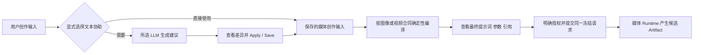

# MODEL_PROVIDER — 模型供应与 Provider 权威

Status: current（入口见 [CURRENT.md](CURRENT.md)）；
Provider 接入契约见 [adr/0005-provider-plugin-driven-configuration.md](adr/0005-provider-plugin-driven-configuration.md)。

## 分层

| 层                                         | 位置                                                                            | 职责                                                                                              |
| ------------------------------------------ | ------------------------------------------------------------------------------- | ------------------------------------------------------------------------------------------------- |
| ProviderPlugin + ModelCatalogEntry         | backend/app/providers（registry、catalog_*）                                    | 只读插件契约：供应商名称、Base URL、协议、模型 ID、能力列表；前端不写死任何供应商事实             |
| ModelManifest                              | backend/app/providers/manifest.py                                               | 对外能力唯一事实源：模型、模式、参考槽位、输入约束                                                |
| Workspace Provider Connection / Credential | providers/models.py, connection_service.py, workspace_credentials.py, security/ | BYOK 加密凭据（Fernet）、不可变 connection/credential revision、key rotation 审计；界面不回读 Key |
| Production Model Profile                   | providers/model_profiles/                                                       | 项目/工作台级模型绑定与冻结                                                                       |
| ExecutionModelResolution                   | providers/model_resolution.py, execution_identity.py                            | 执行身份：冻结 model、binding、connection/credential revision、mode 与 reference identity         |
| TransportProfile                           | providers/transport.py, transport_registry.py                                   | 不可变协议事实声明（endpoint、认证方式、编码、poll/cancel），不含凭证与业务 payload               |
| Compiler / Runtime                         | providers/adapters_v2.py, runtime.py 与各 Provider 实现                         | Compiler 唯一构造 wire_request；Runtime 校验身份后原样提交并负责认证、网络、poll/resume           |
| Reference delivery                         | providers/reference_delivery.py, reference_roles.py                             | 严格参考槽位校验、有序多参考传输（不做 `dict[role, artifact]`）、URL/bytes 决策                   |
| 文本通道                                   | providers/litellm_adapter.py + providers/litellm_gateway + infra/litellm           | OpenAI 兼容 Chat HTTP 客户端，可连接官方 LiteLLM Proxy 或兼容端点；DramaForge 不安装 litellm SDK |

媒体由统一的 Compiler 构造请求、Provider Runtime 执行；`ModelAdapter` 复用这些合同。
文本由 `litellm_adapter.py` 的 `LiteLLMModelAdapter` 构造 Chat 请求，经
`LiteLLMGatewayClient` 提交。默认 Compose 包含官方 LiteLLM Proxy；文本连接界面也接受
OpenAI 兼容端点，不代表配置任意 URL 后都会先经过本地 Proxy。
固定契约 fixture 在 `fixtures/providers/contracts/`（由
`backend/tests/unit/test_provider_catalog.py` 校验）。

旧 dict Adapter（Agnes / Ark 的 `*Adapter` class）、`providers/base.py` 的旧
Protocol/DTO，以及无调用方的 `providers/openai.py`、`providers/fake.py` 已经删除；
未被调用的 `providers/connection.py` 纯 DTO 也已删除；持久连接唯一使用
`providers/models.py::ProviderConnection`，不保留同名第二份连接模型。
退役判定与替代关系记录在 `scripts/provider_authority_map.json`，
`scripts/check_provider_authority.py` 在门禁中确认它们保持缺席、替代实现始终存在。

## 协议声明、编译与网络执行

- `TransportProfile` / `AuthSpec` / `PollSpec` 是不可变声明；`async_poll` 必须有
  poll 合同，轮询间隔若提供必须是正有限数。声明不生成模型 payload，也不持有 Key。
- 媒体 Compiler 负责确定 `wire_request` 的模型与全部 body。Runtime 在网络前检查
  provider / protocol profile / operation 与自身一致，并要求 wire `model` 与编译
  envelope 的 `model_id` 一致；拒绝 mismatch，不使用配置默认模型修补。
- Runtime 负责从连接修订读取配置、认证头、请求发送、poll/cancel/resume；发送时
  不重编译、不改变 Compiler body。已有持久 request/resume 格式不因该分层变化。
- 文本仍走专用 LiteLLM 通道；不要把文本协议声明强行套到媒体 submit/poll 之上。

### 协议级发现与能力合同

- 连接扩展的单位是**协议**，不是「供应商 × 模型」：同一个协议适配器可以服务
  Agnes、企业网关或其他满足该协议合同的模型 ID。媒体远端 ID 由工作空间的
  `ProviderModelBinding` 保存并在执行身份中冻结；文本目前另有动态 registry 与逻辑
  profile 绑定。Compiler 或 Runtime 不能用默认模型替换已选模型。
- `auth_models` 是不付费的显式探测：使用当前连接 revision 的 URL / 加密 Key 读取
  插件声明的模型目录路径，把账号实际返回的 ID 保存在不可变 evidence。目录读取本身
  不验证生成能力。当前媒体要求另选本地能力合同；文本动态 registry 则把所有返回 ID
  注册为 `text.generate`，尚未区分目录中的非 Chat 模型，属于待修正缺口。
- `openai_media_v1` 是当前通用媒体协议合同：图像使用 `/images/generations` /
  `/images/edits`，视频使用异步 `/videos` + `/videos/{id}` 轮询。设置页让用户先选
  账号发现的模型，再显式选择图像或视频能力合同；合同描述请求形状与参考槽位，
  远端模型 ID 由 Compiler 写入最终 wire request。
- 不符合该协议的原生端点仍按**协议**增加一个 Adapter（例如 `agnes_cn_v1`、
  `ark_cn_v1`），而不是为每个新模型复制一套适配代码。未声明的协议或能力继续
  fail-closed，不能仅凭 `/v1/models` 的返回值执行。

## 文本凭证边界

文本设置页使用工作空间级 `litellm/openai_chat_v1` 连接保存 URL / Key 的加密 revision。
`workspace_registry.py` 先复制进程静态模型，再为当前 revision 的成功目录 evidence 中
尚不存在的 ID 注册 `litellm/<model>` 动态 adapter。用户在工作空间 / 项目模型方案中
选择具体模型。媒体 BYOK 同样使用 `ProviderConnection` 及其不可变 credential revision。

**当前实现限制**：静态 `script-quality` / `script-fast` 等模型仍使用部署级
`LITELLM_GATEWAY_URL` / `LITELLM_API_KEY`；发现同名 alias 时动态 registry 跳过注册，
并不会把该静态 adapter 改绑到工作空间连接。配置摘要也仍把部署环境视为文本已配置
的来源之一。此调用路径存在来源混淆风险，不能据此声称已经发生凭证泄漏，也不能把
“工作空间 URL / Key 已保存”当作所有文本模型均使用它的证明。

目标是工作空间、显式部署连接及历史模型各有明确来源，选择后不静默切换；具体迁移与
验收见下文 MP-01、MP-09。经 LiteLLM Proxy 的文本请求由 Proxy 路由上游；直接连接
兼容端点的请求不由本地 Proxy 接管。两者共用文本 HTTP 合同。

## 不可绕过的规则

1. **无静默回退**：选择 X 不静默运行 Y；unsupported input fail-closed 且不
   产生 Provider 请求。
2. **Image Generate / Image Edit 真正分离**，不共用一个能力描述。
3. **输入模式由 InputModeSpec 声明**，不能用普通字段互斥替代。
4. **参考槽位严格校验**：未声明的 input slot 不能被 validator 忽略；
   多参考必须有序传输。
5. **Capability 与 Mode 职责分离**，能力词汇收敛。
6. 凭证只在加密层流动：不写入 `.env.example`、Git、日志或证据文件；
   ProviderOperation 记录 provider、完整模型 ID、Profile、引用
   Artifact ID/哈希、提交状态和远端任务 ID，但绝不记录 Key、签名 URL
   或原始私密素材。

## 首版延期（deferred）

- **Provider Connection 删除**：连接可启用/停用；删除操作延期到后续版本，
  首版只提供停用。项目 Provider Binding 的来源摘要只读；设置页与
  `PUT /projects/{project_id}/provider-bindings/{purpose}` 已有显式绑定操作。

## 质量认证不是执行准入

`ProviderModelBinding.quality_gated` 表示**已有人工验收过该绑定的代表产物**
（`ProviderQualityEvidence`：一次带人工接受的身份复核或视频漂移复核）。它属于
**质量认证 / 正式支持证据**，会通过 `ModelCandidateRead.certified` 与
`CandidateEvaluation.certified` 对外呈现。

它**不是**普通执行或实验线的硬准入条件：缺少它的绑定仍可生成、仍可用于实验分支，
`app.providers.eligibility.evaluate_candidate` 不会因此产生 blocking issue。
真正会 fail-closed 的是：绑定/连接停用、未登记能力文档、未通过契约测试、账号未验证、
目录或 manifest 不匹配、以及所需能力/参考槽位缺失（决策日期 2026-09-19）。

## 设置界面的事实边界

- 连接、凭证、目录、模型绑定与人工质量认证分开解释：保存地址 / Key 不代表
  认证通过，插件目录不代表账号可见，某模型证据不连带其他模型。
- 「认证 / 模型目录」探测会把供应商返回的模型 ID 保存在不可变证据中。设置页据此
  展示发现 ID 并允许媒体用户选择本地执行合同；没有发现结果时仍有插件目录选项。
  账号返回但尚无精确目录项的模型可显式复用兼容合同。这不证明远端接受该合同，
  也不能仅凭 ID 推断图片 / 视频能力、参考槽位或参数协议。
- 媒体服务地址使用独立草稿，空输入不回弹为旧地址；媒体轮换 Key 不保存地址草稿。
  文本连接使用一个保存操作依次更新地址和 Key，尚不是跨两项修改的原子事务。
  切换供应商 / 工作空间清除未提交凭证与旧操作反馈；凭证从不回读。
- 选择目录模型只更新本地选择，点击「添加模型绑定」才写入；绑定所选项目
  仍需另一显式操作。历史合同、停用连接 / 绑定和未验证状态不伪装为可用。
- 连接、探测证据和绑定分别呈现读取中、读取失败、成功但为空；探测接口返回
  HTTP 成功但业务状态失败，不显示成功提示。当前认证状态读取后端按连接版本核对的
  `verification_status`；历史 probe 的时间顺序不能覆盖当前状态，因为可能包含旧凭证
  的迟到失败。旧通过仅标注为历史证据。变更配置后重新读取事实，不自动探测。
- 工作空间方案只提交用户修改的模型组，不把一组中首个模型写回全部环节。
  后台刷新保留草稿；版本变化阻止覆盖，必须核对并显式放弃草稿后重新选择。
  保存名称与保存模型选择互不吞掉另一份草稿。
- 从作品进入设置时保留已校验的返回路径，按当前工作空间作品列表选定上下文。
  只读摘要展示方案解析 API 返回的完整模型 ID、来源和方案版本，并与保存的
  项目供应商绑定分列；缺失结果标为「未确认」，不推断未配置或已就绪。
  摘要不是运行中任务的执行身份；真实已用模型仍以生产记录中的冻结身份为准。
- 生产入口额外读取 `GET /projects/{project_id}/execution-models/preflight`。该接口
  使用与执行计划相同的 `ExecutionModelResolver`，分别返回关键帧 / 视频最终解析到的
  binding、完整模型 ID、来源和阻塞原因；逻辑方案显示“使用默认方案”但没有可执行
  Provider binding 时必须在提交前阻塞，不能等第一次生成再暴露错误。

- 上述媒体 A+B 供应商绑定只覆盖图片 / 视频，不是当前配音的服务选择入口。
  文本凭证存在上述工作空间连接与部署级静态路径；配音应到镜头配音设置查看实例所选服务并设置
  音色 / 语速，配置读取不等于已联网验证。旧 `audio.tts` profile slot 即使有解析结果，
  也不能声称被当前 voice worker 采用；供应商来源摘要排除该槽位，缺失它不触发
  配音未配置或未就绪结论。项目模型编辑页不提供无执行效力的声音选择器；保存媒体选择时
  原样保留历史 `audio.tts` 数据，不借机清除。页面提示用户到镜头设置选择音色 / 语速。
  当前实例配音服务选择、冻结 `voice_execution` 及执行证据由配音实现负责；供应商
  UI 不新增 TTS 插件、不代选服务，也不允许失败后自动换服务。

当前只读 API `model-bindings/effective` 会省略无法解析的环节，不能完整说明阻塞
原因；前端不另写 resolver 填补空缺。当前 ProbeRequest 只有布尔确认，没有单次
正数预算和 Owner 授权合同，因此设置页禁用付费探测入口，后端同样拒绝派发；不能用
勾选框替代操作授权。认证 / 模型目录检查仍须用户显式点击，页面访问和刷新不会运行它。

### 认证失效、历史证据与付费探测的后端边界

- `auth_models` 明确返回 HTTP 401 / 403 时，只撤销本次探测对应的**当前连接版本**
  的认证投影：`verification_status=failed`、清空 `verified_at`、将该连接的模型绑定
  `account_verified` 清为 false。连接不自动停用，用户可以核对配置后显式重新认证。
- 超时、网络失败、429 / 5xx、无效或空目录并不能证明凭证被拒绝：记录失败 evidence，
  不清除此前认证，也不将本次失败显示为成功。认证通过仍只表示过去一次检查成功，
  不保证现在的网络、配额或任务执行可用。
- 探测开始时固定不可变 connection revision 与 credential revision，返回后重新读取并
  锁定当前连接再比对；旧版本迟到的成功或失败只进入历史记录，不能认证或撤销新版本。
  更换凭证 / 地址清理当前可用性和质量投影，但保留不可变 revision、能力 evidence 与
  人工质量 evidence。明确认证拒绝不抹除此前质量证据，执行仍被账号认证状态阻止。
- `POST /api/v1/workspaces/{workspace_id}/provider-connections/{connection_id}/probes`
  在加载凭证、创建客户端或处理参考产物前，以 `PAID_PROBE_AUTHORIZATION_UNAVAILABLE`
  （HTTP 422）拒绝 `image_t2i` / `image_i2i` / `video_i2v`，即使插件漏标付费能力、
  已有价格快照或传入 `paid_request_confirmed=true` 也不例外。
  仅未标付费的 `auth_models` 与查询已有远端任务的 `video_poll_download` 保持可用；
  插件若将它们标为付费也会阻止。该查询不创建新生成任务，成功不自动认证模型绑定。
  这是缺少授权合同期间的 fail-closed，不是已实现预算审批或 Owner 授权。

## 冻结的接入合同（真实账号）

| 供应商   | 插件 / Profile          | 默认视频模型                 | 调用方式                                           | 当前产品范围                                                          |
| -------- | ----------------------- | ---------------------------- | -------------------------------------------------- | --------------------------------------------------------------------- |
| MiniMax  | `minimax/minimax_cn_v1` | `MiniMax-H3`                 | `POST /v2/video_generation`，异步查询并下载        | 一个公网 HTTPS 首帧，768P，5 秒，比例继承首帧，不声明原生音频         |
| 火山方舟 | `volcengine/ark_cn_v1`  | `doubao-seedance-2-0-260128` | `POST /contents/generations/tasks`，按任务 ID 查询 | 一个公网 HTTPS 首帧；音频、时长、多参考和可信素材能力尚未进入产品合同 |

Seedance 1.0 Pro 旧目录项保留以避免既有绑定失效；新连接优先 Seedance 2.0。
模型 ID 是否对账号可见以当天账号探测结果为准。

## 真实接入流程与停止条件

流程：前端"模型供应商插件"面板 → 选择插件、确认 Base URL → 保存加密 Key →
先运行不付费的"认证 / 模型目录"（401/403 或目录缺失即停止）→ 创建精确的
视频模型绑定（当前精确目录项的新绑定需随后再次显式认证；发现 ID 复用不同目录项
时可以继承当前 revision 的目录 evidence，尚待 MP-03 统一）→
核对账号价格与授权需求。当前接口尚不能提交单次正数预算及 Owner 授权合同，
设置页和后端均阻止付费探测；已有价格快照不等于预算或操作授权。缺少合同期间
接入流程到此停止，不通过其他入口绕开。

通过标准：任务成功后视频被下载并物化为 DramaForge Artifact（只拿到供应商
短期 URL 不算完成）；实际费用不超过本次授权；能力探测成功不等于质量合格。

立即停止的情况：

- 模型 ID 不可见、401/403、地区或账号权限不符；
- 供应商提交结果为 `unknown_submission`（先对账，未经新授权不重发）；
- 价格未知、币种不一致、参考 Artifact 不可读取，或需要超出当前合同的
  音频 / 多参考 / 首尾帧 / 时长 / 分辨率参数；
- 任何页面、日志或证据文件出现 Key 或可复用下载凭证。

付费操作（探测、试拍、生产、修复）每次都需要独立的正数预算与 Owner 明确
授权；能力边界细节见 [PRODUCTION_RUNTIME.md](PRODUCTION_RUNTIME.md)。

## 模型接入与请求透明度开发目标

**状态：MP-01 至 MP-12 均为待实施、未验收的目标合同。** 前文描述现有实现及限制；
本节规定改造后必须达到的行为，不能因文档合入就标为已实现或对外支持。整体开发顺序
与跨域验收入口见 [ARCHITECTURE_MAPPING.md](ARCHITECTURE_MAPPING.md)。界面布局及
交互由 [FRONTEND_WORKBENCH.md](FRONTEND_WORKBENCH.md) 负责，队列和资源调度由
[PRODUCTION_RUNTIME.md](PRODUCTION_RUNTIME.md) 负责，本节不建立第二套规范。

目标用户路径是：保存一个具名连接 → 发现或手动登记精确模型 → 确认支持的用途与限制
→ 设置工作空间默认或项目覆盖 → 保存创作输入 → 查看最终提示词与生效参数 → 显式
授权执行。目录发现不是生成实测，生成成功不是质量认证，连接创建不是付费授权。

下表是可由当前源码复核的改造起点，不代表这些路径已经在真实账号中复现故障：

| 当前实现 | 对目标的缺口 | 代码依据 |
| --- | --- | --- |
| 每空间同 provider/profile 只允许一条连接 | 两个兼容地址及同名模型无法按独立连接共存 | `providers/models.py::ProviderConnection`、`connection_service.py::create_connection` |
| 设置探测直接拼 Base URL 与插件目录路径，文本执行另有规范化函数 | 输入带 `/v1` 的文本地址时，目录路径可能重复版本段 | `connection_service.py::probe`、`litellm_gateway/client.py::normalize_models_url` |
| 文本发现统一注册 Chat 能力，同名静态 alias 不替换 adapter | 目录分类及空间/部署来源尚不满足 MP-03、MP-09 | `litellm_gateway/workspace_registry.py`、`litellm_gateway/model_catalog.py` |
| Workbench 预览生成语义计划，Provider Compiler 在 Worker 执行；创意上下文直接追加 JSON | 尚无可确认的最终 payload 预览；模型 prompt 策略和编译证据需要统一 | `production/workbench_execution.py::_compose_effective_prompt / build_plan`、`execution/media_submission.py` |
| 编译器摘要字段形状不同，执行层从摘要顶层读取生效参数 | wire 已有参数仍可能在统一转换记录中缺失 | `providers/minimax.py::MiniMaxVideoCompiler`、`providers/openai_compatible_media.py`、`execution/media_submission.py` |
| ProbeRequest 只有布尔付费确认，后端拒绝派发计费探测 | 受控首次验证授权尚未交付 | `api/v1/provider_connections.py::ProbeRequest`、`connection_service.py::probe` |

### 复用实体、接口与验收口径

沿用 `ProviderConnection`、`ProviderConnectionRevision`、加密 credential revision、
`ProviderCapabilityEvidence`、`ProviderModelBinding`、`ModelCatalogEntry`、
`ModelManifest`、`ProductionModelProfile`、`ExecutionModelResolution`、
`WorkbenchExecutionPlan`、`ProviderOperation` 与 `Artifact`。不得为设置向导创建第二套
模型目录或执行事实。`CompiledRequest` 在本节是现有 `CompiledImageRequest` /
`CompiledVideoRequest` 及文本 translation 合同的统称，不表示仓库已有同名持久实体。

文本与媒体共用模型身份和能力来源，但保留各自执行归属：文本提案/优化沿用 Director
的 invocation/proposal 合同；媒体生成沿用 NodeRun → ProviderOperation → Artifact。
不能为了统一设置页，把文本调用伪装成媒体任务，或让 LLM 自动替用户提交图像/视频。

图中的 Apply / Save 指镜头提示词建议；StoryProposal 的显式 Apply 语义仍按 CREATION_FLOW。

现有扩展入口如下；表内路径均带 `/api/v1` 前缀。新增请求字段、状态投影或凭证作用域
必须作为这些领域合同的兼容演进落实，并同步 [API.md](API.md) 与生成的前端类型；
不得把本节的目标字段当作当前 API 已支持。

| 用途 | 当前接口 / 源码 | 改造落点 |
| --- | --- | --- |
| 安装的协议与目录 | `GET /provider-plugins`；`api/v1/provider_connections.py` | 继续提供只读插件与能力合同；附发现策略、合同来源和版本 |
| 连接管理 | `GET/POST /workspaces/{workspace_id}/provider-connections`；单项 `GET/PATCH .../{connection_id}`、`PUT .../{connection_id}/credential` | 多连接、统一地址规范化、修订与权限校验 |
| 发现 / 验证 | `GET/POST .../{connection_id}/probes` | 分离证据类别；付费验证扩展前保持现有拒绝行为 |
| 模型登记 | `GET/POST .../{connection_id}/model-bindings` | 当前仅 image/video；文本连接身份与手动登记需兼容演进，不创建另一套绑定真相 |
| 默认与覆盖 | `api/v1/model_profiles.py`；`GET /projects/{project_id}/model-bindings/effective`、`GET /projects/{project_id}/execution-models/preflight` | 返回可追溯的连接/模型身份、来源及阻塞原因；不能只返回名称 |
| 生成预览与提交 | `POST /projects/{project_id}/shots/{shot_id}/execution-plan`、`POST .../executions`、`GET .../executions/receipt`；`api/v1/workbench.py` | 扩展同一计划，冻结已预览编译产物、版本与幂等回执 |
| 请求编译与执行 | `providers/runtime.py`、`providers/translation.py`、`execution/media_submission.py` | 由同一强类型结果提供预览、执行和审计，保留单次提交与恢复边界 |

验收分为三个互不替代的层次：

- **离线合同验收**：使用确定性 fixture、MockTransport、测试数据库及前端拦截响应，
  验证身份、迁移、参数、状态、请求次数和权限；不访问真实供应商、不产生费用。
- **真实兼容验证**：针对明确的连接修订、远端模型 ID、输入模式和合同版本验证。
  只读操作也需显式触发；可能计费的验证须满足 MP-11。没有预算或授权时记为未运行，
  不能用 mock 结果宣称账号/模型可用。
- **质量认证**：用户接受代表产物后另记 `ProviderQualityEvidence`；不与前两层合并，
  不成为普通实验和首次生成的前置人工认证门槛。

每项需求必须保留可重复的通过与失败断言、无意外网络/写入的断言以及适用迁移检查。
验收报告明确标注“离线通过 / 真实验证未运行 / 真实验证通过的确切合同”，不使用笼统
“全模型支持”。生产正式验收仍遵循仓库现有质量 Gate，不以本节局部用例替代。

### MP-01 多连接身份、同名模型隔离与兼容迁移

**规范**：一个工作空间允许保存多个相同协议的具名连接。连接 UUID 是实例身份，
`provider_type / protocol_profile` 只描述供应商类别与协议；显示名称、Base URL、模型
别名均不能充当全局唯一身份。模型选择必须最终解析到 `workspace_id + connection_id
+ remote_model_id + operation/mode + contract_revision`，并在执行受理时冻结 connection
revision 与 credential revision。不同连接上的同名远端模型可以共存。

**边界与迁移**：前向迁移移除现有 `uq_provider_connection_profile` 对多实例的限制，
同时调整按 provider/profile 取单行的 resolver、registry 与设置读取，不能只改数据库。
保留既有 connection/binding UUID、凭证修订、证据及运行记录；历史 profile 中只有
`provider/model` 的引用若唯一可解析则迁成明确引用，若歧义则标待重选并阻止新执行，
禁止取查询第一行。已受理任务继续使用其冻结身份；历史只读展示不能因迁移丢失。
连接停用不删除证据；物理删除仍不在本次范围。

**验收**：

| Given / When | Then | 级别 |
| --- | --- | --- |
| 同空间两个兼容连接 A/B，均声明 `model-x`；分别预览并提交 | 两个编译结果、认证头来源和远端地址严格归属所选连接；停止 A 不改变 B；跨空间不能选择 A/B | 离线 |
| 空间 alias 与部署级 alias 同名 | 无静默覆盖或跳过空间身份；若选择部署模型，来源必须显式为部署连接 | 离线 |
| 旧数据包含 profile、绑定、凭证修订、证据及已排队任务；执行迁移 | 旧 ID/引用完整、已排队任务身份保持、歧义的新请求返回待重选错误；迁移不调用供应商 | 离线迁移 |

### MP-02 协议级统一 URL 规范化

**规范**：保存、认证、目录、Chat、媒体提交、轮询与取消共用协议声明的 endpoint
resolver。保存输入保留可解释的原值，规范化结果属于 connection revision。OpenAI
兼容根地址和 `/v1` 地址都应得到唯一正确 endpoint；支持完整 operation URL 的协议
必须显式声明并解析它，不支持则保存时返回字段错误。合法版本/部署前缀例如
`/api/v3`、`/gateway/team/v1` 不得被通用 `rstrip` 或重复拼接破坏。操作 URL 不允许
由模型响应任意替换；协议差异保留在 `TransportProfile` / 插件内。

**边界**：不把“任何 URL”解释为“任何厂商协议”。没有声明的 endpoint、认证方式、
query 参数或路径形式必须拒绝或要求显式选择协议，不能依次试多个生成端点。API Key
不能嵌在用户信息、query、fragment 或规范化日志中。现有内网 LiteLLM 场景按明确
部署信任策略允许，不能以放开全部内网访问代替网络边界设计。

**验收**：离线参数化用例覆盖根地址、尾斜杠、`/v1`、合法嵌套前缀、原生版本路径、
完整 operation URL、空值及带凭证 URL；同一连接的发现与执行路径各与预期一致且
规范化幂等。`https://example.test/v1` 不产生 `/v1/v1/models`；Ark 协议保留 `/api/v3`。
非法输入在发出网络请求前失败。真实只读目录验证仅证明该 endpoint 当次可用，不证明
所有操作可用。

### MP-03 发现、认证、能力识别、生成验证与质量分离

**规范**：连接与模型分别展示可独立审计的事实：凭证已保存；目录发现成功/空/不支持/
失败；认证通过/拒绝/未知；能力合同已匹配/用户指定/未知；某模式生成实测通过/失败/
未运行；人工质量认证有/无。可采用组合 read model，不得把它们压成一个绿色“可用”。
目录响应只提供远端 ID 及可验证元数据；能力必须来自版本化合同或协议可信能力元数据，
不得按名称包含 `image/video/chat` 或默认为 `text.generate` 推断。

**边界**：证据绑定精确 connection revision、credential revision、模型及验证范围。
目录中存在模型不证明额度、Chat 支持、工具调用、图像参考槽位或音视频参数。明确的
401/403 撤销当前修订的认证投影，历史迟到结果不能覆盖新修订；429、超时与空目录
不伪装成凭证拒绝。创建精确目录绑定与复用合同的动态绑定应一致消费当前证据，不能
因 ID 是否等于合同种子值而要求不同次数的认证。模型 A 的实测不认证模型 B。

**验收**：离线目录 fixture 混有 Chat、embedding、image、video 与未知 ID 时，各项
保留正确类别或未知状态，未知项不能进入 Chat 默认候选。覆盖成功后新增绑定、轮换
Key、旧版本迟到成功/失败、当前401、429与空目录；分别断言证据保留和当前投影。
真实验证必须按模型/模式记录结果；单个实测成功不能将整张目录标为通过。

### MP-04 无模型目录接口的手动 ID 接入

**规范**：插件声明发现策略，至少区分可读取目录与无目录接口。无目录的已支持协议
允许用户输入精确远端模型 ID，并选择已有激活能力合同，保存为“手动登记、未实测”。
缺少目录不删除已保存的 Key，也不错误提示“模型不存在”。官方接口若有不计费认证
方式，应由协议声明并生成独立认证 evidence。

**边界**：手动输入不能绕过合同校验或普通生产的账号准入。没有独立认证接口时，
允许进入 MP-11 的受控首次验证路径；该路径明确记录“认证未知”、具体模型与单次
预算，不能把手工勾选当成账号已验证。该验证通过后才更新相应范围的投影。目录请求
明确401/403时禁止以“手动模式”绕过拒绝；不支持的协议或能力只可登记草稿，不能
生成。现有任意名称不能被自动映射到一个看起来相近的合同。

**验收**：离线模拟不提供目录的插件，手动登记不发请求、不变更认证状态；未知合同
阻止提交，已声明合同可预览。相同场景的普通生成在认证不足时阻止，受控验证在授权
缺失时阻止；当前401仍阻止。真实验证只在明确预算内对指定 ID 发一次请求，成功
记录实测范围，失败保留手动配置及可恢复的错误，不自动尝试其他 ID。

### MP-05 版本化能力、参数 schema、UI schema 与官方来源

**规范**：沿用 `ModelCatalogEntry.capability_manifest_json / option_schema_json` 与
`ModelManifest`，补齐同一版本下的参数及展示元数据：操作/输入模式、参考素材角色与
数量、类型/必填/枚举/范围/互斥与条件、默认值及其依据、输出限制、单位、是否可编辑、
基础/高级分组、帮助文案与不支持原因。UI schema 仅控制呈现，后端 schema 才是校验
权威。合同记录官方文档 URL、供应商/API 版本、核验日期、compiler/template 版本与
内容 hash；复用兼容协议的合同必须标 `protocol_contract`，不得冒称官方模型认证。

**边界**：官方 API 参数合同与官方提示词建议是两类来源，不能假设每个模型均有官方
prompt 模板。参数默认和转换均须有证据；没有证据的能力保持未声明。目录更新新增
revision，不能原地改写已绑定合同。全局目录仍是只读发布资产，普通用户不得通过
表单上传代码、任意表达式或覆盖全局合同；未知兼容平台可以选择已支持协议合同，
但不由前端维护一份参数字典。

**验收**：离线使用多个模式 fixture，断言 UI 可编辑字段与后端允许字段一致；非法
枚举、条件缺失、额外字段、超数量参考在网络前返回字段级错误。旧合同预览在发布
新合同后仍可按旧版本回读；新执行若需升级则显式重选并重预览。官方来源失效或未
核验时不新增“已验证”标记；真实兼容测试按该精确 revision 验证，不推广到同族模型。

### MP-06 可选 LLM 润色与确定性请求编译

**规范**：用户原始提示词是可恢复的创作输入。LLM 仅在用户显式选择“优化/改写”时
生成候选文本与结构化创意建议，保留原文、差异、所用模型身份；经 Apply/Save 后才
成为下一次编译输入。编译器按 MP-05 的模型/模式合同确定性组合提示词、映射参数和
绑定参考；相同冻结输入产生相同语义请求及 hash。LLM 不能决定 endpoint、写入 Key、
猜测未声明字段或把能力缺失描述成支持。

**边界**：关闭润色时，提示词仍可直接进入合同允许的生成；改写失败保留原文并返回
错误，不自动采用半成品。创作意图可依据已版本化 prompt 策略转成自然语言，但内部
流程 JSON、未接受提案和诊断标记不默认塞入最终 prompt。硬参数必须放官方字段，
不能仅在文本写“5秒”便声称发送了 duration 参数。任何有损近似须逐项解释并显式
接受；不能为了命中字段而默默删掉用户意图。LLM 润色若计费同样适用 MP-11，不能
由无副作用的执行预览偷偷触发。

最终提示词默认只读。合同若声明可编辑的 prompt 覆盖槽，可将用户覆盖单独保存在草稿，
再次 Save/编译并展示差异；没有声明时修改原始创作输入再编译。覆盖不能删除必需参数、
改变引用身份或编辑原始 wire JSON；后端执行同样的字段与能力校验。

**验收**：离线对相同冻结输入重复编译获得同 hash；关闭润色、预览、刷新均无 LLM
调用；拒绝候选不修改已保存 prompt。给定不支持的音频/参考/时长要求，编译返回
阻塞或待接受近似，不把要求挪到 prompt 后假装原生支持。真实润色验证与媒体生成
验证分别授权和计量；媒体质量不作为编译确定性的替代断言。

### MP-07 同一编译产物驱动预览、提交与审计

**规范**：扩展已有 execution-plan，使预览由正式 Compiler 生成：原始提示词、最终
提示词、精确模型/连接与合同版本、生效参数、参考顺序和交付方式、默认/转换/舍弃
说明及阻塞项。`CompiledRequest` 的结构化结果统一产生 UI 预览和审计摘要，不能再
从各供应商不同的 `safe_request_summary` 字段形状推测生效值。预览不调用 Provider，
不创建 `NodeRun` 或 `ProviderOperation`，只可持久化非秘密的编译快照。

媒体受理时将已预览的不可变编译快照关联到现有计划/NodeRun；Worker 校验身份后消费同
一份语义 payload，不重新运行 LLM、选择模型或改变参数。hash 必须覆盖所选连接及
凭证修订 ID、远端模型、模式、合同/compiler/prompt 策略版本、最终文本、参数、
有序 Artifact ID/内容 hash 及接受的近似。hash 不包含 Key、签名凭证与易变时间戳。

**边界**：编辑提示词、切模型/模式、改参数/引用、换连接或 Key、变更生效合同都会
使旧预览失效，必须再次预览；提交时原子校验 `expected_shot_version` 与 hash，失败
不得排队或计费。短期签名 URL、上传授权及认证头只在发送前由冻结 Artifact/credential
引用延迟绑定；仅这些声明的传输槽位可变化，不改变模型、引用内容或语义 hash。
无法忠实保留已冻结合同则明确阻塞，不能以重新编译“修复”。重放幂等键返回原回执。

**验收**：离线拦截最终 HTTP body，去除声明的秘密/时效槽位后，与用户确认的编译
结果逐字段一致；覆盖图像、视频和文本合同、默认值、转换报告，effective 参数不能
因 summary 形状不同丢失。预览后逐一修改上述 hash 输入，提交均拒绝且 create 调用
次数为零；只刷新签名 URL 可执行且 Artifact 顺序/hash 不变。重复提交同一幂等键
只创建一个远端任务。真实媒体验证确认所用模型/模式与快照一致，并将产物物化为 Artifact。
文本合同的请求一致性由已有文本 translation/invocation 路径验证，保留提案及调用证据，
不为它创建媒体 NodeRun；LLM 调用后是否采用提案仍是独立用户门。

### MP-08 权限、凭证隔离与非秘密预览

**规范**：连接、绑定、计划、证据和引用的读写均验证当前 workspace/project 权限；
前端禁用按钮不代替服务端检查。执行还需验证冻结凭证修订属于所选连接且工作空间
一致。凭证只写不读，预览只向有权查看该项目内容的用户返回提示词、参数与素材描述；
此“非秘密”指不含认证材料，不代表创作文本可公开。

**边界**：公开响应、日志、异常、trace、测试证据及 ProviderResumeToken 禁止携带
Key、Authorization、签名 URL、可复用下载凭证或原始素材字节。脱敏预览保留 Artifact
ID/角色/顺序，不输出带授权 query 的地址；内部发送时才解析传输材料。不能仅依赖
字段名包含 `secret` 的检测，应有字段白名单与嵌套值泄漏回归。业务准入继续沿用
Owner/项目权限，不能为模型管理新建绕过权限的通用调试入口。

**验收**：离线跨空间猜 connection/binding/Artifact/plan ID，读取、预览及提交均拒绝
且无网络请求。轮换/停用连接后按 MP-01/MP-07 校验新请求，历史审计仍可安全回读。
用合成密钥和签名 URL 注入嵌套响应/报错，断言所有对外返回、日志和证据均不含它们。
真实验收不在报告保留密钥或短期下载凭证，只记录可审核的非秘密身份与状态。

### MP-09 部署级 / legacy 来源显式化与无静默回退

**规范**：现有 `LITELLM_GATEWAY_URL / LITELLM_API_KEY`、静态 logical alias、空间
动态模型及历史 profile 必须返回明确来源。部署级模型若继续开放给用户，应表现为
管理员显式启用的部署连接，按其授权范围可选；没有空间连接不能让它伪装成“空间
Key 已配置”。空间模型与部署 alias 同名不共享 adapter 身份。用户选中的来源不可用
时返回具体阻塞，禁止取另一个同名 alias、另一个空间、环境默认或排序首项。

**边界**：保留历史回读与已受理任务的冻结身份；兼容逻辑只负责解释旧数据，不能
自行产生新的默认选择。对无法唯一映射的历史选择显示待重选；不删除历史证据，不
为了消除混用而破坏部署管理员明确选择的网关。Proxy 上游如果可能改变真实模型，
也须受无静默回退约束；响应能提供的实际模型/路由信息进入执行证据，不能只记 alias。

**验收**：离线同时存在 env、空间 A/B 与同名 alias，逐一选择后验证 URL/credential
来源与记录身份；缺失/禁用/认证拒绝均不转到另一来源。关闭环境配置时空间模型仍
可用；关闭空间连接时部署连接的授权状态不受伪造。迁移 fixture 的歧义项只读可见，
新执行阻止。真实验证对比供应商回执可提供的实际身份，缺失则标未确认而非推断。

### MP-10 保留单一文本 HTTP 合同，LiteLLM Proxy 可选

**规范**：沿用 `LiteLLMModelAdapter` / `LiteLLMGatewayClient` 的文本 HTTP 合同；
用户可显式选择兼容 Chat 端点或已部署的 LiteLLM Proxy。Proxy 负责其上游适配和所
配置的配额/路由能力；DramaForge 负责空间身份、提案、授权与生产记录。不为此改造
增加进程内 litellm SDK，也不同时维护 SDK 与 Proxy 两条选择规则。

**边界**：默认 Compose 当前启用 Proxy 和其数据库；目标是将本地 Proxy 作为明确
可选的部署能力，并保持现有部署的兼容升级方案。直接兼容端点不要求额外启动本地
Proxy/数据库，Proxy 停止不影响项目浏览、手工编辑与明确使用直连的请求。直连仅
支持已经声明的 Chat 协议；Responses、原生鉴权、工具调用或媒体 endpoint 不会因
接入 LiteLLM 自动变成已支持能力。媒体继续按自身 compiler/runtime 与异步合同执行。
不得复活退役的 `TEXT_LLM_*` 配置。部署配置细节由 [DEPLOYMENT.md](DEPLOYMENT.md)
维护，资源验收见 [PRODUCTION_RUNTIME.md](PRODUCTION_RUNTIME.md)。

**验收**：离线同一文本语义请求经直连和 Proxy fixture 都保留选定模型及错误语义；
可选 Proxy 未启动时，浏览/编辑和直连测试通过，显式 Proxy 请求返回服务不可达且
不回退。依赖检查确认未引入 SDK；部署迁移不移除旧实例的有效凭证/模型配置。
真实 Proxy 集成测试与真实上游模型实测分开记结果，mock upstream 不能冒称付费
供应商已通过。

### MP-11 费用、验证授权与未知提交处理

**规范**：保存、手动登记、目录展示、纯编译预览无生成副作用。只有协议声明不计费
的认证/目录检查可按显式只读操作运行；计费或费用性质未知的操作不得伪装为免费
探测。文本润色、媒体验证、试拍、生产与修复每次都要有 Owner 的明确操作授权、
正数预算及币种，并绑定具体连接/模型/模式/编译 hash 与幂等命令。价格来源和估算
时间可追溯，预算不足或价格无法确定时阻止派发；不能用零预算代表不限额。
金额是本次操作的授权上限，不冒充供应商报价或实际账单；估算与实付分列。
界面可一次展示明确操作清单并逐项记录授权，不必为同一已授权操作的安全查询重复弹窗。

**边界**：现有 `ProbeRequest.paid_request_confirmed` 无法表达这些内容，授权合同
实现并验收前继续返回 `PAID_PROBE_AUTHORIZATION_UNAVAILABLE`。受控首次验证沿用
统一授权边界；媒体沿用 ProviderOperation，文本沿用 invocation 证据，不创建第二套付费 runtime。一次授权不涵盖
后续自动重试、换模型或新的优化调用。发送前持久化提交标记；可能已生效/计费的超时
进入 `unknown_submission`，可查询既有回执/远端任务但不重新 create。只有确认未
提交且取得适用新授权才可另开尝试；未知结果不能记为零费用或成功退款。

**验收**：离线覆盖缺 Owner、零/负预算、币种不符、过期/错模型授权、重复命令、
发送后断线、Provider429/5xx与迟到回执；分别断言阻止位置、create 次数、预算状态和
恢复方式。无权限/缺预算必须在读取发送用凭证和 create 前失败。真实计费验收按一项
操作一份授权，核对回执与费用；价格/实际费用无法核实或提交未知则如实停在待对账，
不能以重新生成来完成验收。

### MP-12 类型化错误、诊断与可恢复结果

**规范**：API、compiler、runtime 和前端共享稳定的错误代码及受控详情，不用供应商
字符串作为控制流。至少区分下列错误类别；实现时复用已有 code，新增 code 必须
同步类型和 API 文档，不能将下表中文类别直接当作已存在枚举。

| 类别 | 必须区分的情况 | 用户可执行的恢复动作 |
| --- | --- | --- |
| 地址/协议 | 无效 URL、未支持协议、endpoint 路径不匹配 | 修正地址或明确选择已支持协议；不自动尝试生成端点 |
| 认证/发现 | 401/403、目录不支持、目录空、响应损坏、模型 ID 未发现 | 修正凭证、按 MP-04 手动登记，或重新显式读取；不统称“Key 错误” |
| 能力/参数 | 合同未知/失效、模式或参考不支持、字段值非法 | 定位字段/引用，换明确模型或接受已说明的近似；不静默降级 |
| 身份/计划 | 连接停用、跨空间、旧预览、合同/凭证修订不符、旧模型来源歧义 | 重选/重新预览；不排队或修改原请求 |
| 授权/预算 | 缺少 Owner 操作授权、预算不足、价格未知 | 补齐本次操作授权或修正预算；不后台重试 |
| 远端/传输 | 429、服务5xx、发送前不可达、发送后未知、任务失败、下载失败 | 区分安全的查询/恢复与需要新授权的 create；遵循 Retry-After 而不盲目重发 |

**边界**：错误响应包含 code、字段路径/受影响引用、非秘密说明、是否需要新预览、
建议动作及 correlation ID；重试信息明确“重新查询”还是“新提交”，不得只给模糊
`retryable=true` 诱发重复付费。HTTP 成功但业务状态失败必须按失败呈现。用户草稿、
历史证据和已受理回执在失败后保留；未经确认的结果显示待核对，不能乐观显示成功。

**验收**：离线对上表每类至少覆盖一个 API/前端恢复用例，断言中文操作说明与 code
一致、无秘密、草稿保留、无意外新任务；同一远端401、429、超时在文本与媒体路径
保持相同类别语义。真实验证遇到未分类错误应记录脱敏 correlation ID 并按未知状态
停止，补齐 fixture 后回归；不为了“通过”改成通用成功或自动换模型。
