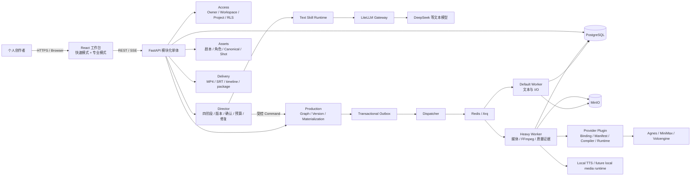
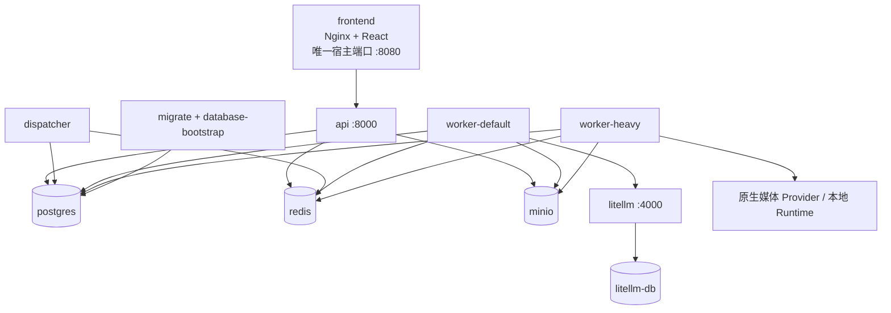
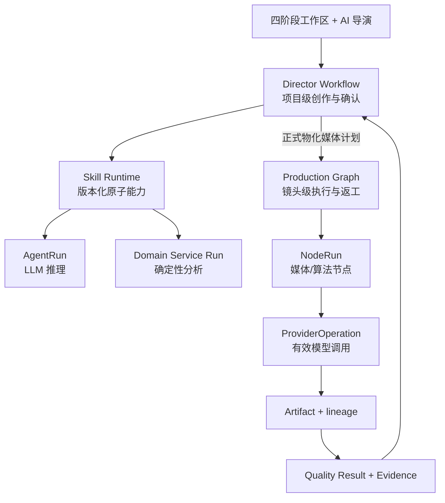

# DramaForge 运行时与领域架构

**状态：ACTIVE / 首版架构合同**

**版本：1.2**

**日期：2026-08-19**

## 1. 架构原则

第一版采用：

> **一个用户可见的 AI 导演，按已发布且版本化的作品模板调用原子专业 Skill；专业角色以受控运行记录执行，允许结构化复审和返工，不允许自由聊天式多 Agent 自治。**

AI 导演负责理解目标、整理上下文、解释方案、提出结构化变更和在允许的分支中做选择。确定性系统负责权限、状态迁移、版本、成本授权、任务执行、产物血缘和质量 Gate。

LLM 的建议永远不能直接：

- 写业务事实表；
- 修改锁定版本；
- 发起收费媒体请求；
- 绕过确认和质量 Gate；
- 拼装供应商原始请求；
- 自由增加重试次数或发明新流程节点。

## 2. 项目总体架构

DramaForge 是一个模块化单体应用加异步 Worker 集群。业务真相集中在 PostgreSQL；Redis 只承担任务和事件分发；媒体字节存入 MinIO；LiteLLM 只代理文本模型；图片、视频和声音使用原生 Provider 或本地 Runtime。

### 2.1 系统上下文



### 2.2 逻辑分层

| 层 | 职责 | 主要实现 |
|---|---|---|
| 体验层 | 四阶段创作、AI 导演侧栏、专业生产板、Provider 设置 | `frontend/src/routes`、`frontend/src/features`、`frontend/src/components` |
| API / Application | 身份、业务命令、聚合 Snapshot、下载授权；不直接执行长任务 | `backend/app/api` |
| 创作领域 | 创意、剧本、角色、分镜、版本、确认、预算、试拍和修复决策 | `backend/app/director`、`backend/app/creation`、`backend/app/assets` |
| 生产领域 | Production Graph、GraphVersion、GraphNode/Edge、物化和发布 | `backend/app/production` |
| 执行层 | NodeRun、依赖判断、幂等、缓存、局部重跑、合成和质量节点 | `backend/app/execution`、`backend/app/consistency` |
| 模型接入层 | Provider 目录、连接、Binding、Profile、Intent、Selection、Compiler、Runtime | `backend/app/providers` |
| 可靠调度层 | Outbox、Dispatcher、Arq 队列、Worker 恢复和事件 | `backend/app/events`、`backend/app/runtime`、`backend/app/workers` |
| 数据与交付 | PostgreSQL/RLS、MinIO Artifact、FFmpeg、导出和下载 | `backend/app/shared`、`backend/app/storage`、`backend/app/delivery` |
| 安全层 | Session、BYOK 加密、Secret 边界和下载授权 | `backend/app/access`、`backend/app/security` |

### 2.3 部署拓扑



部署约束：

- 只有前端网关发布宿主端口；PostgreSQL、Redis、MinIO、LiteLLM、API 和 Worker 保持 Compose 内网；
- API 与 Worker 使用受限数据库角色和 RLS 上下文，迁移使用独立管理身份；
- API 不硬依赖 LiteLLM 健康启动，文本能力不可用时显式降级或阻断相应 Skill；
- Dispatcher 只投递已提交 Outbox，不能拥有创作或生产状态机；
- Worker 只信任 Run ID，必须从数据库重建 Project、Actor、Binding、预算和版本上下文。

### 2.4 事实源与数据边界

| 事实 | 唯一来源 | 禁止的第二真相 |
|---|---|---|
| 用户、Workspace、Project 和权限 | PostgreSQL + RLS | 前端 Store、Redis 租户字段 |
| 创作内容与确认 | 不可变 CreativeArtifactVersion + ApprovalRecord | 聊天历史、可覆盖 JSON 草稿 |
| 当前阶段与允许动作 | DirectorWorkflowRun 状态机 | UI 自己推断并推进状态 |
| 生产定义 | Published GraphVersion + GraphNode/Edge | Worker 临时拼接流程 |
| 执行状态 | NodeRun / WorkflowStepRun / AgentRun | SSE 消息或队列状态 |
| Provider 实际调用 | ProviderOperation | AgentRun、NodeRun 中复制供应商响应 |
| 媒体结果 | Artifact 元数据 + MinIO 对象 | 数据库大二进制、外部短期 URL |
| 成本 | BudgetAuthorization / Reservation / ProviderOperation | LiteLLM Spend 或前端估算 |
| 发布证据 | `tmp/p0-evidence/<commit>/` 的脱敏索引 | 历史截图、口头验收 |

### 2.5 依赖方向

允许：

```text
frontend → API Command / Snapshot
API → Domain Service
Director → Skill Runtime / Production Command
Production → Execution contract
Execution → Provider abstraction / Storage
Worker → Domain/Execution service by Run ID
```

禁止：

```text
frontend → GraphNode / Provider 原始 JSON
API route → 直接 SQL / 直接 Worker / 收费 Provider
Director LLM → 数据库 / 文件 / Provider
Provider plugin → Director 或业务 Route
Redis / SSE → 业务事实源
Worker payload → 直接信任 project/user/provider 字段
```

## 3. 双层编排

不把整部作品塞进一个巨大 DAG。



### 3.1 Director Workflow

项目级、低频、可人工确认，管理：

- 创意、剧本、角色、视觉、声音和分镜的版本；
- 四阶段状态与四个硬确认点；
- Issue、变更提案、影响分析、锁定和回退；
- 风险报告、模型 Selection Plan、成本预估；
- 试拍授权、试拍验收与正式生产授权；
- 修复方案选择和生产图局部重物化。

### 3.2 Production Graph

镜头级、高频、可重试，管理：

- 图片、视频、语音、口型、字幕、合成与质检节点；
- 节点依赖、幂等、队列、重试、超时与取消；
- ProviderOperation、有效请求、成本和 Artifact 血缘；
- 单镜头或单节点局部重跑；
- 输出交付物。

Director Workflow 只能通过受控 Command 物化或修改 Production Graph，不能直接调 Worker。

## 4. 作品模板与流程模板

第一版只有一个产品级模板：

```text
work_template_id: live_action_dialogue_short
version: 1.0.0
status: published
supported_duration: 15-30s
supported_aspect_ratios: [9:16, 16:9]
stable_locale: zh-CN
```

模板发布时冻结：

- 阶段、步骤、依赖和允许分支；
- 每一步所用 Skill 版本；
- 输入/输出 Schema；
- 硬确认与预算授权位置；
- 可修改字段和锁定规则；
- Issue 责任路由；
- 最大重试和人工介入策略；
- 可选择的 Production Graph 子模板；
- 质量策略版本。

运行时导演可以在已发布模板允许的选项中选择，不能临时删步骤、换未批准模型或生成一张新图。

## 5. 四个阶段包与原子 Skill

阶段包是 UI 聚合，不是四个巨型 Skill。

| 阶段包 | 内部原子 Skill | 主要输出 |
|---|---|---|
| 创作方案 | 概念生成、编剧、对白节奏、剧情闭环检查、角色动机 | ConceptSet、StoryCore、EpisodeScript、StoryReview |
| 拍摄方案 | 角色设定、视觉锚定、声音设计、分镜、风险预审、模型选择 | CharacterBible、VisualBible、VoiceBible、Storyboard、RiskReport、SelectionPlan |
| 代表镜头试拍 | 代表镜头选择、媒体生成、人物/声音/口型/表演质检 | TrialPlan、TrialArtifacts、QualityReport、TrialReview |
| 正式生产 | 镜头生产、质量检查、修复规划、局部重跑、剪辑组装 | ShotArtifacts、RepairOptions、Program、DeliveryPackage |

第一轮实现可收敛为九个内置 Specialist Skill：

1. `story_development`：概念、主题、动机、冲突、结局、剧本与对白；
2. `story_validation`：逻辑、节奏、篇幅、闭环和对白可执行性；
3. `character_design`：角色卡、关系、外观区分与风险；
4. `visual_anchor_design`：Canonical 方案、参考资产和一致性锚点；
5. `voice_design`：声线、说话人、语速、情绪和授权来源；
6. `storyboarding`：镜头、时长、对白归属、画面/视频意图和连续性；
7. `production_preflight`：风险、代表镜头、模型能力、成本与预计耗时；
8. `quality_inspection`：结构化问题、严重度、证据和建议；
9. `repair_planning`：2–3 个定向修复方案及其影响、成本和风险。

Skill 可以由 LLM、确定性服务或两者组合完成。媒体生成和算法检测是 Production Graph 节点能力，不为了产品命名强行包装成 Agent。

## 6. Skill 合同

统一 SkillDefinition 最少包含：

```json
{
  "skill_id": "storyboarding",
  "version": "1.0.0",
  "execution_kind": "agent_run",
  "input_schema": "schema://storyboarding/input/1",
  "output_schema": "schema://storyboarding/output/1",
  "required_capabilities": ["text.reasoning.structured"],
  "allowed_commands": ["propose_storyboard_revision"],
  "permission_scope": ["read_locked_story", "write_proposal"],
  "timeout_policy": {},
  "retry_policy": {},
  "quality_policy_id": "storyboard-review-v1"
}
```

每次执行必须通过 `WorkflowStepRun` 统一追踪，并且只引用一种实际执行：

```text
WorkflowStepRun
  execution_kind = agent | node | service
  agent_run_id XOR node_run_id XOR service_run_id
  input_version_refs[]
  output_version_refs[]
  template_version
  skill_version
  trace_id
```

`Skill` 是可版本化能力合同，`AgentRun` 是一次 LLM 执行，`NodeRun` 是一次生产节点执行；三者不得混用。

## 7. AI 导演状态与动作

Director Workflow 的主状态：

```text
drafting_creative
awaiting_creative_confirmation
drafting_shooting_plan
awaiting_shooting_confirmation
awaiting_trial_authorization
trial_running
awaiting_trial_review
awaiting_production_authorization
production_running
repair_proposed
awaiting_repair_authorization
assembling
completed
needs_human
blocked
cancelled
```

允许动作由状态机白名单控制，例如：

- `propose_change`
- `confirm_change`
- `confirm_creative_plan`
- `confirm_shooting_plan`
- `authorize_trial_budget`
- `accept_trial_and_authorize_production`
- `select_repair_option`
- `authorize_repair_budget`
- `override_subjective_gate`
- `cancel_run`

LLM 输出只能是动作提案；Command Handler 再校验当前状态、Actor、版本前置条件、成本上限和幂等键。

## 8. 结构化协商与返工

专业 Skill 之间不直接聊天。发现冲突时只产生 Issue：

```json
{
  "issue_type": "character_continuity_conflict",
  "source_stage": "storyboard",
  "responsible_stage": "character_design",
  "severity": "blocking",
  "evidence": [],
  "suggested_actions": ["revise_shot", "revise_character_anchor"],
  "affected_version_refs": []
}
```

唯一合法回路：

```text
Issue → Director Decision → Targeted Revision Proposal
      → User Confirmation（若改变创作事实/成本）
      → New Version → Validation
```

超过模板重试上限或证据冲突时转 `needs_human`，不能让 Agent 无限讨论。

## 9. 版本、锁定和影响分析

以下都是不可变版本对象，修改只产生新版本：

- StoryCore、SeasonPlan、EpisodeScript；
- CharacterBible、VisualBible、VoiceBible；
- StoryboardPlan；
- RiskReport、SelectionPlan、CostEstimate；
- TrialPlan、TrialReview；
- QualityPolicy 和 WorkflowTemplate。

确认会生成 `ApprovalRecord` 并锁定输入版本。变更锁定内容前，`ImpactAnalysisService` 基于版本引用和 Production Graph 血缘计算：

- 被替代和失效的版本；
- 受影响镜头与节点；
- 可继续复用的 Artifact；
- 需要撤销的 Approval；
- 预计新增费用与耗时。

影响报告经过用户确认后才执行 `ApplyChangeCommand`。不要把“回滚”实现为覆盖旧记录或删除 Artifact。

## 10. 媒体能力与模型选择

分镜 Skill 只输出供应商无关的意图：

```text
ImageGenerationIntent
VideoGenerationIntent
SpeechGenerationIntent
LipSyncIntent
```

意图必须包含创作语义、画幅、时长、角色/场景/参考资产引用和所需能力。`ModelSelectionService` 读取版本化能力档案，生成可执行 `SelectionPlan`：

- 主模型与理由；
- 模型/端点版本；
- 必需参考方式与高级参数映射；
- 能力缺口和降级；
- 成本/时延估算；
- 允许的回退路径；
- 对应质量策略。

Provider Compiler 把意图编译为供应商请求，并保存脱敏后的 `EffectiveRequest` 与 `TranslationReport`。模型有能力但插件没有表达或参数被丢弃时必须阻断，不能悄悄退化为纯文本提示。

第一版允许两个预先发布的镜头图模板：

- `dialogue-native-audio-shot-v1`：视频模型原生承担人物表演/对白音频；
- `dialogue-post-dub-shot-v1`：视频画面 + 合规 TTS + 口型/合成节点。

只有通过能力与质量验证的模板可被 Selection Plan 选择。

## 11. 现有代码迁移映射

本表基于 2026-08-19 的 `dev@5df1332` 审计，模块路径描述当前实现边界，不代表真实 Provider、用户或发布 Gate 已通过：

| 当前证据路径 | 审计判断 |
|---|---|
| `backend/app/director/` | DirectorWorkflow、版本化创作对象、WorkflowStepRun、确认、预算、变更影响、试拍、质量与修复已有第一轮实现 |
| `backend/app/production/service.py` | 通用 Graph 校验、版本与物化能力继续作为媒体生产层 |
| `backend/app/director/production_templates.py` | 已发布 `dialogue-post-dub-shot-v1`；旧 `shot-p0-v1` 只作历史兼容，不进入新 Director 主链 |
| `backend/app/events/outbox.py`、`backend/app/runtime/scheduler.py` | 事务后派发和异步执行底座，保持确定性边界 |
| `backend/app/providers/` | Intent、Manifest、Selection、Compiler、Runtime、参考交付与多 Provider 已实现；Unified/Legacy Media Path 仍待收敛 |
| `backend/app/providers/model_profiles/` | Production Profile 已提供版本化 Slot 绑定；继续作为选择快照与能力档案，不另造平行配置系统 |
| `frontend/src/routes/projects.$projectId.quick.tsx` | 四阶段业务页已实现；Phase 1.5 高保真样板仍需接入真实后端 |
| `frontend/src/routes/projects.$projectId.production.tsx` | 专业生产板已接入版本、质量、局部修复和交付事实；浏览器全链仍有失败用例 |

### 11.1 保留并演进

| 现有模块 | 处理 |
|---|---|
| `production` Graph 定义、版本和物化 | 保留，作为 Production Graph 核心 |
| `execution`、NodeRun、调度器、Outbox/Arq | 保留，补充新节点类型、授权上下文和局部失效 |
| Provider Plugin / Manifest / Production Profile | 保留，补齐能力档案、有效请求证据、选择和回退 |
| Artifact、对象存储和 Delivery | 保留，补版本与质量证据引用 |
| Access / Workspace / Project | 保留数据边界；默认单 Owner，关闭公开注册 |
| 审核与锁 | 复用语义，统一到 ApprovalRecord / GateDecision |

### 11.2 已完成的结构迁移

| 旧实现 | 当前结果 |
|---|---|
| `creation` 中仅 Brief/Plan 的 AgentRun | 已增加 DirectorWorkflow、WorkflowStepRun 和版本化创作对象 |
| `quickWorkflow` 与五步 Quick UI | 已实现四阶段业务页、AI 导演侧栏、变更预览与四次确认 |
| 固定 10 Shot 物化 | 已按确认后的 Storyboard 动态物化，3–6 只是模板建议 |
| `shot-p0-v1` | 新 Director 使用 `dialogue-post-dub-shot-v1` 和多层质量节点 |
| 单一 face gate | 已移除生物特征依赖，改为分维度证据与人工覆盖审计 |
| first capable / 隐式模型选择 | 已引入 Selection Plan、Binding、Manifest 和能力缺口阻断 |
| 旧 production 页面 | 已接入逐镜验收、局部修复、成本和交付血缘 |

### 11.3 当前待收口能力

- Unified Media Path 成为唯一生产主路径并删除 Legacy Media Path；
- 项目级 Canonical Reference Set 已完成试拍生成、接受提升和正式生产缓存复用；待真实请求证明三个镜头使用同一 Artifact 哈希；
- EffectiveRequest / TranslationReport 的真实 Provider 证据；
- 试拍页面直接展示视频、音频和时序帧证据；
- 真正的 lip-sync 或明确保持 post-dub 人工验收边界；
- 多信号质量证据与人工标注集；
- 趋势来源适配与人工导入；
- 当前候选的 Linux/Windows/macOS 支持矩阵。

## 12. API 与前端边界

推荐按业务命令而不是通用 CRUD 暴露：

```text
POST /projects/{id}/director/proposals
POST /projects/{id}/director/proposals/{proposal_id}/confirm
POST /projects/{id}/approvals/creative
POST /projects/{id}/approvals/shooting
POST /projects/{id}/authorizations/trial
POST /projects/{id}/reviews/trial
POST /projects/{id}/authorizations/production
POST /projects/{id}/repairs/{repair_id}/authorize
GET  /projects/{id}/workspace-snapshot
```

前端读一个聚合 snapshot 展示阶段、锁定版本、运行状态、风险、费用和下一步动作；写入只能调用明确 Command。禁止前端直接组合生产节点或以 UI 状态代替后端状态机。

## 13. 架构 Gate

任何实现任务合并前都必须回答：

1. 属于 Director Workflow 还是 Production Graph？
2. 是 Skill、AgentRun、NodeRun 还是确定性服务？
3. 输入输出版本和事实源是什么？
4. 哪个状态允许执行，谁授权？
5. 是否产生媒体费用，预算记录在哪里？
6. 哪些下游会被变更失效，是否可局部重跑？
7. 有效请求和质量证据如何追溯？
8. 失败时如何停止，不会无限讨论或重试？

答不清楚就先补合同或 ADR，不写实现。

## 14. 架构确认表

本表确认架构是否成立，不代替发布 Gate。状态只使用以下四种语义：

- `CONFIRMED`：架构决定已冻结，当前实现和自动化证据足以继续沿此方向开发；
- `PARTIAL`：架构方向确认，但当前 HEAD 仍有双路径、Mock、旧候选证据或真实链缺口；
- `OPEN`：只有设计或局部代码，尚不能作为稳定能力依赖；
- `REJECTED`：已经明确不采用或不允许恢复的设计。

### 14.1 架构决定

| ID | 架构问题 | 决定 | 状态 | 当前边界 |
|---|---|---|---|---|
| AD-01 | 产品编排是否使用一个巨大 DAG | 使用 Director Workflow 管项目级创作与确认，Production Graph 管镜头级媒体执行 | `CONFIRMED` | 两层只能通过受控 Command 交接；Director 不直接调 Worker |
| AD-02 | 快速模式和专业模式是否建立两套项目 | 两种模式共享同一个 Project、版本、批次、Artifact、成本和质量事实 | `CONFIRMED` | UI 可以不同，领域对象和状态机不得复制 |
| AD-03 | AI 是否可以直接修改项目或调用 Provider | LLM 只产生结构化提案；确定性 Command Handler 校验状态、版本、Actor、预算和幂等 | `CONFIRMED` | 不允许写库工具、供应商 JSON、无限重试或绕过确认 |
| AD-04 | 专业角色如何组织 | 一个用户可见 AI 导演调用版本化原子 Skill；AgentRun、ServiceRun、NodeRun 分开追踪 | `CONFIRMED` | 不采用自由聊天式多 Agent 自治 |
| AD-05 | Provider 如何接入 | 业务表达 Intent；Binding/Manifest 决定能力；Compiler 生成原生请求；Runtime 负责提交和恢复 | `CONFIRMED` | Provider 特有字段只能存在于插件/Compiler，不进入业务层 |
| AD-06 | 文本与媒体是否都经过 LiteLLM | 文本可经 LiteLLM Gateway；图片、视频和声音使用原生 Provider/Local Runtime | `CONFIRMED` | LiteLLM 不是媒体总线；业务成本账本仍属于 DramaForge |
| AD-07 | 质量是否压缩成一个自动总分 | 人物、技术、声音、口型、连续性、叙事和用户接受分维度记录 | `CONFIRMED` | 自动证据不足返回 `needs_human`，不能伪造通过 |
| AD-08 | 人物一致性是否使用单一人脸阈值 | 首版不使用人脸 embedding 或单一身份相似度 Gate | `REJECTED` | 未来评估器须经许可、校准、分桶误差和单独发布决策 |
| AD-09 | 旧资产库、故事板、候选治理和时间线是否删除 | 保留为同一生产底座上的后续扩展层，首版冻结非必要入口 | `CONFIRMED` | 不得为了保留未来能力而阻塞首个真实作品闭环 |

### 14.2 六项架构证明

每项必须同时记录自动化、真实运行和当前候选 commit。旧 P0、Mock 或其他 commit 的证据只能支持 `PARTIAL`，不能关闭当前候选。

| ID | 要证明什么 | 最小验收场景 | 必须断言 | 当前事实（`dev@5df1332`） | 状态 | 下一关闭动作 |
|---|---|---|---|---|---|---|
| AP-01 | 快速/专业模式共用一个事实源 | 快速模式确认 StoryCore 新版本，专业模式读取同一 revision、批次和预算状态 | Project/版本 ID 相同；无复制 Artifact；旧批次与预算血缘不丢失 | `0cb923f` 有 source-bound A2 PASS；当前 HEAD 尚未重验 | `PARTIAL` | 在当前干净候选重跑 authenticated live-stack 场景 |
| AP-02 | 版本与影响分析不是展示层 | 已有试拍或静态媒体后修改锁定故事 | 产生新版本；列出失效版本/镜头；保留已发生费用；释放未结算预留；不静默复用失效媒体 | Change/Impact、批次取代和预算释放已有代码及测试；缺当前 HEAD 真实媒体场景 | `PARTIAL` | 用一个真实试拍项目执行改结局并核对数据库、API 和双模式 UI |
| AP-03 | Provider 插件化不是移动硬编码 | 同一 I2V Intent 分别编译为 Agnes、MiniMax 或 Volcengine 请求 | 业务层无模型名分支；原生 payload 不同；不支持参数 fail-closed；保存 EffectiveRequest/TranslationReport | 相关聚焦合同测试 92 项通过；Unified/Legacy Media Path 仍并存，统一开关默认关闭 | `PARTIAL` | 在干净候选启用 Unified Path，完成 Agnes 一次真实 I2I/I2V 后删除生产主链 Legacy 依赖 |
| AP-04 | 预算与付费请求边界真实有效 | 无授权、过期授权、低于估算和有效授权四种情况 | 前三种 Provider POST 为 0；有效授权只覆盖冻结 Binding、价格、镜头和次数；实际费用结算可追溯 | Command、执行 Guard 和 Spy 测试存在；当前 Director 真实费用证据未关闭 | `PARTIAL` | 按 real-provider preflight 执行一次单请求授权并核对 ProviderOperation/Reservation |
| AP-05 | 局部修复真的只影响必要范围 | 一个真实视频镜头因质量问题被拒绝，选择“复用关键帧，仅重试视频” | 只新建 video、video_drift_review、composite、continuity_review；复用 keyframe/voice/subtitle；额外预算单独授权 | Agnes shot-1 已被真实拒绝，修复范围已计算；尚未执行付费重拍 | `PARTIAL` | 获得单次修复授权后执行重拍并比较新旧 NodeRun/Artifact 血缘 |
| AP-06 | 整体架构能交付真实用户价值 | 1 个主角、3 个镜头、15–25 秒的完整作品 | 完成四阶段、四确认、真实试拍、逐镜验收、至少一次局部修复和四项交付；所有证据同一 commit | 尚无新版 Director 完整作品；只有单镜头真实 Agnes 失败证据 | `OPEN` | AP-01 至 AP-05 收口后运行冻结黄金样本，再进入三名目标用户测试 |

### 14.3 不能用来确认架构的证据

- 只有 Schema、ORM、路由或组件存在；
- 单元测试用 Fake/Mock 返回预期 JSON；
- Provider API 返回成功但没有有效请求、费用和 Artifact 血缘；
- 旧固定 10 Shot 流程在其他 commit 上通过；
- 高保真设计预览可交互但没有连接真实后端；
- 自动分数通过但用户看见明显换脸、肢体异常、声音串位或叙事错误；
- 开发者在用户测试中代操作数据库、队列、Provider 控制台或核心流程。

### 14.4 架构冻结条件

以下条件同时满足后，首版架构从“方向确认”进入“实现冻结”：

1. AP-01 至 AP-05 在同一个干净候选 commit 上关闭；
2. 文本只保留已验证的 LiteLLM V3 主路径，媒体只保留已验证的 Unified Provider 主路径；
3. 项目级 Canonical Reference Set 能被三个镜头复用，并在真实请求中保留同一 Artifact 哈希；
4. Agnes 等首发模型的画幅、时长、参考方式和音频能力与 Manifest、Compiler、真实请求一致；
5. 试拍页面能直接审阅视频、音频、关键帧和质量限制，而不是只显示节点状态；
6. AP-06 的黄金样本完整交付，且没有通过人工改库或手工拼接绕过产品流程。

架构冻结后才开始清理历史主流程、物理归档旧规划和扩展 P1 能力；冻结前不新增第二作品模板、自由工作流或更多 Provider。
