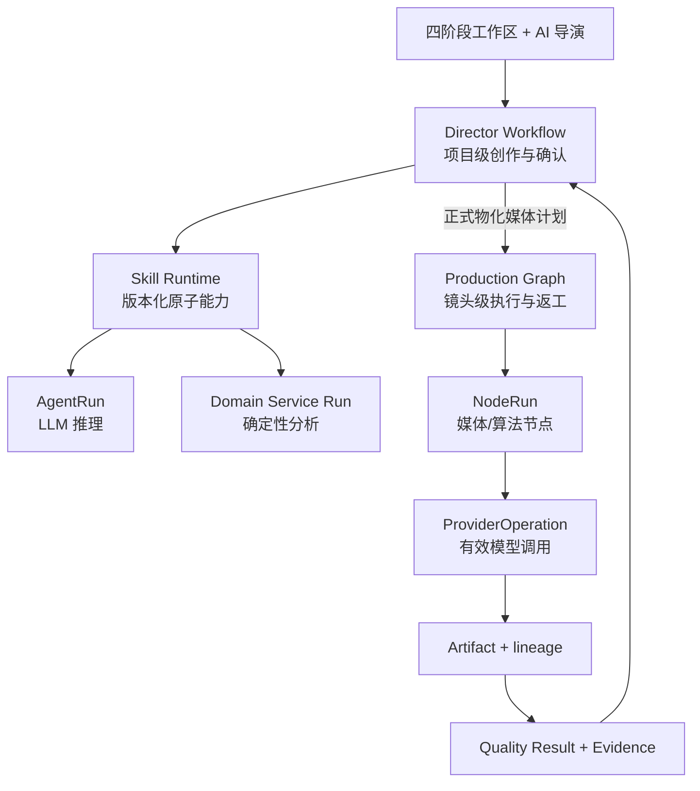

# DramaForge 运行时与领域架构

**状态：ACTIVE / 首版架构合同**

**版本：1.0**

**日期：2026-08-12**

## 1. 架构原则

第一版采用：

> **一个用户可见的 AI 导演，按已发布且版本化的作品模板调用原子专业 Skill；专业角色以受控运行记录执行，允许结构化复审和返工，不允许自由聊天式多 Agent 自治。**

AI 导演负责理解目标、整理上下文、解释方案、提出结构化变更和在允许的分支中做选择。确定性系统负责权限、状态迁移、版本、成本授权、任务执行、产物血缘和质量 Gate。

LLM 的建议永远不能直接：

- 写业务事实表；
- 修改锁定版本；
- 发起收费媒体请求；
- 绕过确认和质量 Gate；
- 拼装供应商原始请求；
- 自由增加重试次数或发明新流程节点。

## 2. 双层编排

不把整部作品塞进一个巨大 DAG。



### 2.1 Director Workflow

项目级、低频、可人工确认，管理：

- 创意、剧本、角色、视觉、声音和分镜的版本；
- 四阶段状态与四个硬确认点；
- Issue、变更提案、影响分析、锁定和回退；
- 风险报告、模型 Selection Plan、成本预估；
- 试拍授权、试拍验收与正式生产授权；
- 修复方案选择和生产图局部重物化。

### 2.2 Production Graph

镜头级、高频、可重试，管理：

- 图片、视频、语音、口型、字幕、合成与质检节点；
- 节点依赖、幂等、队列、重试、超时与取消；
- ProviderOperation、有效请求、成本和 Artifact 血缘；
- 单镜头或单节点局部重跑；
- 输出交付物。

Director Workflow 只能通过受控 Command 物化或修改 Production Graph，不能直接调 Worker。

## 3. 作品模板与流程模板

第一版只有一个产品级模板：

```text
work_template_id: live_action_dialogue_short
version: 1.0.0
status: published
supported_duration: 15-30s
supported_aspect_ratios: [9:16, 16:9]
stable_locale: zh-CN
```

模板发布时冻结：

- 阶段、步骤、依赖和允许分支；
- 每一步所用 Skill 版本；
- 输入/输出 Schema；
- 硬确认与预算授权位置；
- 可修改字段和锁定规则；
- Issue 责任路由；
- 最大重试和人工介入策略；
- 可选择的 Production Graph 子模板；
- 质量策略版本。

运行时导演可以在已发布模板允许的选项中选择，不能临时删步骤、换未批准模型或生成一张新图。

## 4. 四个阶段包与原子 Skill

阶段包是 UI 聚合，不是四个巨型 Skill。

| 阶段包 | 内部原子 Skill | 主要输出 |
|---|---|---|
| 创作方案 | 概念生成、编剧、对白节奏、剧情闭环检查、角色动机 | ConceptSet、StoryCore、EpisodeScript、StoryReview |
| 拍摄方案 | 角色设定、视觉锚定、声音设计、分镜、风险预审、模型选择 | CharacterBible、VisualBible、VoiceBible、Storyboard、RiskReport、SelectionPlan |
| 代表镜头试拍 | 代表镜头选择、媒体生成、人物/声音/口型/表演质检 | TrialPlan、TrialArtifacts、QualityReport、TrialReview |
| 正式生产 | 镜头生产、质量检查、修复规划、局部重跑、剪辑组装 | ShotArtifacts、RepairOptions、Program、DeliveryPackage |

第一轮实现可收敛为九个内置 Specialist Skill：

1. `story_development`：概念、主题、动机、冲突、结局、剧本与对白；
2. `story_validation`：逻辑、节奏、篇幅、闭环和对白可执行性；
3. `character_design`：角色卡、关系、外观区分与风险；
4. `visual_anchor_design`：Canonical 方案、参考资产和一致性锚点；
5. `voice_design`：声线、说话人、语速、情绪和授权来源；
6. `storyboarding`：镜头、时长、对白归属、画面/视频意图和连续性；
7. `production_preflight`：风险、代表镜头、模型能力、成本与预计耗时；
8. `quality_inspection`：结构化问题、严重度、证据和建议；
9. `repair_planning`：2–3 个定向修复方案及其影响、成本和风险。

Skill 可以由 LLM、确定性服务或两者组合完成。媒体生成和算法检测是 Production Graph 节点能力，不为了产品命名强行包装成 Agent。

## 5. Skill 合同

统一 SkillDefinition 最少包含：

```json
{
  "skill_id": "storyboarding",
  "version": "1.0.0",
  "execution_kind": "agent_run",
  "input_schema": "schema://storyboarding/input/1",
  "output_schema": "schema://storyboarding/output/1",
  "required_capabilities": ["text.reasoning.structured"],
  "allowed_commands": ["propose_storyboard_revision"],
  "permission_scope": ["read_locked_story", "write_proposal"],
  "timeout_policy": {},
  "retry_policy": {},
  "quality_policy_id": "storyboard-review-v1"
}
```

每次执行必须通过 `WorkflowStepRun` 统一追踪，并且只引用一种实际执行：

```text
WorkflowStepRun
  execution_kind = agent | node | service
  agent_run_id XOR node_run_id XOR service_run_id
  input_version_refs[]
  output_version_refs[]
  template_version
  skill_version
  trace_id
```

`Skill` 是可版本化能力合同，`AgentRun` 是一次 LLM 执行，`NodeRun` 是一次生产节点执行；三者不得混用。

## 6. AI 导演状态与动作

Director Workflow 的主状态：

```text
drafting_creative
awaiting_creative_confirmation
drafting_shooting_plan
awaiting_shooting_confirmation
awaiting_trial_authorization
trial_running
awaiting_trial_review
awaiting_production_authorization
production_running
repair_proposed
awaiting_repair_authorization
assembling
completed
needs_human
blocked
cancelled
```

允许动作由状态机白名单控制，例如：

- `propose_change`
- `confirm_change`
- `confirm_creative_plan`
- `confirm_shooting_plan`
- `authorize_trial_budget`
- `accept_trial_and_authorize_production`
- `select_repair_option`
- `authorize_repair_budget`
- `override_subjective_gate`
- `cancel_run`

LLM 输出只能是动作提案；Command Handler 再校验当前状态、Actor、版本前置条件、成本上限和幂等键。

## 7. 结构化协商与返工

专业 Skill 之间不直接聊天。发现冲突时只产生 Issue：

```json
{
  "issue_type": "character_continuity_conflict",
  "source_stage": "storyboard",
  "responsible_stage": "character_design",
  "severity": "blocking",
  "evidence": [],
  "suggested_actions": ["revise_shot", "revise_character_anchor"],
  "affected_version_refs": []
}
```

唯一合法回路：

```text
Issue → Director Decision → Targeted Revision Proposal
      → User Confirmation（若改变创作事实/成本）
      → New Version → Validation
```

超过模板重试上限或证据冲突时转 `needs_human`，不能让 Agent 无限讨论。

## 8. 版本、锁定和影响分析

以下都是不可变版本对象，修改只产生新版本：

- StoryCore、SeasonPlan、EpisodeScript；
- CharacterBible、VisualBible、VoiceBible；
- StoryboardPlan；
- RiskReport、SelectionPlan、CostEstimate；
- TrialPlan、TrialReview；
- QualityPolicy 和 WorkflowTemplate。

确认会生成 `ApprovalRecord` 并锁定输入版本。变更锁定内容前，`ImpactAnalysisService` 基于版本引用和 Production Graph 血缘计算：

- 被替代和失效的版本；
- 受影响镜头与节点；
- 可继续复用的 Artifact；
- 需要撤销的 Approval；
- 预计新增费用与耗时。

影响报告经过用户确认后才执行 `ApplyChangeCommand`。不要把“回滚”实现为覆盖旧记录或删除 Artifact。

## 9. 媒体能力与模型选择

分镜 Skill 只输出供应商无关的意图：

```text
ImageGenerationIntent
VideoGenerationIntent
SpeechGenerationIntent
LipSyncIntent
```

意图必须包含创作语义、画幅、时长、角色/场景/参考资产引用和所需能力。`ModelSelectionService` 读取版本化能力档案，生成可执行 `SelectionPlan`：

- 主模型与理由；
- 模型/端点版本；
- 必需参考方式与高级参数映射；
- 能力缺口和降级；
- 成本/时延估算；
- 允许的回退路径；
- 对应质量策略。

Provider Compiler 把意图编译为供应商请求，并保存脱敏后的 `EffectiveRequest` 与 `TranslationReport`。模型有能力但插件没有表达或参数被丢弃时必须阻断，不能悄悄退化为纯文本提示。

第一版允许两个预先发布的镜头图模板：

- `dialogue-native-audio-shot-v1`：视频模型原生承担人物表演/对白音频；
- `dialogue-post-dub-shot-v1`：视频画面 + 合规 TTS + 口型/合成节点。

只有通过能力与质量验证的模板可被 Selection Plan 选择。

## 10. 现有代码迁移映射

本表基于 2026-08-12 的 `dev@3c8f795` 只读审计，模块路径是迁移起点，不代表已满足新合同：

| 当前证据路径 | 审计判断 |
|---|---|
| `backend/app/creation/models.py` | 当前 AgentRun 主要围绕 Brief/Plan，作为通用 Skill 执行记录的迁移起点 |
| `backend/app/production/service.py` | 已有通用 Graph 校验、版本与物化能力，应保留为媒体生产层 |
| `backend/app/execution/shot_pipeline.py` | 当前 `shot-p0-v1` 固定节点链，需发布新 ShotGraphTemplate 替代，不在原地继续叠节点 |
| `backend/app/events/outbox.py`、`backend/app/runtime/scheduler.py` | 事务后派发和异步执行底座，保持确定性边界 |
| `backend/app/providers/` | 已有 Intent、能力、选择、翻译、参考交付与多 Provider 基础；需补齐有效请求/翻译证据和严格缺口语义 |
| `backend/app/providers/model_profiles/` | 现有 Production Profile 可演进为版本化选择快照与能力档案，不另造平行配置系统 |
| `frontend/src/routes/projects.$projectId.quick.tsx`、`frontend/src/lib/quickWorkflow.ts` | 当前 Brief/Plan/固定生产 UI，重写为四阶段工作区 |
| `frontend/src/routes/projects.$projectId.production.tsx` | 作为专业模式起点，补阶段版本、试拍、质量对比、修复和逐镜头接管 |

### 10.1 保留并演进

| 现有模块 | 处理 |
|---|---|
| `production` Graph 定义、版本和物化 | 保留，作为 Production Graph 核心 |
| `execution`、NodeRun、调度器、Outbox/Arq | 保留，补充新节点类型、授权上下文和局部失效 |
| Provider Plugin / Manifest / Production Profile | 保留，补齐能力档案、有效请求证据、选择和回退 |
| Artifact、对象存储和 Delivery | 保留，补版本与质量证据引用 |
| Access / Workspace / Project | 保留数据边界；默认单 Owner，关闭公开注册 |
| 审核与锁 | 复用语义，统一到 ApprovalRecord / GateDecision |

### 10.2 必须重构

| 现有实现 | 目标 |
|---|---|
| `creation` 中仅 Brief/Plan 的 AgentRun | DirectorWorkflow、WorkflowStepRun、通用 AgentRun 和版本化创作对象 |
| `quickWorkflow` 与五步 Quick UI | 四阶段工作区、AI 导演侧栏、变更预览与四次确认 |
| 固定 10 Shot 物化 | 根据已确认 Storyboard 动态物化，3–6 仅为模板建议 |
| `shot-p0-v1` | 首版两个受控 ShotGraphTemplate 与质量节点 |
| 单一 face gate | 多层质量结果和人工可覆盖决策 |
| 显式 binding / first capable | 可解释 Selection Plan、缺口阻断和已批准 fallback |
| 当前 production 页面 | 首版专业模式：逐阶段/逐镜头接管、对比、修复和血缘 |

### 10.3 缺失能力

- WorkflowTemplate / DirectorWorkflowRun / StageRun；
- SkillDefinition / WorkflowStepRun / ServiceRun；
- Issue / ChangeProposal / ImpactReport；
- ApprovalRecord / BudgetAuthorization；
- TrialPlan / TrialReview；
- RepairOption / RepairAuthorization；
- EffectiveRequest / TranslationReport；
- ModelCapabilityProfile / QualityPolicy；
- 多信号质量证据与人工标注集；
- 趋势来源适配与人工导入；
- 单 Owner 安装向导和支持矩阵。

## 11. API 与前端边界

推荐按业务命令而不是通用 CRUD 暴露：

```text
POST /projects/{id}/director/proposals
POST /projects/{id}/director/proposals/{proposal_id}/confirm
POST /projects/{id}/approvals/creative
POST /projects/{id}/approvals/shooting
POST /projects/{id}/authorizations/trial
POST /projects/{id}/reviews/trial
POST /projects/{id}/authorizations/production
POST /projects/{id}/repairs/{repair_id}/authorize
GET  /projects/{id}/workspace-snapshot
```

前端读一个聚合 snapshot 展示阶段、锁定版本、运行状态、风险、费用和下一步动作；写入只能调用明确 Command。禁止前端直接组合生产节点或以 UI 状态代替后端状态机。

## 12. 架构 Gate

任何实现任务合并前都必须回答：

1. 属于 Director Workflow 还是 Production Graph？
2. 是 Skill、AgentRun、NodeRun 还是确定性服务？
3. 输入输出版本和事实源是什么？
4. 哪个状态允许执行，谁授权？
5. 是否产生媒体费用，预算记录在哪里？
6. 哪些下游会被变更失效，是否可局部重跑？
7. 有效请求和质量证据如何追溯？
8. 失败时如何停止，不会无限讨论或重试？

答不清楚就先补合同或 ADR，不写实现。
