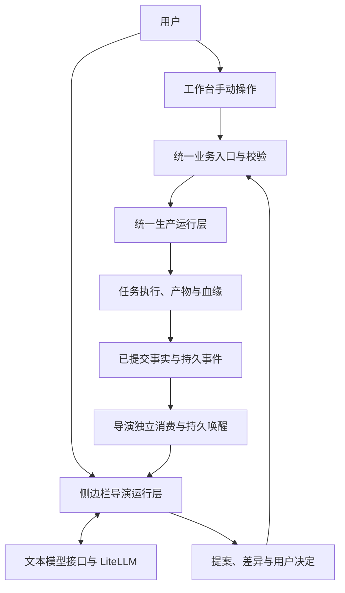

# DramaForge 导演与工作台设计方案总结

日期：2026-09-09  
属性：既有对话与方案的总结稿；不替代项目权威规划，不代表已启动或完成实施。  
配套文档：[执行方案总结](./DramaForge_导演与工作台_执行方案总结_20260909.md)

## 1. 产品目标

建立完整的影视制作工作台，并提供可选的侧边栏导演智能体。用户可以让导演自动推进、选择性采纳建议，也可以完全停用导演，通过工作台独立完成整个制作流程。

完整主链：

**创建项目 → 故事与剧本 → 场景、镜头与资产 → 创作设计与模型配置 → 媒体生成 → 候选与正式素材 → 审片与修复 → 剪辑、音频与字幕 → 成片导出。**

每个必经步骤均具有独立的工作台入口。手动制作仍由系统负责参数校验、依赖检查、任务调度、失败提示、恢复与产物管理。

## 2. 中文模式与交互

产品界面的模式名称统一使用中文。本总结仅规定展示用语，不要求修改既有内部枚举或接口字段。

| 模式名称 | 导演职责 | 用户操作与确认 |
|---|---|---|
| 自动推进 | 理解目标、形成提案，在有效授权内调用业务能力；生产完成后继续分析至下一确认点 | 审阅方案、确认必要操作，随时修改、介入或停止 |
| 辅助创作 | 分析项目，提供可预览、可部分采纳的建议 | 全部采纳、部分采纳或拒绝，通过工作台触发执行 |
| 手动创作 | 不自动分析或续接；用户主动召回时才提供帮助，也可完全停用 | 独立完成全部制作、审片、剪辑和导出 |

三种模式共享同一项目，可以中途切换，已有草稿、任务、候选、正式素材和剪辑结果继续保留。

模板创建与自由创建决定项目初始化方式，与导演参与模式相互独立。自由创建可以使用自动推进，模板创建也可以全程手动创作。

## 3. 架构与职责

采用一套工作台业务能力、独立导演运行层和统一生产运行层。

| 层次 | 负责内容 | 边界 |
|---|---|---|
| 导演运行层 | 上下文、模型与工具循环、提案、等待用户或生产、暂停与恢复 | 通过业务接口操作作品，不直接调用媒体供应商或写生产事实 |
| 统一业务层 | 创建、编辑、应用提案、保存、生成、正式素材确认、修复和导出 | 统一校验身份、项目范围、授权、事实版本、模型能力和命令幂等 |
| 生产运行层 | NodeRun、Outbox、Arq Worker、ProviderOperation、Artifact、远端恢复与产物血缘 | 独立提交与执行，不等待导演状态更新 |
| 工作台界面 | 草稿、预览、用户决定和两侧服务端状态展示 | 不在浏览器中持有自动推进循环，不以聊天消息推断生产成功 |

两侧通过版本化业务命令、稳定执行回执、只读事实接口和持久事件连接。可继续同仓库、同后端镜像，共享 PostgreSQL、Redis 等基础设施；导演使用独立事务、队列、执行进程和恢复入口。共享基础设施整体故障不属于导演故障隔离的承诺范围。

## 4. 导演运行层选型

| 选项 | 本方案定位 |
|---|---|
| Python LangGraph | 主选验证对象，承担有界流程、持久等待和暂停恢复 |
| 现有 LiteLLM 文本接入 | 继续复用模型解析、绑定、协议适配和调用能力 |
| 既有 Arq 生产体系 | 继续承担媒体与成片生产；导演另设队列和执行角色 |
| Pi agent-core／SDK | 首要备选，在相同业务契约和验收条件下验证 |
| Claude Agent SDK | 明确采用 Claude 主导导演路线时的备选 |

上述选型沿用附件结论，尚未完成项目内运行验证。先完成最小闭环与恢复、隔离、幂等验证，再锁定版本并启用新轮次。

框架负责流程位置与恢复，应用仍负责业务工具、有效意图、授权、回执、模型身份和实际生产。框架检查点不能保证外部业务副作用只发生一次，也不能代替业务回执。

## 5. 业务规则与状态权威

### 5.1 用户确认与授权

- 提案采纳、应用、保存、开始生成、选为正式素材、最终导出分别校验。
- 自动推进仅在有效授权覆盖对象、动作、模型和次数时执行；正式素材确认及最终导出保留用户确认。
- 已有有效授权不因刷新或恢复重复询问；范围变化、过期或撤销后重新核验。
- 用户已确认值优先于已采纳提案、项目覆盖和模板／技能／风格默认值。
- 部分采纳只应用选中内容；拒绝记录持久保存，同一上下文下不反复自动提出已拒绝建议。

### 5.2 停止、切换与过期

- 收起侧边栏只改变显示；暂停导演或切换手动创作才改变自动执行权限。
- 停止导演阻止后续自动动作，已受理生产继续运行；取消生产使用独立操作。
- 恢复先读取当前事实，命令受理前再次校验授权、锁定字段、模型绑定和预期版本。
- 用户修改设计、替换正式素材或撤销授权后，旧动作不得继续按过期依据执行。
- 导演等待期间保留用户草稿，异步返回不得覆盖未保存编辑。

### 5.3 唯一事实与可靠恢复

- 项目、提案应用结果、正式素材、生产状态和产物以既有领域记录为准。
- 检查点保存流程位置和业务引用，不产生第二套作品、产物或生产成功事实。
- 每个导演轮次只有一个有效推进者，新旧引擎按轮次分流。
- 命令首次提交前持久保存稳定标识与输入指纹；同标识同输入返回原回执，不同输入产生冲突。
- 生产事实、回执与必要事件同事务提交；导演独立保存事件接收和待唤醒记录后再确认消息。
- 事件至少一次投递，通过去重、版本检查和事实重读收敛；发布成功不等于导演已处理。
- 等待用户或生产时持久暂停并释放执行资源；模型调用、工具调用、修复和总时限均有界。
- 已持久保存的文本结果在恢复时复用；提交结果未知时先核对，不盲目重发或切换模型。
- 上下文、授权、检查点和恢复接口均按用户、工作区与项目隔离。

## 6. 现有基础与改造范围

本次核对源码基线为 `4de7acd14481e262346fb0a4802d7725586194ed`。现有真实文本导演、轮次记录、用户决定、生产链、审片修复、剪辑与字幕交付能力继续复用。

当前主要改造点：

| 当前情况 | 目标处理 |
|---|---|
| 生产接口提交前同步调用导演跟踪 | 改为业务事实与事件提交后，由导演独立消费 |
| 导演直接理解 NodeRun、Graph 与内部快照 | 生产侧提供稳定的事实读取接口 |
| 文本传输混合轮次、事务、模型调用与审计 | 分离编排、上下文、调用记录、模型传输和提案服务 |
| 生产执行角色同时承担导演恢复 | 独立导演队列、进程与恢复资源 |
| 现有下一步协调主要形成确认点 | 增加有界模型／工具循环、授权执行与持久续接 |

保留一个产品、一条创作主链和统一生产事实；不重建生产内核、媒体产物体系或通用多智能体平台。现有画布、导航、组件和剪辑交付体系按受影响范围调整。

## 7. 设计验收原则

必须证明自动推进、辅助创作、导演服务停止条件下的手动创作，均能完成完整制作流程。手动路径从空项目开始，不能用“没有自动调用”替代全流程验收。

同时验证故障隔离、跨进程恢复、防重复执行、最新用户决定、项目隔离和成片血缘。仅改剪辑或字幕后重导出，图片／视频生成调用增量应为零。

已有 V1 候选的验收记录保留；新导演运行层必须取得独立候选证据后才能声明完成。具体任务和验收见配套执行方案。

## 8. 来源

- [讨论任务](codex://threads/01a085d1-a1c0-7bd2-8915-04f281d3364d)：导演与生产解耦，以及三种方式均完成全流程的用户要求。
- [设计附件](/D:/DramaForge_V1.1_设计方案_20260907.md)：内容版本为 2026-09-09。
- [实施附件](</D:/DramaForge_V1.1_实施方案_20260907_修订版 (1).md>)：D0–D8 增量任务。
- [项目权威入口](./docs/plans/professional-program-v2/README.md)。
- [既有 V1 状态](./docs/plans/professional-program-v2/v1-goal/GOAL-STATUS-20260903.md)。
- [现有下一步协调合同](./docs/plans/professional-program-v2/task-contracts/V1-R4B-DIRECTOR-NEXT-ACTION-20260908.md)。
