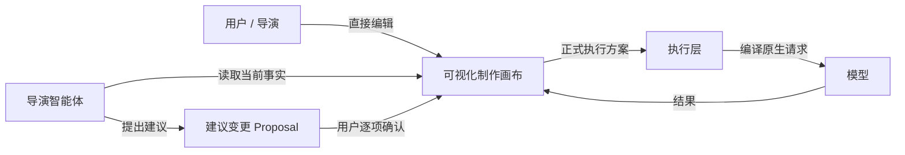
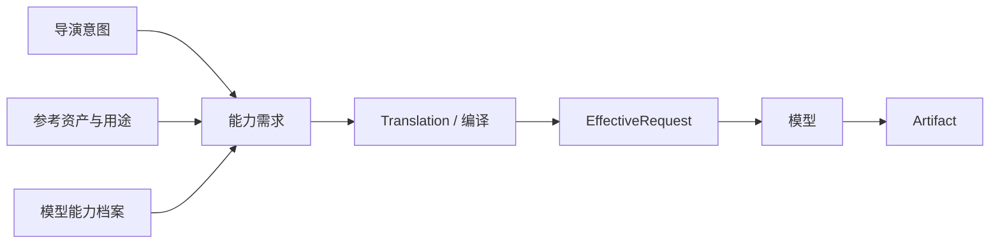

# DramaForge 专业版产品与开发最终方案

> **状态：FINAL / 后续产品与开发唯一总纲**  
> **版本：2.0**  
> **日期：2026-08-25**  
> **适用仓库：`zwb2002-yjy/dramaforge-p0` / `dev` 分支**  
> **用途：统一产品定位、UX/UI、交互、导演智能体行为、资产体系、模型能力、生产链、技术架构、V1 边界与开发顺序。**

---

## 0. 一句话定义

**DramaForge 是一个以场景和镜头为核心、以项目资产为稳定底座、以生产图谱为执行内核、允许用户与导演智能体共同操作，并能够把导演意图透明编译到不同 AI 模型上的专业 AI 影视制作工作台。**

它不是：

- 一个“聊天机器人 + 生图/生视频按钮”；
- 一个更复杂的 LibTV；
- 一个更简单的 ComfyUI；
- 一个只服务零基础小白的四阶段向导；
- 一个把所有模型削成最低公分母的统一生成器。

它要形成的产品感知是：

> **AI 时代的 Storyboard Pro + 虚拟片场 + 生成生产台 + OpenCut。**

---

# 1. 本次重构的结论

本次不是推倒重写 DramaForge。

当前项目已有的大量底层能力方向是正确的，应继续保留：

- Production Graph / 生产图谱；
- Graph Version / 版本与物化；
- NodeRun / 局部节点执行；
- Provider Plugin / 模型供应商插件；
- Manifest / Production Profile / 模型能力与绑定；
- Provider Compiler / 原生请求编译；
- EffectiveRequest / 实际请求快照；
- Artifact / 生产产物及血缘；
- Outbox / Redis / Arq / Worker 异步执行；
- 幂等、恢复、取消、局部重跑；
- Project / Workspace / 项目隔离；
- 质量结果与人工验收边界。

真正需要重构的是：

1. **目标用户**；
2. **产品主流程**；
3. **前端工作台**；
4. **导演智能体与用户的权责关系**；
5. **结构化项目资产系统**；
6. **场景中心的影视导演交互**；
7. **模型能力如何被内化到 UI 与执行层**；
8. **实验、候选、版本、审片和修复的专业交互**；
9. **OpenCut 剪辑接入方式**。

因此总策略是：

> **保留执行内核，重构产品外壳和创作语义。**

---

# 2. 产品重新定位

## 2.1 目标用户

首要用户不再是“零基础用户”。

目标用户调整为：

- AI 短剧制作人员；
- 漫剧 / 动态漫画制作人员；
- AI 广告 / MV / 宣传片创作者；
- 独立影视创作者；
- 已经使用 ComfyUI、LibTV、可灵、即梦、海螺、火山等平台的专业用户；
- 希望一个人完成完整生产，但需要比普通 AI 平台更专业、更透明、更可控的人。

首版允许一个人完成全流程。

**不在 V1 引入复杂的多人角色、审核链、团队审批体系。**

---

## 2.2 核心用户痛点

### ComfyUI 的问题

- 工程节点多；
- 参数细碎；
- 工作流难读；
- 模型切换成本高；
- 影视语义弱；
- 项目资产和导演语义不是第一等对象；
- 专业用户能控制，但控制方式太技术化。

### 一站式 AI 视频平台的问题

- 方便，但容易黑盒；
- 平台可能偷偷做提示词扩写、人物修复、参考裁剪、模型重写；
- 生成结果和原始导演意图不一定一致；
- 角色、场景、动作、提示词难形成长期可控资产；
- 模型差异被平台隐藏后，用户难判断为什么这次效果不同；
- 很难完整追溯“这条视频到底怎么生成出来的”。

### 当前 AI 影视生产的核心难题

- 人物身份稳定；
- 侧脸 / 转头 / 大动作漂移；
- 场景连续性；
- 角色服饰连续性；
- 多人物站位；
- 复杂动作；
- 摄影机机位；
- 运镜；
- 关键帧到视频之间的信息丢失；
- 不同模型原生能力差异；
- 提示词和参考素材难复用；
- 失败后只能整条重来；
- 平台稳定化策略容易造成风格同质化。

---

# 3. 产品第一价值

DramaForge 的第一价值固定为：

> **导演意图真正贯穿整个生产链。**

不是：

- 模型最多；
- 生成最快；
- 参数最全；
- 自动化程度最高；
- “一键出片”。

而是：

> 用户对角色、场景、动作、机位、表演、风格、参考用途和模型选择的意图，可以在整个生产链中被看见、被解释、被执行、被验证、被修改、被局部重跑。

---

# 4. 产品权责：用户才是导演

这是整个系统最高优先级的产品规则。

## 4.1 最终权责关系

> **用户是导演。**  
> **导演智能体是导演助手。**  
> **画布是当前制作事实。**  
> **模型是执行工具。**

导演智能体可以非常主动，可以：

- 给完整方案；
- 分析剧本；
- 设计镜头；
- 推荐参考；
- 分析失败；
- 建议模型；
- 编译提示词；
- 帮助修改画布；
- 帮用户执行。

但：

> **导演智能体没有创作主权。**

---

## 4.2 用户不需要服从智能体规划

导演智能体可以先给一个完整制作方案，例如：

- 风格；
- 场景拆分；
- 角色；
- 镜头；
- 机位；
- 动作；
- 关键帧策略；
- 视频策略；
- 模型建议。

用户可以：

- 全部接受；
- 部分接受；
- 全部否定；
- 自己提出另一套想法；
- 手动改画布；
- 完全关闭导演智能体。

系统必须接纳用户当前决定。

不是“表面认同用户，后台仍然按 AI 自己的方案执行”。

---

# 5. 画布是真正的制作事实源

## 5.1 聊天不是事实源

导演智能体聊天记录只用于：

- 沟通；
- 解释；
- 讨论；
- 形成建议。

真正的当前制作状态必须落到：

- 项目；
- 资产；
- 场景；
- 镜头；
- 导演台；
- 提示词；
- 参考关系；
- 模型选择；
- 当前正式版本；
- 实验分支；

这些可视化的生产对象上。

因此核心规则是：

> **聊天不是事实源，画布才是事实源。**

---

## 5.2 用户手动修改画布

用户在画布中手动修改：

- 机位；
- 景别；
- 动作；
- 参考；
- 提示词；
- 模型；
- 关键帧；
- 场景；
- 角色状态；

修改立即成为当前工作方案。

导演智能体之后必须读取新的画布状态。

用户不需要再说：

> “我刚才把镜头改成特写了。”

---

## 5.3 导演智能体不能直接改正式画布

导演智能体提出修改时：

> **必须先形成“建议变更预览”。**

例如：

```text
建议 1：补充 @林墨 三分之二侧脸参考

原因：
当前关键帧为侧脸，视频阶段需要转头，
现有参考角度对身份控制不足。

预期收益：
降低转头过程中人物身份漂移。

可能代价：
可能略微限制面部形变自由度。

影响范围：
仅镜头 07 的视频输入。

[接受] [拒绝]
```

用户确认后才真正应用。

---

## 5.4 多项建议支持逐项接受 / 拒绝

如果导演助手一次建议：

- 调整机位；
- 增加人物参考；
- 改视频提示词；
- 换模型；

不能只有：

> 全部接受 / 全部拒绝。

必须允许：

- 接受 1；
- 拒绝 2；
- 接受 3；
- 拒绝 4。

---

## 5.5 用户拒绝后不纠缠

用户未接受的建议视为当前决定。

导演智能体不应：

- 反复追问；
- 反复劝说；
- 后台仍偷偷应用；
- 每次生成前再弹同一个建议。

只有出现新的证据，例如：

- 模型明确执行失败；
- 身份明显漂移；
- 资产引用被删除；
- 当前模型无法执行；

才可以重新提出新的建议。

---

# 6. 不允许隐藏“第二套导演方案”

这是系统级硬规则。

假设用户已经明确：

> 平视。  
> 固定机位。  
> 不要推镜。

导演助手不能回复：

> 好。

然后后台为了“更电影感”偷偷生成：

```text
cinematic low angle,
slow dolly in,
dramatic push-in...
```

正确执行必须保留三个层次。

## 6.1 用户导演语义

```text
摄影机：
平视、固定机位。

人物：
林墨缓慢回头看向门口。
```

## 6.2 模型执行表达

例如模型只支持提示词：

```text
locked-off camera,
eye-level framing,
the character slowly turns toward the door
```

## 6.3 实际请求快照

记录实际发送的：

- Prompt；
- Negative Prompt；
- 参考图片；
- 参考视频；
- 参数；
- 模型；
- 版本；
- 分辨率；
- 时长；
- 模型专属字段。

模型适配器允许：

> **翻译。**

不允许：

> **篡改用户导演语义。**

---

# 7. 导演智能体的角色

## 7.1 用户可见只有一个导演智能体

前端不出现：

- 编剧 Agent；
- 摄影 Agent；
- 美术 Agent；
- 动作 Agent；
- 质检 Agent；

一堆 AI 人格轮流聊天。

用户只看到：

> **导演智能体 / 导演助手**

内部可以调用多个：

> **专业能力模块**

例如：

- 故事开发；
- 角色设计；
- 视觉规范；
- 分镜；
- 模型能力分析；
- 质量检查；
- 修复规划。

但对用户：

> 永远是同一个导演助手。

---

## 7.2 专业能力模块不是自由多智能体自治

继续保持当前架构优势：

- 一个用户可见导演助手；
- 后台专业能力版本化；
- 结构化输入输出；
- 可追踪；
- 不允许多个 Agent 自由讨论并自行改业务事实。

---

# 8. 导演智能体工作模式

## 8.1 自动模式

普通低风险动作可以连续推进。

例如：

- 分析剧本；
- 生成建议；
- 整理提示词；
- 生成候选；
- 做质量分析。

但重要创作决策暂停确认。

例如：

- 改正式角色形象；
- 改正式场景风格；
- 换模型；
- 改关键镜头；
- 改正式关键帧；
- 执行会影响下游的资产升级；
- 使用可能牺牲创意的几何矫正。

---

## 8.2 手动模式

用户更明确地逐步推进。

导演智能体：

- 提建议；
- 等用户操作；
- 不主动继续执行后续步骤。

---

## 8.3 什么是“重要决策”

采用：

> **固定硬规则 + 导演智能体动态判断**

组合。

固定规则控制明显高风险动作。

导演智能体可根据上下文判断：

> 这个镜头是否值得停下来确认。

---

# 9. 关闭导演智能体后的行为

如果用户关闭右侧导演智能体面板：

## 已经确认并运行中的任务

继续运行。

例如：

- 生图已经提交；
- 视频已经提交；
- 导出已经开始。

不因为关闭面板而中断。

## 尚未确认的智能体建议

不能执行。

## 导演智能体行为

停止：

- 主动建议；
- 主动弹出修改；
- 自动推进未授权创作动作。

## 画布

用户仍然可以完全手动工作。

## 系统硬校验

仍然存在。

例如：

- 引用不存在；
- 当前模型能力不支持；
- 当前视频使用旧关键帧；
- 文件损坏；
- 请求缺失必需参数。

因为这些属于系统能力，而不是“导演助手意见”。

---

# 10. 导演助手建议：稳定方案与创意方案

为了避免“最佳实践”导致所有作品越来越像，导演助手在重要创作决策中可给：

### 稳定方案

强调：

- 一致性；
- 模型执行成功率；
- 身份稳定；
- 连续性；
- 可控性。

### 更冒险 / 更有辨识度方案

强调：

- 特殊构图；
- 更激进镜头语言；
- 更复杂表演；
- 更独特视觉；
- 更强导演个性。

导演助手应明确说明：

> 稳定意味着什么；  
> 个性方案可能付出什么代价。

不要只给一个所谓：

> “最佳方案”。

---

# 11. UI 总体母版

最终参考权重：

| 参考 | 借鉴内容 | 权重/定位 |
|---|---|---:|
| Storyboard Pro | 场景、镜头、故事板、影视语义工作台 | 40% |
| Frame.io | 候选、版本、审片、资产结果管理 | 25% |
| Unreal Sequencer | 3D Blocking、摄影机、空间调度 | 20% |
| DaVinci Resolve | 专业工作区组织、信息密度、剪辑思维 | 15% |
| LibTV | AI 生成细节交互：模型能力切换、`@素材`、资产收录、候选复用 | 局部参考 |
| OpenCut | 剪辑时间线 | 集成模块 |

核心原则：

> **Storyboard Pro 决定产品骨架。**  
> **LibTV 只决定 AI 生成操作如何更顺手。**

绝不把：

> LibTV 无限画布 + 节点连线

变成 DramaForge 整体 UI 母版。

ComfyUI 更不是视觉母版。

---

# 12. 顶层工作区

建议最终一级工作区：

```text
剧本 | 资产 | 场景 | 制作 | 剪辑
```

不要拆成：

```text
生图
生视频
声音
工作流
模型
任务
产物
...
```

因为用户生产思维应该是：

> **我在制作一部作品。**

不是：

> **我在操作不同 AI 工具。**

---

# 13. 项目进入逻辑

进入已有项目时：

> **恢复上次工作位置。**

例如上次用户停在：

> 第 07 场 / 镜头 04 / 视频阶段。

再次打开就回到这里。

同时始终提供：

> **一键返回项目场景总览。**

---

# 14. 项目总览：故事板墙

项目首页不是 KPI Dashboard。

而是：

> **视觉故事板墙。**

示意：

```text
┌──────────────────┐
│                  │
│   场景代表画面    │
│                  │
├──────────────────┤
│ 07 仓库对峙       │
│ 6 镜头 · 38s      │
│ 4完成 · 1风险     │
└──────────────────┘
```

显示：

- 场景代表画面；
- 场景名称；
- 镜头数量；
- 少量状态；
- 必要风险。

支持：

- 拖拽排序；
- 复制；
- 新增；
- 删除；
- 拆分；
- 合并。

拆分 / 合并属于结构变更：

> 必须先给影响提示。

例如：

```text
拆分后将影响：
- 镜头 06–09 将进入新场景
- 新场景需要单独场景资产状态
- 已生成媒体不会删除
```

---

# 15. 场景为中心，而不是镜头孤岛

DramaForge 采用：

> **场景中心。**

场景是：

- 空间；
- 人物；
- 服饰；
- 道具；
- 光线；
- 调度；
- 镜头组；
- 连续性；

的共同容器。

镜头从场景中派生。

而不是：

> 每个镜头各自生图，各自临时找素材。

---

# 16. 场景工作台整体布局

建议：

```text
┌──────────────────────────────────────────────────────────┐
│ 项目 / 第07场 仓库对峙                    导演助手  ●    │
├───────────┬───────────────────────────────┬──────────────┤
│ 场景资产   │                               │ 导演智能体    │
│           │                               │              │
│ 角色      │         中央大幕布             │ 当前理解      │
│ 场景      │                               │ 建议          │
│ 服饰      │  画面 / 视频 / 2D导演预演      │ 风险          │
│ 道具      │  / 3D导演预演                  │ 提示词        │
│           │                               │ 引用资产      │
├───────────┴───────────────────────────────┴──────────────┤
│ 镜01 | 镜02 | 镜03 | 镜04 | 镜05 | 镜06                │
├──────────────────────────────────────────────────────────┤
│ 导演意图 ─ 关键帧 ─ 视频 ─ 审片                         │
└──────────────────────────────────────────────────────────┘
```

---

# 17. 中央大幕布原则

中央区域永远优先显示：

> **当前作品本身。**

不同阶段对应：

### 未生成

显示：

- 导演构图；
- 2D Blocking；
- 3D Blocking；
- 场景预览；
- 关键帧占位；
- 参考画面。

### 关键帧阶段

显示：

- 当前正式关键帧；
- 候选；
- 对比。

### 视频阶段

显示：

- 视频播放器；
- 当前帧；
- 审片标记。

### 剪辑阶段

进入 OpenCut 时间线。

不要让中心区域变成：

> 巨型提示词表单。

---

# 18. 导演智能体侧栏

提示词、规划、风险和建议主要在：

> **右侧导演助手面板。**

包含：

- 当前导演意图；
- 当前模型；
- 当前模型能力适配；
- 生图提示词；
- 视频提示词；
- 当前引用资产；
- 风险；
- 建议；
- 模型能力缺口；
- 建议变更预览；
- 局部重跑入口。

导演侧栏可以关闭。

---

# 19. 底部镜头区：故事板 + 时间轴混合

默认紧凑：

```text
镜01 | 镜02 | 镜03 | 镜04 | 镜05
```

每个镜头显示：

- 缩略图；
- 时长；
- 关键帧状态；
- 视频状态；
- 小风险提示。

展开之后显示：

- 镜头描述；
- 台词；
- 动作；
- 景别；
- 机位；
- 运镜；
- 角色；
- 关键资产；
- 当前版本。

这比纯 Storyboard 更适合生成式影视生产。

---

# 20. 点击镜头后的状态驱动

点击一个镜头：

## 尚未生成

默认进入：

> **导演设计状态**

显示：

- 镜头意图；
- 角色；
- 场景；
- 构图；
- 动作；
- 机位；
- 提示词；
- 模型；
- 参考。

## 已生成关键帧

优先显示：

> 关键帧结果。

仍可返回：

> 导演设计。

## 已生成视频

优先显示：

> 视频结果。

可切换：

- 导演设计；
- 关键帧；
- 视频；
- 审片。

---

# 21. 镜头不是“生图工具 + 生视频工具”

镜头内部仅分：

```text
关键帧 | 视频
```

用户心智是：

> **我在完成这个镜头。**

不是：

> 我要先去图片生成器，再去视频生成器。

---

# 22. 完整可见生产链

单镜头完整生产链：

```text
导演意图
  ↓
生图提示词
  ↓
参考资产 / 导演台控制
  ↓
生图模型
  ↓
关键帧候选
  ↓
正式关键帧
  ↓
视频提示词
  ↓
动作 / 运镜 / 参考输入
  ↓
视频模型
  ↓
视频候选
  ↓
正式视频
  ↓
审片 / 修复
```

用户应该能够看到：

> 整个链从哪里开始，到哪里结束。

但 UI 不能做成 ComfyUI。

默认只显示：

```text
导演方案 ─ 关键帧 ─ 视频 ─ 审片
```

点击某一步下钻。

---

# 23. 每个局部都能重跑

这是 DramaForge 的关键专业能力。

## 修改视频提示词

只重跑：

> 视频阶段。

保留：

- 角色资产；
- 场景资产；
- 关键帧；
- 上游。

## 修改关键帧提示词

生成：

> 新关键帧候选。

旧正式视频不删除。

用户确认新关键帧后再决定：

> 是否继续重跑视频。

## 换模型

默认：

> 创建实验分支。

不覆盖正式结果。

---

# 24. 换模型不是复制原模型参数

如果从：

> 模型 A

换到：

> 模型 B

不能直接复制：

- A 的权重；
- A 的私有参数；
- A 的参考槽位；
- A 的提示词 hack。

应该保留：

- 导演意图；
- 资产引用；
- 参考用途；
- 镜头约束；
- 构图；
- 动作；
- 连续性要求；

然后：

> 按模型 B 能力重新编译。

---

# 25. 候选生成与结果显示

普通状态：

> **单个正式结果大预览。**

如果一次生成多个候选：

> 临时进入候选比较。

形式：

- 主大图；
- 下方缩略图带；
- 或 2～4 个候选比较。

用户确定一个正式结果后：

> 回到单结果大预览。

不要让候选网格永久占满工作区。

---

# 26. 候选支持批注

图片候选支持：

- 圈选；
- 箭头；
- 点；
- 文本备注。

例如：

> 这里脸不对。  
> 右手结构错误。  
> 背景门位置偏了。

视频支持：

- 时间点；
- 时间段；
- 当前帧；
- 文字备注。

例如：

```text
2.3s：人物开始漂
4.1–4.8s：手部异常
6.2s：运镜突然加速
```

---

# 27. “按标记修复”

用户标记问题后可以：

> **按标记修复**

导演助手分析：

- 问题属于关键帧？
- 人物参考不足？
- 视频模型漂移？
- 动作过复杂？
- 运镜过复杂？
- 当前模型不适合？
- 场景连续性问题？

然后提出可见修复方案。

---

# 28. V1 视频修复边界

首版只做：

## 方案 A：整镜头重跑

保留当前上游，重新生成整条视频。

## 方案 B：重做关键帧 → 重跑整段视频

用于：

- 身份基础错误；
- 构图错误；
- 角色状态错误；
- 关键帧本身不适合做视频控制。

首版：

> **不做片段级视频重拍。**

---

# 29. V2 视频修复

下一版再做：

- 2～3 秒局部替换；
- 时间段重拍；
- 视频局部重绘；
- 从某时间点继续；
- 智能续写；
- 多段拼接；
- 局部动作连续性修复；
- 跨片段角色动作衔接。

LibTV 这些能力可以作为后续参考，但不能挤占首版。

---

# 30. 正式线与实验线

系统必须长期维护：

> **Formal / 正式线**  
> **Experiment / 实验线**

并存。

实验可以是：

- 模型 B；
- 新提示词；
- 新参数；
- 新参考；
- 稳定版；
- 创意版；
- 开启 CV 修复；
- 不开启 CV 修复。

实验绝不能覆盖正式结果。

---

# 31. 场景级实验

实验不只限单镜头。

允许：

> 场景级实验。

例如：

- 整个仓库场景改冷色；
- 换另一套角色服饰；
- 全场使用另一生图模型；
- 试一种更激进镜头风格。

用户采纳时支持：

- 全部采纳；
- 只采纳服饰；
- 只采纳灯光；
- 只采纳镜头 03、05；
- 只保留为实验。

---

# 32. 采用实验结果时的影响范围

用户点击：

> 采用实验结果

必须选择：

1. **仅采用当前节点结果**
2. **设为新的正式关键帧，但保留旧视频**
3. **采用新关键帧，并重跑下游视频**
4. **仅保留为实验**

系统同时显示：

> 哪些旧结果仍在引用旧版本。

---

# 33. 结构化资产系统

DramaForge 的资产不是“文件夹里堆图片”。

必须形成：

> **项目级结构化影视资产。**

---

# 34. 角色资产卡

建议结构：

```text
角色：林墨

身份参考
├─ 正脸
├─ 三分之二侧脸
├─ 侧脸
├─ 半身
└─ 全身

妆造
├─ 黑色风衣
├─ 发型
└─ 眼镜

表演
├─ 表情
├─ 动作
└─ 姿态

声音
├─ 默认声音
└─ 历史对白

版本
├─ v4 当前正式
├─ v3
└─ v2
```

---

# 35. 角色资产“最低可用 + 按需补齐”

不要求新建角色时一次补齐：

- 正脸；
- 45°；
- 侧脸；
- 半身；
- 全身；
- 所有表情。

可以先：

> 正脸 + 半身。

后面镜头出现：

> 侧脸转头。

导演助手再提示：

> 建议补一个三分之二侧脸参考。

---

# 36. 从单张角色图扩展参考集

系统允许：

> 从一张已确认角色图扩展候选参考。

例如：

- 正脸；
- 侧脸；
- 半身；
- 全身。

但自动生成的扩展图：

> **永远先是候选。**

不能未经用户确认就自动进入正式角色身份参考集。

---

# 37. 场景资产卡

建议包含：

```text
场景：仓库夜景

参考
├─ 正式参考图
├─ 其他参考图
└─ 历史画面

空间
├─ 墙
├─ 门
├─ 窗
├─ 家具
├─ 道具
└─ 粗3D场景

视觉
├─ 时间：夜
├─ 光线
├─ 色调
├─ 材质
└─ 项目视觉规范

连续性
├─ 角色入口
├─ 核心道具位置
├─ 已验证机位
└─ 已生成镜头
```

场景参考图可以：

> 直接上传。

---

# 38. 其他资产类型

首版项目资产可以包含：

- 角色；
- 场景；
- 服饰；
- 发型；
- 道具；
- 动作；
- 姿态；
- 表情；
- 图片；
- 视频；
- 声音；
- 音效；
- 音乐；
- 对白；
- 旁白；
- 字幕模板；
- 文案；
- 提示词；
- 生成方案。

---

# 39. 生成结果不自动成为资产

一条视频生成出来：

> 不代表它已经成为项目资产。

只有用户主动：

> **加入资产**

才进入资产库。

避免：

- 失败候选；
- 临时实验；
- 垃圾结果；

污染项目资产。

---

# 40. 资产分类与标签

V1：

- 默认分类；
- 用户自定义标签；
- 多选；
- 批量加入；
- 批量删除；
- 筛选；
- 回收站。

首版不做：

> 语义智能搜索。

---

# 41. 回收站

差的结果可以：

> 放入回收站。

仅保留：

- 来源项目；
- 基本信息。

是否永久删除：

> 用户决定。

首版回收站不需要复杂血缘图。

---

# 42. 媒体资产版本规则

图片、视频、角色视觉、场景视觉等正式媒体资产修改：

> **产生新版本。**

不覆盖旧版本。

新版本：

> 先是候选。

用户确认后：

> 成为当前正式版本。

旧版本：

> 默认折叠到历史。

---

# 43. 资产升级不自动重跑旧镜头

例如：

> 林墨角色资产从 v3 升到 v4。

系统显示：

```text
当前有 12 个镜头仍使用 v3：
镜02、镜03、镜05...
```

用户选择：

- 哪些升级；
- 哪些继续保留旧版。

不能：

> 自动全项目替换 + 全片重跑。

---

# 44. 文本 / 提示词与执行快照

提示词、台词、旁白、文案：

> 可以直接编辑。

但已经执行过的历史：

> 冻结执行快照。

例如：

```text
提示词方案当前版本：B

视频 07 历史执行：
实际使用提示词 A
模型：Seedance X
角色资产：林墨 v3
```

这样后续用户修改 B：

> 不污染旧执行历史。

---

# 45. `@资产` 快速引用

保留 LibTV 已验证的 `@素材` 交互。

但指向：

> **结构化项目资产。**

例如：

```text
@林墨
@仓库夜景
@黑色风衣
@回头警觉
@压抑愤怒
```

---

# 46. `@资产` 默认版本

输入：

```text
@林墨
```

默认引用：

> 林墨当前正式角色资产卡。

用户不用每次手选：

- 正脸；
- 侧脸；
- 半身；
- 全身。

---

# 47. 引用详情

专业用户可以打开：

> **引用详情**

手动指定：

- 正脸；
- 侧脸；
- 45°；
- 某套服装；
- 某个版本；
- 某张视频。

---

# 48. `@资产` 支持用途语义

用户可以明确：

```text
@林墨 作为人物身份参考
@林墨 只参考服装
@仓库夜景 参考空间布局和光线
@动作01 只参考动作，不参考人物外观
@视频03 只参考运镜
@音频02 作为对白节奏参考
```

资产本身是什么：

> 不等于它在这次生成里怎么用。

---

# 49. 模型无法严格实现引用用途

例如：

```text
@动作视频
只参考动作，不参考人物
```

但当前视频模型：

> 无法完全把动作与人物外观解耦。

系统不能：

- 静默忽略；
- 假装已经做到；
- 直接禁止用户。

应该提示：

```text
当前模型无法严格实现“只参考动作，不参考人物”。

可选：
1. 近似执行
2. 转换为姿态控制
3. 更换支持该能力的模型
4. 保持当前方案直接尝试
```

由用户决定。

---

# 50. 模型能力内化：借鉴 LibTV，但再往前一步

LibTV 的成熟点是：

> **选择不同模型后，生成器动态显示模型能做什么。**

例如：

- 首尾帧；
- 全能参考；
- 多图；
- 主体参考；
- 视频编辑；

不同模型入口不同。

DramaForge 继承：

> **模型原生能力不能被统一 UI 削平。**

---

# 51. 首版模型能力实现方式

V1 不做复杂自动探测平台。

采用：

> **模型适配器自带能力声明 + UI 动态适配。**

每个模型插件至少声明：

```text
模型名称
版本
任务类型

输入能力
├─ 文本
├─ 首帧
├─ 尾帧
├─ 首尾帧
├─ 多图
├─ 人物参考
├─ 场景参考
├─ 视频参考
├─ 音频参考
├─ 动作 / 姿态
└─ 原生音频

限制
├─ 最大参考数量
├─ 支持时长
├─ 分辨率
├─ 文件格式
└─ 模式互斥

模型专属能力
高级参数
```

---

# 52. UI 随模型变化

模型 A：

```text
支持：
✓ 首帧
✓ 人物参考
✓ 参考视频
× 尾帧
```

模型 B：

```text
支持：
✓ 首尾帧
✓ 多图参考
✓ 原生音频
× 动作参考
```

界面应该真实变化。

不允许为了“统一体验”让所有模型都只剩：

> Prompt + Image + Duration。

---

# 53. 模型专属能力允许存在

例如某模型有：

- 提示词增强；
- 主体库；
- 动作迁移；
- 多镜头；
- 原生音频；
- 角色参考；
- 视频编辑；

DramaForge 可以在：

> 高级能力 / 模型专属

区域显示。

不是所有模型都必须有相同按钮。

---

# 54. 模型能力层次

DramaForge 模型接入建议抽象成：

```text
第一层：媒体类型
图片 / 视频 / 音频 / 文本

第二层：通用能力语义
首尾帧 / 人物参考 / 场景参考 /
动作 / 视频参考 / 原生音频...

第三层：模型原生模式
全能参考 / 动作迁移 / 视频编辑...

第四层：模型专属参数
数量 / 分辨率 / 时长 / 权重 / 特殊字段
```

---

# 55. DramaForge 比 LibTV 多一层：导演意图

真正的执行链应该是：

```text
用户导演意图
      ↓
能力需求
      ↓
当前模型能力
      ↓
执行方案
      ↓
模型原生请求
```

例如：

```text
导演意图：
林墨从侧面缓慢转头看向门口，
身份必须稳定，
摄影机缓慢推进。
```

能力需求：

```text
人物身份参考
转头动作
图生视频
推镜
```

当前模型：

```text
人物参考 ✓
图生视频 ✓
运镜 Prompt ✓
独立动作参考 ×
```

系统才决定：

> 近似执行 / 换模型 / 转换控制。

---

# 56. 项目模型配置

项目设置：

```text
默认语言模型
默认图片模型
默认视频模型
默认声音模型
```

镜头允许：

> 局部覆盖。

用户手动选择模型：

> 是优先选择。

导演助手可以建议更换。

但：

> **不能未经批准自动换。**

---

# 57. 模型能力证据

V1 不做复杂排名。

但可以逐步积累：

```text
未验证
已使用
多次成功
稳定
已知问题
```

这是生产经验事实。

模型版本更新后：

> 不继承旧版本的稳定状态。

重新进入待验证。

---

# 58. V2 模型能力增强

以后再做：

- 官方接口自动同步；
- 自动能力探测；
- 控制测试；
- 生产结果稳定度；
- 场景分桶；
- 模型推荐；
- 能力验证证据。

首版不做：

> 大而全模型 Benchmark。

---

# 59. 项目视觉规范

核心规则：

> **风格属于项目，不属于模型。**

项目建立：

> **视觉规范**

内容包括：

- 角色造型基准；
- 场景美术；
- 色彩；
- 光线；
- 材质；
- 镜头语言；
- 构图偏好；
- 写实 / 动画 / 漫画程度；
- 禁止风格；
- 已确认代表画面。

---

# 60. 视觉锚点

项目可以保留：

- 主角标准图；
- 标准场景夜景；
- 室内对白标准图；
- 3～5 张代表关键帧。

切换图片模型时：

> 继续携带视觉规范 + 视觉锚点 + 项目资产。

而不是让项目风格跟着模型漂。

---

# 61. 场景视觉覆盖

允许场景级合法覆盖。

例如：

- 回忆；
- 梦境；
- 幻觉；
- 新闻影像；
- 监控画面。

但要明确：

> 这是场景级视觉例外。

不是模型偷偷变风格。

---

# 62. 稳定性与创意边界

应该锁定：

### 稳定底座

- 角色身份；
- 已确认服装；
- 发型；
- 关键道具；
- 场景连续性。

### 创意变量

- 镜头语言；
- 构图；
- 动作；
- 表演；
- 运镜；
- 节奏。

目标不是：

> 把所有变化锁死。

而是：

> **稳定该稳定的，开放该创作的。**

---

# 63. CV / 几何 / 姿态矫正必须透明

例如系统建议：

> 做人脸几何矫正。

必须显示：

### 收益

- 转头稳定；
- 人脸结构更一致。

### 可能代价

- 夸张透视变弱；
- 面部非对称表达可能被压缩；
- 风格化特征可能减弱。

用户确认后才应用。

V1：

> **智能建议 + 解释 + 用户确认**

而不是自动黑盒预处理。

---

# 64. 关键帧 ≠ 人物身份参考集

必须区分：

### 关键帧

回答：

> **这个镜头长什么样。**

### 角色参考集

回答：

> **这个人是谁。**

### 动作 / 姿态控制

回答：

> **这个人怎么动。**

### 导演台

回答：

> **人物和摄影机在空间里怎么摆。**

### 视频模型

负责：

> 合成为动态镜头。

这些概念不能混成“都上传几张图片”。

---

# 65. 视频人物漂移诊断

系统应区分：

## 情况 1：关键帧已经身份错误

问题在：

> 图片阶段。

## 情况 2：关键帧正确，视频一开始就变

可能是：

- 视频模型身份保持差；
- 输入身份信息不足；
- 参考未正确进入请求。

## 情况 3：开始正确，转头后变

可能是：

> 参考角度覆盖不足。

## 情况 4：静止稳定，复杂动作漂

可能是：

> 动作复杂度超过模型身份保持能力。

## 情况 5：同样输入换模型稳定

说明：

> 原视频模型不适配该镜头。

---

# 66. “图片通过” ≠ “适合当视频控制源”

关键帧可以：

> 作为图片审核通过。

但同时：

> 标记视频参考风险。

例如：

```text
图片质量：通过
人物身份：通过
视频参考适用性：中风险
原因：仅侧脸，下一动作包含转头
```

可以保留这张关键帧：

> 不需要强制换图。

同时补充：

- 正脸；
- 45°；

人物参考。

---

# 67. 二维导演台

普通镜头默认：

> 2D 导演画布。

用户可以控制：

- 角色位置；
- 朝向；
- 构图；
- 景别；
- 摄影机方向；
- 动作；
- 视线；
- 道具关系。

目标：

> 用影视语言控制，而不是节点参数。

---

# 68. 什么时候建议进入三维导演台

导演助手可以标记：

```text
直接生成
建议导演设计
建议确认导演设计
```

适合三维导演台的情况：

- 多人物 Blocking；
- 特殊机位；
- 复杂动作；
- 人物与道具互动；
- 复杂运镜；
- 关键剧情镜头；
- 新的未验证镜头语言；
- 空间关系容易出错。

普通对白镜头：

> 不强制。

---

# 69. 三维导演台定位

不是：

> 游戏编辑器。

不是：

> 高精数字人制作器。

而是：

> **粗三维影视 Blocking / Camera 工具。**

V1 包括：

- 墙；
- 门；
- 窗；
- 家具；
- 基础道具；
- 角色代理；
- 可摆姿骨架；
- 摄影机。

---

# 70. 三维角色

三维角色采用：

> 角色外观代理 + 可摆姿骨架。

目的：

- 知道谁是谁；
- 看位置；
- 看姿态；
- 看画面关系。

不要求：

> 高保真人体数字人。

最终人物外观仍由图片 / 视频模型生成。

---

# 71. 三维场景自动生成

可以由导演助手理解：

- 剧本；
- 场景资产；
- 参考图片；

形成：

> **场景语义规格**

例如：

```text
仓库 12m × 8m
北侧卷帘门
东侧工作台
中央有木箱
角色 A 从南侧进入
```

但：

> LLM 不直接自由输出坐标。

之后由：

> 确定性 Scene Assembler

生成几何。

使用：

- 内置 primitives；
- 空间算法；
- 碰撞；
- 可行走区域；
- 规则化布局。

---

# 72. V1 三维边界

首版：

- 内置简单几何；
- 自动粗场景；
- 不支持复杂外部三维资产导入；
- 不支持高精材质；
- 不做游戏级编辑。

---

# 73. 摄影机交互

默认影视语义：

```text
全景
中景
近景
特写

平视
高机位
低机位

固定
推
拉
摇
移
跟
```

高级面板：

- 焦段；
- 摄影机高度；
- Pitch；
- Yaw；
- 距离；
- 景深；
- 焦点。

普通用户不需要先理解：

> 3D 坐标参数。

---

# 74. 动作控制

默认：

> 自然语言动作 + 3D 拖拽微调。

例如：

- 回头；
- 前倾；
- 撑桌；
- 拥抱；
- 坐下；
- 站起；
- 伸手；
- 退后一步。

高级：

> 骨架关节微调。

---

# 75. 表情与视线

默认控制：

- 表情类型；
- 强度；
- 视线目标；
- 头部方向；
- 眼睛状态；
- 嘴部状态。

视线目标可直接设为：

- 另一角色；
- 道具；
- 摄影机；
- 空间点。

支持表演过程：

```text
开始：克制
中间：惊讶
结束：压抑愤怒
```

高级只做有限控制：

- 眉；
- 眼睑；
- 嘴角；
- 头部角度；
- 视线偏移。

V1 不做：

> 复杂 Facial Rig 曲线。

---

# 76. 动作与表情可以成为资产

用户觉得某次：

- 回头；
- 撑桌；
- 警觉；
- 冷笑；

效果好，可以：

> 加入资产。

之后：

```text
@回头警觉
@压抑愤怒
```

复用。

---

# 77. 提示词 / 生成方案收藏

图片 / 视频生成效果好时：

> **提炼并收录提示词 / 生成方案。**

记录不只是一段文本。

还应该记录：

- 模型；
- 模型版本；
- 任务；
- 提示词；
- 资产；
- 参考用途；
- 参数；
- 镜头条件；
- 最终结果。

---

# 78. V1 只收集，不做深度经验推荐

首版：

> 先把数据沉淀下来。

V2 再做：

- 历史相似成功方案推荐；
- 自动检索；
- 经验提炼；
- 条件归因；
- 模型选择建议；
- 成功模式复用。

不要为了“AI 很聪明”在首版先做复杂 Production Memory。

---

# 79. OpenCut 的定位

DramaForge：

> **拍。**

OpenCut：

> **剪。**

OpenCut 不应该成为整个 DramaForge UI 母版。

只在：

> 剪辑阶段

成为主要工作区。

---

# 80. OpenCut 集成边界

DramaForge 继续维护事实：

- 项目；
- 场景；
- 镜头；
- 当前正式视频；
- 资产；
- 版本；
- 血缘；
- 生产状态。

OpenCut 管：

- 时间线；
- 视频轨；
- 音频轨；
- 字幕；
- 裁剪；
- 排序；
- 转场；
- 基础效果。

通过：

> **剪辑适配层**

连接。

不要现在重度 Fork OpenCut 内核。

---

# 81. 导演助手在剪辑阶段

导演助手可以：

- 建议节奏；
- 建议镜头顺序；
- 建议删除镜头；
- 建议延长停顿；
- 建议音乐；
- 建议补拍；
- 建议重做某镜头。

但：

> 实际修改仍先形成可见建议。

用户关闭导演助手后：

> OpenCut 可以完全手动剪。

---

# 82. 当前底层架构继续保留

当前 `dev` 的以下方向继续：

```text
Frontend
   ↓
API / Domain
   ↓
Director Workflow
   ↓
Production Graph
   ↓
Execution / NodeRun
   ↓
Provider Compiler / Runtime
   ↓
Provider
   ↓
Artifact
```

---

# 83. Director Workflow 的新定位

旧定位过于：

> 四阶段强制流程。

新定位：

> **项目级创作状态 + 建议 + 影响分析 + 生产协调。**

保留：

- 版本；
- Proposal；
- Change；
- Impact；
- Issue；
- 质量；
- 局部返工；

弱化：

- 强制阶段向导；
- 多个硬确认点；
- 预算作为流程 Gate。

---

# 84. Production Graph 的新定位

继续是：

> **镜头级真实媒体执行图。**

管理：

- 图片；
- 视频；
- 音频；
- 字幕；
- 合成；
- 质检；
- 重跑；
- ProviderOperation；
- Artifact。

新 UI 的“薄生产链轨迹”只是：

> Production Graph 的影视语义视图。

不是另造一套生产引擎。

---

# 85. Provider 架构继续沿用

保持：

```text
业务导演语义
  ↓
Intent
  ↓
Binding / Capability
  ↓
Compiler
  ↓
EffectiveRequest
  ↓
Runtime
  ↓
Provider
```

禁止：

- Director LLM 拼原始 Provider JSON；
- 前端拼 Provider JSON；
- 模型不支持时偷偷丢字段；
- 两套模型配置。

---

# 86. LiteLLM 的边界

继续：

> LiteLLM 只作为文本大模型统一网关。

图片 / 视频 / 音频：

> 走原生 Provider 插件 / Runtime。

不把 LiteLLM 强行变成：

> 全媒体总线。

---

# 87. 当前代码模块迁移表

| 当前模块 | 决策 | 新用途 |
|---|---|---|
| `backend/app/production` | 保留 | 生产图谱 |
| `backend/app/execution` | 保留 | NodeRun、局部执行 |
| `backend/app/events` | 保留 | Outbox |
| `backend/app/runtime` | 保留 | 调度、恢复 |
| `backend/app/workers` | 保留 | 媒体任务 |
| `backend/app/providers` | 保留并增强 | 模型能力、编译、运行 |
| `backend/app/providers/model_profiles` | 保留 | 模型能力/绑定快照 |
| Artifact / Storage | 保留 | 资产产物与血缘 |
| Director | 重构 | 可选导演助手、Proposal、Impact |
| Assets | 扩展 | 项目结构化影视资产 |
| Quick Workflow | 降级 | 不再是主产品骨架 |
| Production Page | 演进 | 变成统一场景制作工作台 |
| Budget Gate | 弱化 | 调用记录可保留，不控制创作 |
| Delivery | 保留并对接 OpenCut | 成片/字幕/剪辑交接 |

---

# 88. V1 顶层页面信息架构

```text
项目大厅
  ↓
项目
├─ 剧本
├─ 资产
├─ 场景
│   ├─ 场景总览 / 故事板墙
│   └─ 场景工作台
├─ 制作
│   └─ 跨场景生产状态 / 批量生产
└─ 剪辑
    └─ OpenCut
```

---

# 89. “制作”工作区的作用

因为场景工作台负责：

> 单场景深度制作。

“制作”一级区建议负责：

- 跨场景生产状态；
- 批量生成；
- 当前队列；
- 待审镜头；
- 失败镜头；
- 批量进入审片。

不要把它重新做成：

> 冗余第二生产页。

---

# 90. UI 设计原则

整体视觉：

> 专业影视软件感。

不是：

- 暗黑紫 AI；
- 大量渐变；
- 大圆角卡片；
- 到处发光；
- 聊天气泡统治 UI；
- 大段说明文字占屏。

重点：

- 大幕布；
- 缩略图；
- 时间；
- 镜头；
- 空间；
- 资产；
- 版本；
- 状态。

---

# 91. 信息密度

默认：

> 克制。

专业信息：

> 可展开。

例如默认只显示：

```text
模型：Seedance 2.5
时长：6s
关键帧：正式 v3
```

点击：

> 高级执行详情

才看到：

- 原始请求；
- 参考列表；
- 各模型参数；
- EffectiveRequest；
- TranslationReport；
- 远端任务 ID；
- 产物血缘。

---

# 92. 状态语言

减少后端工程术语直接暴露。

例如：

```text
NodeRun
GraphVersion
Artifact
```

不要在默认 UI 当主要标签。

用户看到：

```text
生成中
已完成
需要确认
实验
正式
使用旧版资产
模型能力不足
```

高级追踪页再展示技术 ID。

---

# 93. 用户完全手动构造流程

这条必须成为验收标准。

即使：

> 导演助手从未开启。

用户也应该可以：

```text
建项目
→ 写剧本
→ 建角色
→ 建场景
→ 建镜头
→ 设机位
→ 设动作
→ @资产
→ 写 Prompt
→ 选模型
→ 生关键帧
→ 选正式关键帧
→ 生视频
→ 换模型实验
→ 审片
→ 修复
→ OpenCut
→ 导出
```

---

# 94. 导演助手不是工作流所有者

导演助手在系统里更像：

> **可操作专业工作台的 Copilot。**

不是：

> 工作流 Engine。

Workflow / Production Graph：

> 属于系统。

智能体：

> 在允许范围内建议和操作。

---

# 95. 首版必须支持的能力

## 工作台

- 项目恢复；
- 场景故事板墙；
- 场景中心工作台；
- 中央大幕布；
- 镜头 Storyboard + Timeline；
- 状态驱动镜头详情；
- 薄生产链轨迹。

## 资产

- 角色资产卡；
- 场景资产卡；
- 服饰；
- 道具；
- 动作；
- 表情；
- 音频；
- 文本；
- 提示词；
- 分类 / 标签；
- 回收站；
- 版本；
- `@资产`。

## 生成

- 图片模型；
- 视频模型；
- 声音模型；
- 模型能力声明；
- 动态 UI；
- 关键帧 → 视频；
- 有效请求；
- 局部重跑；
- 模型切换实验。

## 导演助手

- 可开关；
- 自动 / 手动；
- 完整方案；
- 建议变更预览；
- 逐项采纳；
- 风险解释；
- 模型能力冲突；
- 用户意图优先。

## 导演台

- 2D；
- 粗 3D；
- 摄影机；
- 人物位置；
- 骨架；
- 动作；
- 表情；
- 视线；
- 基础场景。

## 审片

- 图片批注；
- 视频时间点；
- 视频时间段；
- 整镜头重跑；
- 重做关键帧 + 视频。

## 剪辑

- OpenCut；
- 视频轨；
- 音频轨；
- 字幕；
- 基础剪辑；
- 导出。

---

# 96. V1 明确不做

- 视频任意时间段局部重拍；
- 智能续写；
- 复杂视频拼接；
- 自动 Production Memory；
- 自动成功经验推荐；
- 复杂语义资产搜索；
- 跨项目资产智能共享；
- 跨项目生成经验；
- 外部复杂 3D 资产；
- 高精数字人；
- 多人团队审批；
- 企业权限体系；
- 复杂模型排行榜；
- 大规模自动 Benchmark；
- 强制 ComfyUI 本地媒体执行。

---

# 97. 开发顺序

## 阶段 0：先修权威文档

当前 `docs/current` 中仍存在旧目标：

- 小白用户；
- 四阶段强制确认；
- 预算授权；
- 旧发布时间线。

必须先更新。

否则 AI 开发工具会继续按旧合同开发。

---

## 阶段 1：冻结底层复用边界

先证明：

- Production Graph 正常；
- Provider Path 正常；
- Artifact 正常；
- 局部重跑正常；
- 异步恢复正常；
- EffectiveRequest 正常。

这阶段：

> 不做大规模重构。

---

## 阶段 2：做专业工作台壳

先做：

```text
项目
→ 场景总览
→ 场景工作台
→ 中央大幕布
→ 镜头底栏
→ 导演侧栏
```

先把产品形态做对。

---

## 阶段 3：资产系统

完成：

- 角色资产卡；
- 场景资产卡；
- 通用资产；
- 标签；
- `@资产`；
- 版本。

---

## 阶段 4：生产链可视化

把已有 Production Graph：

> 映射成影视语义。

```text
导演意图
→ 关键帧
→ 视频
→ 审片
```

并实现：

> 每一步下钻和局部重跑。

---

## 阶段 5：模型能力动态化

强化：

- Manifest；
- Profile；
- Capability；
- Compiler。

前端：

> 根据模型能力变 UI。

---

## 阶段 6：正式 / 实验双线

完成：

- Prompt 实验；
- 参数实验；
- 换模型；
- 候选对比；
- 采纳范围；
- 旧版本提示。

---

## 阶段 7：导演助手重构

这时才让导演助手操作：

> 已经成熟的画布。

实现：

- Proposal；
- 预览；
- 逐项采纳；
- 用户覆盖；
- 自动 / 手动；
- 风险解释。

不要先让 Agent 决定整个产品结构。

---

## 阶段 8：导演台

完成：

- 2D；
- 粗 3D；
- Camera；
- Blocking；
- Pose；
- Expression；
- Gaze。

---

## 阶段 9：OpenCut

通过适配层接入剪辑。

---

# 98. 推荐新的领域结构

可以在不破坏现有底层的前提下逐步演进成：

```text
Project
├─ Script
├─ VisualStandard
├─ AssetLibrary
│   ├─ CharacterAsset
│   ├─ SceneAsset
│   ├─ CostumeAsset
│   ├─ PropAsset
│   ├─ ActionAsset
│   ├─ ExpressionAsset
│   ├─ AudioAsset
│   └─ PromptScheme
├─ Scenes
│   └─ Scene
│       ├─ SceneState
│       ├─ Blocking
│       └─ Shots
│           └─ Shot
│               ├─ DirectorIntent
│               ├─ ImageStage
│               ├─ Keyframe
│               ├─ VideoStage
│               ├─ Review
│               └─ ExperimentBranches
└─ EditProject
```

---

# 99. 新导演助手关系结构



关键点：

> **导演助手无法绕过画布直接形成另一套创作事实。**

---

# 100. 模型执行关系



如果：

> `C` 与 `P` 不匹配，

系统必须：

> 提示能力缺口。

不能：

> 静默降级。

---

# 101. 首版真实验收场景

至少用一个真实作品验证：

## 项目

- 1 个主角；
- 1～2 个配角；
- 3 个以上场景；
- 多个镜头；
- 真人或稳定风格；
- 完整关键帧 + 视频 + 剪辑。

---

## 场景 A：用户完全手动

导演助手关闭。

用户完成：

```text
资产
→ 场景
→ 镜头
→ 关键帧
→ 视频
→ 审片
→ OpenCut
```

证明：

> AI 助手不是强制入口。

---

## 场景 B：导演助手提出方案

导演助手：

- 给完整场景方案；
- 提机位；
- 提动作；
- 提模型。

用户：

> 拒绝一半建议。

系统按：

> 用户最终画布

执行。

---

## 场景 C：模型能力冲突

用户指定：

```text
@动作视频 只参考动作
```

模型不支持严格解耦。

系统：

> 给替代方案。

用户：

> 选择继续近似执行。

历史执行快照必须记录：

> 实际发生了什么。

---

## 场景 D：人物转头漂移

关键帧好看。

视频转头漂。

系统诊断：

> 视频身份保持 / 参考角度。

用户补：

> 45° 角色参考。

只重跑：

> 视频。

---

## 场景 E：换模型实验

当前正式：

> 模型 A。

用户：

> 换模型 B 验证。

系统：

- 不覆盖 A；
- 建实验；
- 按 B 能力重新编译；
- 用户对比；
- 用户选择是否采纳。

---

## 场景 F：关键帧改版

用户改关键帧。

系统：

- 生成新候选；
- 保留旧视频；
- 提示旧视频基于旧关键帧；
- 用户自己决定是否重跑。

---

# 102. 首版验收标准

V1 至少满足：

1. 导演助手关闭时，用户仍可完整制作。
2. 用户手动修改画布立即生效。
3. 导演助手不能未经确认修改正式画布。
4. 多项导演建议支持逐项采纳。
5. 用户拒绝建议后助手不重复纠缠。
6. 模型不能执行某项导演语义时必须明确说明。
7. `@资产` 可以声明用途。
8. 模型能力动态影响 UI。
9. 不同模型保留原生能力。
10. 每一步生成可查看实际输入。
11. 每一步可以局部重跑。
12. 换模型默认创建实验分支。
13. 正式结果不会被实验覆盖。
14. 角色 / 场景资产有正式版本与历史版本。
15. 资产升级不会自动重跑历史作品。
16. 图片通过与视频控制适用性可分开判断。
17. 视频可以按时间点 / 时间段批注。
18. V1 修复可以整镜重做。
19. OpenCut 可接收正式镜头进入剪辑。
20. 每个结果能追溯模型、提示词、参考资产与参数。

---

# 103. 判断新功能是否应该开发

以后新增功能先问：

### 问题 1

它是否增强：

> 导演意图贯穿生产链？

### 问题 2

它是否增强：

> 项目资产复用和稳定性？

### 问题 3

它是否增强：

> 局部实验 / 局部修复 / 可追溯性？

### 问题 4

它是否让 UI 更像影视制作软件，而不是 AI 工具集合？

如果答案主要是：

> “让平台功能显得更多”

则延后。

---

# 104. 最终产品形态

用户打开 DramaForge 应该首先看到：

- 场景；
- 镜头；
- 角色；
- 摄影机；
- 动作；
- 关键帧；
- 视频；
- 审片；
- 时间线。

而不是：

- API；
- JSON；
- 模型参数；
- DAG；
- Agent 日志；
- Provider 请求。

这些专业底层信息：

> 都存在。

但默认处于：

> 正确的深度层级。

---

# 105. 最终产品判断

DramaForge 最终不应该是：

> **“一个统一调用很多模型的平台”。**

而应该是：

> **“一个真正理解影视制作对象，并能把这些对象编译成不同 AI 模型执行方式的专业制作系统”。**

真正的核心资产不是：

> 某个模型。

而是：

- 导演意图；
- 项目视觉规范；
- 角色资产；
- 场景资产；
- 镜头设计；
- 生产版本；
- 成功生成方案；
- 生产血缘。

模型可以替换。

项目导演语义：

> 必须保留下来。

---

# 106. 最终定义

> **DramaForge 是一个专业 AI 影视制作工作台：用户拥有导演主权，导演智能体作为可选专业助手，与用户共同操作同一个可视化制作画布；系统以结构化项目资产和场景/镜头语义为创作底座，以生产图谱和模型适配器为执行内核，将导演意图透明地翻译成不同模型的原生能力，并支持版本、候选、实验、局部重跑、审片、修复和最终剪辑。**

后续所有开发都以此文档为准。

---

# 附录 A：UI 快速总览

```text
项目大厅
  ↓
项目
  ├─ 剧本
  ├─ 资产
  ├─ 场景
  │    ├─ 故事板墙
  │    └─ 场景工作台
  │         ├─ 左：资产 / 场景
  │         ├─ 中：大幕布
  │         ├─ 右：导演助手
  │         ├─ 下：镜头 Storyboard / Timeline
  │         └─ 底：导演意图 → 关键帧 → 视频 → 审片
  ├─ 制作
  └─ 剪辑 / OpenCut
```

---

# 附录 B：产品交互参考优先级

### 第一优先：Storyboard Pro

用于决定：

- 故事板墙；
- 场景组织；
- 镜头组织；
- 影视工作台；
- 导演语义。

### 第二优先：Frame.io

用于：

- 候选；
- 审片；
- 批注；
- 版本；
- 结果管理。

### 第三优先：Unreal Sequencer

用于：

- 3D Blocking；
- Camera；
- 空间；
- 动作。

### 第四优先：DaVinci Resolve

用于：

- 专业工作区结构；
- 信息密度；
- 后期思维。

### AI 交互参考：LibTV

重点吸收：

- `@素材`；
- 模型切换后动态能力；
- 模型原生模式；
- 生成副本；
- 结果加入资产；
- 摄影机参数；
- 多模态素材用途。

明确不整体复制：

- 无限节点画布；
- 节点连线作为主工作流。

### 剪辑：OpenCut

用于：

> 剪辑阶段。

---

# 附录 C：V2 Backlog

## 视频

- 片段级重拍；
- 局部重绘；
- 智能续写；
- 智能拼接；
- 跨片段动作连续性。

## 资产

- 语义搜索；
- 智能推荐；
- 跨项目复用。

## 生产经验

- 相似成功方案；
- 自动提示词归因；
- 生产记忆；
- 模型推荐。

## 模型

- 自动能力探测；
- 官方元数据同步；
- 实际生产能力证据；
- 场景化稳定等级。

## 3D

- 外部资产导入；
- 高精角色；
- 高精场景；
- 更专业 Previz。

## 团队

- 多用户；
- 评论；
- 权限；
- 审批；
- 协作。

---

# 附录 D：当前工程参考

主要基线：

- `docs/current/01-产品与发布契约.md`
- `docs/current/02-运行时与领域架构.md`
- `docs/current/03-质量与验证体系.md`
- `docs/current/04-执行路线图.md`
- `backend/app/director/`
- `backend/app/production/`
- `backend/app/execution/`
- `backend/app/providers/`
- `backend/app/providers/model_profiles/`
- `backend/app/events/`
- `backend/app/runtime/`
- `backend/app/workers/`
- `frontend/src/routes/projects.$projectId.quick.tsx`
- `frontend/src/routes/projects.$projectId.production.tsx`

本方案要求：

> **首先重写旧产品合同和路线图，使权威文档与本方案一致；然后在现有执行底座上进行专业产品重构。**

---

# 附录 E：最终不变原则

1. 用户拥有导演主权。
2. 画布是制作事实。
3. 导演助手只提出可视化建议，不偷偷修改。
4. 模型适配只能翻译，不能篡改导演语义。
5. 模型能力不削平。
6. 项目资产是稳定底座。
7. 生成结果不自动成为资产。
8. 正式线与实验线隔离。
9. 修改优先局部重跑。
10. 稳定性优化必须解释代价。
11. 普通 UI 使用影视语言，高级层才显示模型参数。
12. V1 优先完整专业闭环，不做平台功能堆砌。
