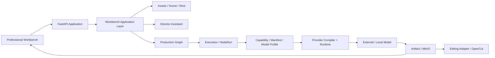
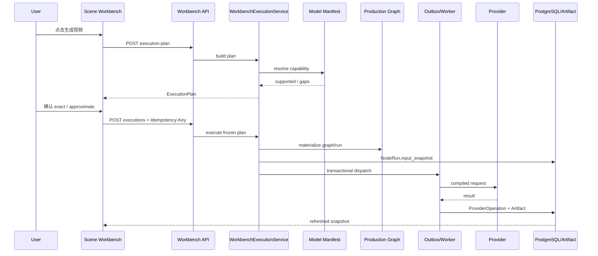
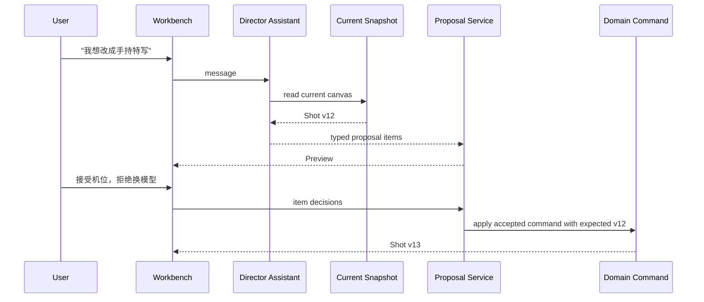

# DramaForge Professional 技术设计方案

> **状态：TECHNICAL DESIGN / 后续实现的技术约束**
>
> **产品上位文档：** `DramaForge_专业版产品与开发最终方案_完整交互版.md`
>
> **仓库：** `zwb2002-yjy/dramaforge-p0`
>
> **审计分支：** `dev`
>
> **审计基线：** `9e0b27fb6fbf2413ea27859ea463380be0f5051d`
>
> **基线提交：** `docs: record unified golden sample completion`
>
> **设计日期：** 2026-08-26
>
> **本文职责：** 把已经冻结的产品、UI、交互原则映射到当前真实代码。本文不是重新写 PRD，也不是逐日实施排期；它回答的是“基于当前 `dev`，专业版应该如何落到现有模块、数据模型、API、前端路由、执行链和迁移边界”。

---

# 1. 设计结论

DramaForge Professional **不做重写**。

当前 `dev` 已经具备专业版最难重建的执行底座：

- `Project / Scene / Shot / Asset` 领域骨架；
- `ProductionGraph / GraphVersion / GraphNode / GraphEdge`；
- `NodeRun`、幂等、局部重跑、异步执行；
- `ProviderOperation` 与真实供应商调用血缘；
- `Artifact` 与对象存储；
- `ModelManifest / CapabilitySpec / ModelProfile`；
- Provider Compiler / Runtime；
- Director Proposal / Impact / Quality / Repair 的第一轮能力；
- React Query + TanStack Router 的项目工作台前端；
- Playwright / Vitest / Pytest 测试体系。

因此专业版采用：

> **保留 Production / Execution / Provider / Artifact 内核，扩展现有 Scene / Shot / Asset；新增实验、资产版本、导演助手 Proposal、审片批注等缺失实体；重新组织前端工作台。**

明确禁止：

1. 新建第二套 Project；
2. 新建第二套 Scene / Shot；
3. 新建第二套模型能力表；
4. 新建第二套媒体执行引擎；
5. 为新 UI 复制一套 Artifact；
6. 让前端 Store 成为制作事实源；
7. 让导演智能体直接写业务表；
8. 让 Provider Adapter 改写用户导演语义。

---

# 2. 当前 `dev` 代码审计

## 2.1 当前事实源

| 领域 | 当前真实代码 | 设计判断 |
|---|---|---|
| Project | `backend/app/access/models.py::Project` | 保留 |
| 用户项目偏好 | `backend/app/access/models.py::UserProjectPreference` | 扩展 |
| Script / Episode | `backend/app/assets/models.py` | 保留 |
| Scene | `backend/app/assets/models.py::Scene` | 扩展，不另建 |
| Shot | `backend/app/assets/models.py::Shot` | 扩展，不另建 |
| Asset | `backend/app/assets/models.py::Asset` | 作为统一项目资产目录继续使用 |
| Character | `backend/app/assets/models.py::Character` | 保留 |
| CharacterReference | `backend/app/assets/models.py::CharacterReference` | 兼容保留，逐步迁到统一资产版本引用层 |
| Director Workflow | `backend/app/director/models.py::DirectorWorkflowRun` | 旧四阶段兼容，不再是专业工作台前置 |
| Change Proposal | `backend/app/director/models.py::ChangeProposal` | 旧创作版本变更继续使用；专业助手另补逐项 Proposal |
| Impact Report | `backend/app/director/models.py::ImpactReport` | 可复用影响分析思想 |
| Production Batch | `backend/app/director/models.py::ProductionBatch` | 旧 Director 批次兼容；新手动工作台不强制依赖 |
| Production Graph | `backend/app/production/models.py` | 核心保留 |
| Graph Service | `backend/app/production/service.py` | 扩展 scope |
| NodeRun | `backend/app/execution/models.py::NodeRun` | 核心保留 |
| Artifact | `backend/app/execution/models.py::Artifact` | 核心保留 |
| ShotHumanLock | `backend/app/execution/models.py::ShotHumanLock` | 保留，用于阻止旧自动路径覆盖用户工作 |
| ProviderOperation | `backend/app/execution/models.py::ProviderOperation` | 核心保留 |
| Shot Pipeline | `backend/app/execution/shot_pipeline.py` | 先复用，不因 UI 重命名就重写 |
| 模型能力 | `backend/app/providers/capabilities.py` | 保留 |
| Model Manifest | `backend/app/providers/manifest.py` | **唯一模型能力事实源** |
| 模型 Profile | `backend/app/providers/model_profiles/` | **唯一项目默认模型配置** |
| Unified Generation API | `backend/app/api/v1/generations.py` | 复用 Registry / Manifest / CapabilityRouter 思路 |
| 剪辑导出 | `backend/app/delivery/` | 保留，后续接 Editing Adapter |
| 前端项目 Shell | `frontend/src/features/creation-preview/ProjectWorkspaceShell.tsx` | 作为迁移锚点重构 |
| 快速创作 | `frontend/src/routes/projects.$projectId.quick.tsx` | 旧兼容入口，后续降级 |
| 专业生产 | `frontend/src/routes/projects.$projectId.production.tsx` | 复用其 Storyboard / Shot / NodeRun 数据能力，重构 UI 语义 |

---

## 2.2 当前已经接近目标的能力

### A. Scene / Shot 已经存在

当前不是“只有 AI 流程，没有影视对象”。

已有：

```text
Episode
  └─ Scene
      └─ Shot
```

`Shot` 已包含：

- `shot_type`
- `camera_move`
- `visual_description`
- `dialogue`
- `duration_seconds`
- `status`
- `sort_order`
- `version`

因此新专业工作台必须扩展 `Shot`，而不是建立 `ProfessionalShot`。

---

### B. Asset 已经是统一项目目录

当前 `Asset` 已有：

```text
project_id
kind
name
description
status
metadata
version
```

`Character` 已经以 `Asset.id` 作为 PK 扩展。

所以专业版结构化资产应建立在当前 `Asset` 上：

```text
Asset
  ├─ Character
  ├─ Scene Asset
  ├─ Costume
  ├─ Prop
  ├─ Action
  ├─ Expression
  ├─ Audio
  └─ Prompt Scheme
```

不再建立另一套 `MediaLibraryItem`。

---

### C. 模型能力系统已经存在

`backend/app/providers/manifest.py` 已有：

```text
ModelManifest
CapabilitySpec
InputSlotSpec
ParameterSpec
ConstraintSpec
ConditionalConstraint
```

它已经能够表达：

- 输入槽位；
- required / min / max；
- media type；
- common options；
- native options；
- UI component；
- mutually exclusive；
- requires；
- conditional constraints。

而且当前 API 已提供：

```text
GET /models
GET /models/{model_id}
GET /capabilities
```

因此专业版“模型能力动态 UI”应直接消费现有 Manifest。

**禁止再造：**

```text
professional_model_capabilities
model_feature_matrix_v2
video_model_features
```

等平行体系。

---

### D. Provider Request 已经具备可追溯基础

当前 `ProviderOperation` 已保存：

- actual provider；
- actual model；
- manifest hash；
- selection plan；
- request summary；
- response summary；
- remote task id；
- provider cost；
- execution path version。

专业版不需要再建一套 `GenerationHistory`。

需要做的是：

> **标准化 `NodeRun.input_snapshot` 和 `ProviderOperation.request_summary` 的内容，让 UI 能解释“导演意图 → 执行翻译 → 实际请求”。**

---

### E. 当前专业生产页已有可复用 UI 逻辑

`projects.$projectId.production.tsx` 已经有：

- shot timeline strip；
- Storyboard；
- shot selection；
- keyframe preview；
- per-shot node rail；
- NodeRun 状态；
- Artifact；
- 局部 rerun；
- 导出。

问题不是“没有”。

问题是它当前偏：

> **NodeRun / 预算 / 四阶段证据面板**

而不是：

> **场景 / 镜头 / 画面 / 导演意图。**

所以应拆组件并改变信息层级，不应整页推倒后再复制逻辑。

---

# 3. 技术架构目标

目标架构仍然保持当前模块化单体 + Worker：



`Workbench` 不是新业务真相层。

它只负责：

- 聚合 Scene / Shot / Asset / Production / Model facts；
- 暴露符合专业 UI 的 Snapshot；
- 调用领域 Command；
- 不直接存一套复制业务数据。

---

# 4. 新版事实源边界

| 信息 | 唯一事实源 |
|---|---|
| 项目 | `projects` |
| 项目视觉规范 | `projects.style_bible` |
| 场景 | `scenes` |
| 正式镜头设计 | `shots` |
| 项目资产目录 | `assets` |
| 媒体资产版本 | `asset_versions`（新增） |
| 资产版本中的具体参考 | `asset_version_references`（新增） |
| 镜头引用哪个资产及用途 | `shot_reference_bindings`（新增） |
| 正式关键帧 / 视频选择 | `shots.formal_*_artifact_id`（新增） |
| 实验 | `production_experiments` / `shot_experiments`（新增） |
| 实际运行 | `node_runs` |
| 实际 Provider 调用 | `provider_operations` |
| 媒体字节 | `artifacts + MinIO` |
| 模型能力 | `ModelManifest` |
| 项目默认模型 | `ProductionModelProfile` |
| 用户最后工作位置 / Agent 面板偏好 | `user_project_preferences.workspace_state`（扩展） |
| 导演助手聊天 | `director_threads / director_messages`（新增，**不是制作事实源**） |
| 导演助手建议 | `director_proposals / director_proposal_items`（新增） |
| 审片批注 | `review_annotations`（新增） |
| 剪辑状态 | Editing Adapter / Edit Document，不能反向成为 Shot 生产事实源 |

---

# 5. 核心设计决策

## TD-01：`Shot` 继续代表正式线

不创建 `FormalShot`。

当前 `Shot` 直接代表：

> **当前正式镜头设计。**

新增字段承载专业导演语义和正式结果选择。

实验单独存在，不污染正式 Shot。

这样：

- 旧脚本导入仍产生原来的 Shot；
- 旧 `/projects/{id}/shots` 仍可读；
- 新工作台直接升级当前对象；
- 不需要给所有旧项目迁移第二份 Shot。

---

## TD-02：实验使用独立实体，不复制 Project

新增：

```text
ProductionExperiment
  └─ ShotExperiment
```

`ProductionExperiment`：

- 单镜头实验；
- 场景级实验；

统一使用。

`ShotExperiment` 创建时：

> **复制当前 Shot 的模型无关完整设计快照与引用关系。**

它不是继承一个“实时 Formal Shot”。

Formal 后续变化：

> 不会偷偷改变已经存在的实验。

---

## TD-03：正式与实验使用同一个 Production Graph 引擎

当前 `GraphService.create_graph()` 只允许：

```text
shot
episode
```

扩展为：

```text
shot
shot_experiment
episode
```

正式：

```text
scope_type = shot
scope_entity_id = shot.id
```

实验：

```text
scope_type = shot_experiment
scope_entity_id = shot_experiment.id
```

这样每条实验拥有独立：

- Graph；
- GraphVersion；
- NodeRun；
- ProviderOperation；
- Artifact lineage。

不会因为实验发布 GraphVersion 而改变正式 Shot graph 的 current version。

---

## TD-04：项目视觉规范直接复用 `Project.style_bible`

不新增 `ProjectVisualStandard` 表。

把 `style_bible` 从当前自由 JSON 规范化为 Pydantic schema：

```text
ProjectVisualStandard
├─ text_direction
├─ character_style
├─ scene_style
├─ color
├─ lighting
├─ material
├─ shot_language
├─ composition_preferences
├─ realism_level
├─ forbidden_styles
├─ visual_anchor_asset_ids
└─ visual_anchor_artifact_ids
```

更新时：

- `Project.version + 1`
- 执行前冻结到 `NodeRun.input_snapshot`

因此历史媒体仍然知道当时使用的是哪版视觉规范。

---

## TD-05：最后工作位置直接扩展 `UserProjectPreference`

当前已有：

```text
experience_mode
last_guided_step
```

新增：

```text
workspace_state JSON
```

建议结构：

```json
{
  "last_view": "scene",
  "scene_id": "...",
  "shot_id": "...",
  "shot_stage": "video",
  "director_panel_open": true,
  "director_mode": "manual",
  "advanced_panel_open": false
}
```

它是用户体验偏好：

> **不是业务事实。**

因此允许前端做防抖更新。

---

## TD-06：新专业工作台不依赖 `DirectorWorkflowRun`

专业用户完全手动制作时：

> 不要求先创建 Director Workflow。

因此新的：

```text
scenes
assets
workbench shot execution
experiments
review
editing
```

API 必须只依赖：

- 当前用户；
- Project；
- 当前资源版本；
- Provider / model capability；
- Production Graph。

**不得调用：**

```python
require_legacy_execution_allowed(...)
```

这个 Guard 继续保护：

- `/quick`
- 旧 `characters/lead`
- 旧 direct generation
- 旧 shot_ops

新专业 API 使用单独的：

```text
WorkbenchExecutionGuard
```

校验：

- project ownership；
- expected version；
- model capability；
- reference validity；
- execution plan；
- idempotency。

---

## TD-07：新专业工作台不把 Budget 作为执行前置

当前以下模型继续存在：

- `BudgetAuthorization`
- `BudgetReservation`
- `ProductionBatch.budget_authorization_id`

因为旧四阶段路径仍依赖。

专业工作台 V1：

> **不通过 `DirectorProductionService` / `ProductionBatch` 才能生成媒体。**

新执行链直接：

```text
Workbench Command
→ Production Graph
→ NodeRun
→ Outbox / Worker
→ ProviderOperation
```

`NodeRun.budget_reservation_id` 本来已经 nullable。

`ProviderOperation.provider_cost`：

> 如果供应商返回则继续记录。

这样首轮重构：

- 不需要破坏旧预算表；
- 不需要造“假预算授权”；
- 不需要为了新产品一次删除大量稳定代码。

旧 Budget 在专业版 UI：

> 不展示为 Gate。

等旧 Quick 路径完全退役后再单独做 Budget schema 清理 ADR。

---

# 6. Scene 数据设计

当前：

```python
class Scene:
    id
    episode_id
    scene_number
    location_name
    time_of_day
    synopsis
    version
```

V1 只新增：

```text
design_state JSON NOT NULL DEFAULT {}
```

不创建第二个 Scene Design 表。

---

## 6.1 `SceneDesignState`

由 Pydantic 定义：

```python
class SceneDesignState(BaseModel):
    visual_override: dict = {}
    continuity_rules: list[dict] = []
    role_states: list[dict] = []
    key_props: list[dict] = []
    layout_spec: dict = {}
    blocking_2d: dict = {}
    blocking_3d: dict = {}
```

注意：

- `blocking_3d` 保存的是可序列化场景状态；
- 不保存 Three.js runtime 对象；
- 坐标统一使用项目场景坐标；
- UI 摄影机 / 人物拖动完成后写回 JSON；
- `Scene.version` 作为 optimistic concurrency。

---

## 6.2 场景排序

当前已有：

```text
episode_id + scene_number UNIQUE
```

V1 直接使用 `scene_number` 做顺序。

拖拽排序：

> 由后端在一个事务内重新编号。

不新增 `sort_order`，避免重复顺序事实。

---

## 6.3 场景 Storyboard 代表画面

V1 不新增 `representative_artifact_id` 字段。

默认算法：

1. 用户显式指定的 Scene Asset 正式图；
2. 场景中第一个正式关键帧；
3. 场景中最新可用正式关键帧；
4. 占位图。

如果以后明确需要人工固定代表画面：

> 再新增显式 selection。

首版不提前加。

---

## 6.4 Scene 结构命令

新增应用服务：

```text
SceneService
```

支持：

```text
create
update
reorder
copy
split_preview
split
merge_preview
merge
```

`split` / `merge` 必须：

1. 计算 Impact Preview；
2. 返回受影响 Shot / Experiment / Artifact；
3. 用户确认后执行；
4. 已有 Artifact 不删除。

---

# 7. Shot 正式设计

当前 `Shot` 保留已有：

```text
shot_type
camera_move
visual_description
dialogue
duration_seconds
status
sort_order
version
```

新增：

```text
director_state JSON NOT NULL DEFAULT {}
image_prompt TEXT NOT NULL DEFAULT ''
video_prompt TEXT NOT NULL DEFAULT ''

formal_keyframe_artifact_id UUID NULL
formal_video_artifact_id UUID NULL
formal_composite_artifact_id UUID NULL
```

三个 Artifact FK 均：

```text
ON DELETE RESTRICT
```

---

## 7.1 `ShotDirectorState`

建议 schema：

```python
class ShotDirectorState(BaseModel):
    framing: dict
    camera: dict
    action: dict
    expression: dict
    gaze: dict
    composition: dict
    continuity_constraints: list[dict]
    model_overrides: dict
    video_reference_risk: dict | None
```

示例：

```json
{
  "framing": {
    "shot_size": "close_up",
    "angle": "eye_level"
  },
  "camera": {
    "movement": "locked",
    "focal_length_mm": 50
  },
  "action": {
    "description": "缓慢回头看向门口"
  },
  "gaze": {
    "target_type": "point",
    "target": "door"
  },
  "model_overrides": {
    "image_model_id": null,
    "video_model_id": "..."
  }
}
```

---

## 7.2 为什么 Prompt 独立列，而不是全塞 JSON

因为需要：

- 高频编辑；
- 局部重跑；
- diff；
- 文本搜索；
- 清晰 API；
- 不让 Director State 成为万能垃圾桶。

因此：

```text
image_prompt
video_prompt
```

作为一等字段。

---

## 7.3 用户直接修改

新增：

```text
PATCH /projects/{project_id}/shots/{shot_id}/design
```

必须包含：

```text
expected_version
```

服务器：

1. 校验 Shot 属于 Project；
2. 比较版本；
3. 写入；
4. `Shot.version += 1`；
5. 不自动生成媒体；
6. 不要求 Director Agent 批准。

如果版本冲突：

> HTTP 409 + 当前 Snapshot。

---

# 8. 结构化资产设计

## 8.1 `Asset` 继续作为资产卡主对象

当前：

```text
Asset
├─ kind
├─ name
├─ description
├─ status
├─ metadata
└─ version
```

保留。

新增：

```text
current_version_id UUID NULL
```

指向：

> 当前正式媒体/结构化版本。

---

# 9. AssetVersion

新增表：

```text
asset_versions
```

建议字段：

```text
id UUID PK
project_id UUID FK
asset_id UUID FK
version_no INT
status VARCHAR
supersedes_version_id UUID NULL
payload JSON
created_by UUID
created_at timestamptz
promoted_at timestamptz NULL

UNIQUE(asset_id, version_no)
```

`status`：

```text
candidate
formal
historical
rejected
```

规则：

- 自动扩展角色视角 → candidate；
- 用户确认 → formal；
- 原 formal → historical；
- `Asset.current_version_id` 指向新 formal；
- 不覆盖旧版本。

---

# 10. AssetVersionReference

新增：

```text
asset_version_references
```

字段：

```text
id
project_id
asset_version_id
artifact_id
reference_role
label
sort_order
metadata
created_at
```

`reference_role` 示例：

### 角色

```text
front_face
three_quarter
profile
half_body
full_body
expression
outfit
primary
```

### 场景

```text
scene_reference
layout_reference
lighting_reference
style_reference
primary
```

### 动作 / 视频

```text
action_reference
camera_reference
primary
```

---

## 10.1 `CharacterReference` 兼容策略

当前 `CharacterReference` 不删除。

迁移时：

1. 每个现有 Character 创建 AssetVersion v1；
2. `CharacterReference` 逐条映射到 `AssetVersionReference`；
3. canonical 映射为 `front_face` 或 `primary`；
4. `Asset.current_version_id = v1`；
5. 老 API 暂时继续写 `CharacterReference`；
6. 新专业资产 API 写新表；
7. 在兼容期，由 adapter read service 合并两套旧/新引用；
8. 等 `/characters/lead` 退役后再删除双读。

首轮禁止直接删 `CharacterReference`。

---

# 11. AssetTag

为 V1 分类 + 标签 + 筛选新增：

```text
asset_tags
asset_tag_links
```

`asset_tags`：

```text
id
project_id
name
normalized_name
```

唯一：

```text
(project_id, normalized_name)
```

`asset_tag_links`：

```text
asset_id
tag_id
```

分类继续使用：

```text
Asset.kind
```

不新增 Category 表。

---

# 12. 回收站

直接复用：

```text
Asset.status
```

约定：

```text
active
draft
recycled
```

加入回收站：

> `status = recycled`

不删除 Artifact。

永久删除：

> 独立 Command，先检查 lineage / binding / formal result。

---

# 13. `@资产` 的技术实现

## 13.1 不依赖 Prompt 字符串名称解析

用户在 UI 输入：

```text
@林墨
```

前端必须通过 autocomplete 选中真实 Asset。

选中后创建：

```text
ShotReferenceBinding
```

Prompt 中的 `@林墨`：

> 主要用于人类可读。

真正执行引用：

> 以 binding 为准。

如果用户只手打 `@林墨` 但没有从菜单完成绑定：

> UI 显示“未解析引用”，不能假装已绑定。

这样 Asset 重命名不会让执行引用失效。

---

# 14. ShotReferenceBinding

新增：

```text
shot_reference_bindings
```

字段：

```text
id
project_id
shot_id
shot_experiment_id NULL
stage                  # image | video | both
asset_id NULL
asset_version_id NULL
artifact_id NULL
resolution_mode        # current_formal | pinned_version | direct_artifact
purpose
label
sort_order
metadata
created_by
created_at
updated_at
version
```

`purpose`：

```text
identity
clothing
scene_layout
scene_lighting
style
action
pose
camera_language
audio_rhythm
first_frame
last_frame
generic_reference
```

---

## 14.1 执行时冻结

如果 binding：

```text
resolution_mode = current_formal
asset_id = 林墨
```

执行前：

```text
Asset.current_version_id
→ AssetVersion
→ AssetVersionReference
→ Artifact
```

全部解析。

解析结果写入：

```text
NodeRun.input_snapshot.resolved_references
```

因此后续角色资产升级：

> 不会改变已经生成的视频历史。

---

## 14.2 “旧资产生成”提示

UI 比较：

```text
NodeRun.input_snapshot.resolved_asset_version_id
```

与：

```text
Asset.current_version_id
```

不同则显示：

> 当前视频使用角色资产旧版本。

这是派生状态，不额外存一份布尔值。

---

# 15. 实验系统

## 15.1 ProductionExperiment

新增：

```text
production_experiments
```

字段：

```text
id
project_id
scope_type             # shot | scene
scope_entity_id
name
status                 # active | adopted | archived
purpose
created_by
created_at
updated_at
version
```

---

## 15.2 ShotExperiment

新增：

```text
shot_experiments
```

字段：

```text
id
project_id
experiment_id
shot_id
base_shot_version

design_snapshot JSON
image_prompt TEXT
video_prompt TEXT
model_overrides JSON

production_graph_id UUID NULL

accepted_keyframe_artifact_id UUID NULL
accepted_video_artifact_id UUID NULL
accepted_composite_artifact_id UUID NULL

status
created_by
created_at
updated_at
version
```

---

## 15.3 创建实验

例如用户：

> 换模型 B 验证。

服务器：

1. 读取当前 Shot；
2. 复制 `director_state`；
3. 复制 image/video prompt；
4. 复制所有 formal `ShotReferenceBinding`；
5. 仅修改 `video_model_id = B`；
6. 创建 `ShotExperiment`；
7. 创建独立 `ProductionGraph(scope=shot_experiment)`；
8. 不修改正式 Shot。

---

## 15.4 为什么不 Raw Copy Provider 参数

实验创建复制的是：

- director intent；
- prompt；
- reference purpose；
- assets；
- shot constraints；
- model-independent options。

不复制：

- 供应商 A 的私有 request payload；
- A 专属字段；
- A 的 transport 参数。

换 B 时：

> 重新走 Manifest + Compiler。

---

# 16. 场景级实验

场景实验：

```text
ProductionExperiment(scope_type=scene)
```

下面创建多个：

```text
ShotExperiment
```

每个 ShotExperiment 都是正式 Shot 当时的冻结拷贝。

允许用户只采纳：

- 服饰；
- 灯光；
- 某个 Shot；
- 某个关键帧；
- 某个模型策略。

---

# 17. 实验采纳

新增：

```text
ExperimentAdoptionService
```

Command：

```text
POST /projects/{project_id}/experiments/{experiment_id}/adopt
```

body：

```json
{
  "shot_experiment_id": "...",
  "scope": "keyframe_only",
  "expected_shot_version": 12
}
```

scope：

```text
current_result_only
keyframe_only
keyframe_and_rerun_video
design_only
full_shot
```

---

## 17.1 采用新关键帧但保留旧视频

允许：

```text
Shot.formal_keyframe_artifact_id = 新
Shot.formal_video_artifact_id = 旧
```

UI 通过旧视频对应 NodeRun 的输入引用判断：

> 当前视频仍基于旧关键帧。

不要自动删旧视频。

---

# 18. Production Graph 映射

## 18.1 不把 UI 生产链变成新 DAG

用户看到：

```text
导演意图 → 关键帧 → 视频 → 审片
```

底层继续使用现有：

```text
prompt
keyframe
identity_review
video
video_drift_review
voice
subtitle
composite
continuity_review
```

语义映射：

| UI 阶段 | 当前 Node |
|---|---|
| 导演意图 | Shot + prompt compose |
| 关键帧 | keyframe + identity_review |
| 视频 | video + video_drift_review |
| 审片 | review / continuity / human annotation |
| 高级音频 | voice + subtitle + composite |

---

## 18.2 首轮不要因为 UI 改名重写 `shot_pipeline.py`

只有当实际媒体执行合同需要变化时：

> 才发布新的 pipeline template。

否则先复用当前稳定节点。

---

# 19. WorkbenchExecutionService

新增：

```text
backend/app/production/workbench_execution.py
```

职责：

```text
1. load Project / Scene / Shot or ShotExperiment
2. freeze design version
3. resolve references
4. resolve project model default + shot override
5. load ModelManifest
6. create ExecutionPlan
7. validate capability
8. materialize / reuse ProductionGraph
9. create NodeRun
10. persist immutable input_snapshot
11. commit through existing Outbox / scheduler path
```

它不：

- 直接发 HTTP Provider；
- 写原始供应商 JSON；
- 修改 Project Profile；
- 调 Director budget gate。

---

# 20. ExecutionPlan

执行前创建纯结构化计划：

```python
class WorkbenchExecutionPlan(BaseModel):
    project_id: UUID
    scene_id: UUID
    shot_id: UUID
    experiment_id: UUID | None

    stage: Literal["keyframe", "video"]

    shot_version: int
    director_intent: dict
    prompt: str
    resolved_references: list[ResolvedReference]

    model_binding: ResolvedModelBinding
    capability: Capability

    exact_controls: list[str]
    approximate_controls: list[ControlTranslation]
    unsupported_controls: list[CapabilityGap]

    semantic_request_preview: dict
```

先：

> Plan

再：

> Execute。

Plan 不产生 Provider 请求。

---

# 21. 模型能力缺口

定义：

```python
class CapabilityGap(BaseModel):
    requirement: str
    reason: str
    severity: Literal["warning", "blocking"]
    alternatives: list[Alternative]
```

Alternative：

```text
continue_approximate
convert_to_pose
switch_model
remove_control
manual_override
```

例如：

```text
用户：
@动作视频 只参考动作，不参考人物

当前模型：
只能 generic reference video
```

返回：

```json
{
  "requirement": "action_only_reference",
  "severity": "warning",
  "alternatives": [
    "continue_approximate",
    "convert_to_pose",
    "switch_model"
  ]
}
```

如果用户明确选择：

> continue_approximate

执行快照必须记录。

---

# 22. Reference Purpose 与 Provider Slot 分离

新增产品层：

```text
ReferencePurpose
```

不能直接把：

```text
identity
clothing
camera_language
```

塞进 Provider API 并假装所有模型原生支持。

新增：

```text
ReferencePlanCompiler
```

流程：

```text
用户用途
↓
模型 Manifest
↓
是否有原生槽
↓
exact / approximate / unsupported
↓
现有 ImageGenerateRequest / ReferenceToVideoRequest
```

---

## 22.1 V1 映射策略

### Exact

模型 Manifest 真正声明原生能力：

> 使用原生 slot。

### Approximate

模型只支持 generic image/video reference：

- 仍传真实 Artifact；
- Prompt Compiler 增加明确用途说明；
- Translation Report 记录 approximate。

### Unsupported

模型连媒体类型 / 数量都不支持：

> 不提交请求。

---

# 23. Provider Contract 演进

当前：

```text
ImageGenerateRequest.reference_images
ReferenceToVideoRequest.reference_images
ReferenceToVideoRequest.reference_videos
ReferenceToVideoRequest.reference_audio
```

V1 不必立即重写这些稳定合同。

优先：

> 在 Workbench → Provider Contract 之间新增语义 ReferencePlan。

只有某供应商确实有：

- subject slot；
- action slot；
- camera ref slot；

时，再向 `CapabilitySpec.input_slots` 和 Request Contract 做向后兼容扩展。

禁止提前虚构所有模型都有这些原生槽。

---

# 24. Model Manifest 是动态 UI 唯一来源

前端直接使用当前：

```text
GET /models?capability=...
GET /models/{model_id}
```

响应中的：

```text
capability_specs
input_slots
common_options
native_options
constraints
```

生成：

- 输入槽位；
- disabled state；
- select；
- switch；
- number；
- slider；
- native advanced options；
- 互斥提示。

---

## 24.1 禁止前端写模型名条件

禁止：

```ts
if (modelId.includes("seedance")) { ... }
if (modelId === "kling-o3") { ... }
```

模型差异来自：

> Manifest。

唯一允许的模型名使用：

- 显示；
- 搜索；
- 日志。

---

# 25. Project Model Profile

继续使用：

```text
backend/app/providers/model_profiles
```

项目 UI 简化显示：

```text
默认语言模型
默认图片模型
默认视频模型
默认声音模型
```

内部仍可映射到现有细粒度 Slot。

不删除：

```text
planning_script
visual_keyframe
visual_image_edit
video_shot
...
```

因为执行层仍需要。

---

## 25.1 `SimpleModeSelection`

当前只有：

```text
llm_model_id
image_model_id
video_model_id
```

扩展：

```text
voice_model_id
```

应用时：

- language → planning slots；
- image → visual slots；
- video → video shot；
- voice → audio TTS。

这只是一种 Profile 编辑方式：

> 不是第二模型配置事实。

---

# 26. Shot 局部模型覆盖

正式 Shot 的：

```text
director_state.model_overrides
```

只记录：

```text
image_model_id
video_model_id
voice_model_id
```

执行时优先级：

```text
request override
> shot override
> project profile
> workspace profile
> system default
```

现有 `ResolvedModelBinding.source` 已经支持：

```text
request_override
project_profile
workspace_profile
system_default
```

因此不要新写 selector 体系。

---

# 27. 实际执行透明性

每个新 Workbench NodeRun 的：

```text
input_snapshot
```

统一包含：

```json
{
  "workbench": {
    "scene_id": "...",
    "shot_id": "...",
    "shot_experiment_id": null,
    "shot_version": 12,
    "stage": "video",

    "director_intent": {},
    "prompt": "...",

    "style_bible_snapshot": {},
    "resolved_references": [],

    "requested_model_override": null,
    "model_binding_snapshot": {},

    "accepted_approximations": []
  }
}
```

---

## 27.1 ProviderOperation.request_summary

标准化：

```json
{
  "effective_request_redacted": {},
  "translation_report": {
    "exact": [],
    "approximate": [],
    "omitted": []
  },
  "reference_delivery": [],
  "semantic_fingerprint": "..."
}
```

不能把 Secret、Header、Token 写进去。

---

# 28. “没有隐藏第二套 Prompt”的技术保证

UI 可以展开三层：

## A. 当前导演方案

来自：

```text
Shot / ShotExperiment
```

## B. 模型执行翻译

来自：

```text
ExecutionPlan.translation
```

## C. 实际请求

来自：

```text
ProviderOperation.request_summary.effective_request_redacted
```

自动测试必须验证：

> 如果 A 中明确 `camera.movement = locked`，Translation Report 不能悄悄变成 `dolly_in`。

如果模型不支持：

> 只能标记 approximate / unsupported。

---

# 29. ReviewAnnotation

新增：

```text
review_annotations
```

字段：

```text
id
project_id
shot_id
shot_experiment_id NULL
artifact_id

annotation_type     # image_region | video_time | video_range
geometry JSON NULL
time_start_ms NULL
time_end_ms NULL
text

status              # open | resolved | dismissed
created_by
created_at
updated_at
```

---

## 29.1 图片批注

`geometry` 使用归一化坐标：

```json
{
  "shape": "rect",
  "x": 0.41,
  "y": 0.22,
  "w": 0.18,
  "h": 0.25
}
```

不存屏幕像素。

---

## 29.2 视频批注

```text
time_start_ms
time_end_ms
```

单点：

```text
start == end
```

范围：

```text
end > start
```

---

# 30. V1 Repair Command

审片标记不等于支持局部视频 repaint。

V1 固定两种动作：

```text
rerun_video
regenerate_keyframe_then_video
```

新增：

```text
WorkbenchRepairService
```

它接受：

- annotation ids；
- 用户说明；
- 当前 Shot / Experiment；
- 当前模型；

返回：

> 修复 Plan。

用户也可以完全绕过 Agent：

> 直接手动点重跑。

---

# 31. Director Assistant 数据设计

## 31.1 Conversation 不是业务事实

新增：

```text
director_threads
director_messages
```

Thread：

```text
id
project_id
scene_id NULL
shot_id NULL
status
created_by
created_at
updated_at
```

Message：

```text
id
project_id
thread_id
role           # user | assistant
content
source_agent_run_id NULL
created_at
```

用途：

- 对话连续性；
- UI 历史；
- Agent 上下文。

明确：

> **如果聊天历史和当前 Shot 冲突，当前 Shot 永远胜出。**

---

# 32. Director Assistant 每一轮上下文

每次用户发送消息：

```text
1. 读取当前 Workbench Snapshot
2. 读取当前资产正式版本
3. 读取当前模型能力
4. 读取最近对话
5. 加入当前用户消息
6. 运行 Director Skill
```

不是：

> 从历史聊天猜当前方案。

---

# 33. AgentRun 复用

当前 `AgentRun` 已有：

- project；
- requested capability；
- prompt/context version；
- input/context hash；
- run status；
- ProviderOperation parent。

专业助手仍应复用 `AgentRun`，不建 `DirectorAgentRun2`。

需要迁移：

```text
planning_authorization_id -> nullable
```

并允许专业 Assistant Run：

```text
planning_authorization_id = NULL
```

新增 operation：

```text
director_assist
```

旧 Planning 路径：

> 继续保持原有 authorization 规则。

专业 Assistant：

> 不需要成本预算 Gate 才能与用户讨论。

如果文本模型本身产生可记录费用：

> 仍记 ProviderOperation，不作为用户流程门禁。

---

# 34. DirectorProposal

当前 `ChangeProposal` 只适合：

```text
target_artifact_kind + replacement_payload
```

无法表达：

> 一次 Agent 建议同时改机位、补参考、改 Prompt、换模型，而且用户只接受其中两项。

因此不强改旧 `ChangeProposal`。

新增：

```text
director_proposals
director_proposal_items
```

---

## 34.1 DirectorProposal

```text
id
project_id
thread_id NULL
source_agent_run_id NULL
scope_type
scope_entity_id
summary

status
# awaiting_review
# partially_applied
# applied
# dismissed
# stale

created_by_agent
created_at
updated_at
```

---

## 34.2 DirectorProposalItem

```text
id
project_id
proposal_id
item_order

command_kind
target_type
target_id
expected_target_version

before_snapshot JSON
command_payload JSON

rationale
expected_benefit
creative_cost
risk_summary
impact JSON

status
# pending
# accepted
# rejected
# applied
# stale

decided_by NULL
decided_at NULL
applied_at NULL
```

---

# 35. Proposal 不使用任意 JSON Patch 直接写库

`command_kind` 必须来自白名单，例如：

```text
shot.update_director_state
shot.update_image_prompt
shot.update_video_prompt
shot.set_model_override
shot_reference.add
shot_reference.remove
asset_version.promote
scene.update_design
experiment.create
```

服务：

```text
ProposalCommandRegistry
```

将 command 映射到确定性 Domain Service。

LLM 不允许输出：

```text
table=shots
column=...
sql=...
```

---

# 36. Proposal 逐项接受

API：

```text
POST /projects/{project_id}/director-assistant/proposals/{proposal_id}/decisions
```

body：

```json
{
  "items": [
    {"item_id": "...", "decision": "accept"},
    {"item_id": "...", "decision": "reject"}
  ]
}
```

执行规则：

1. 先记录 decision；
2. accepted item 再走 Domain Command；
3. rejected 永远不执行；
4. proposal 最终状态按 item 汇总。

---

# 37. Proposal Stale

如果：

```text
expected_target_version = 8
```

用户在 Agent 建议后自己把 Shot 改成：

```text
version = 9
```

则 Proposal Item：

> `stale`

不能拿旧建议覆盖新画布。

UI 显示：

> 当前镜头已经修改，建议需要重新计算。

---

# 38. 用户手改优先

手动：

```text
PATCH Shot
```

不创建 Proposal。

Agent 下次：

> 读取更新后的 Shot。

这保证：

> Agent 是 Copilot，不是工作流所有者。

---

# 39. 前端状态管理边界

当前已有：

- React Query；
- Zustand；
- TanStack Router。

专业版约束：

## React Query

负责：

> 服务器制作事实。

例如：

- Scene；
- Shot；
- Asset；
- NodeRun；
- Experiment；
- Proposal；
- Model Manifest。

## Zustand

只允许：

- 当前选中 Shot；
- 当前工具；
- 临时缩放；
- panel 开关；
- 未提交 drag 状态；
- 3D viewport 临时状态。

禁止 Zustand 保存：

> “正式关键帧是谁”  
> “当前角色版本是谁”  
> “当前模型方案是谁”

作为第二事实源。

---

# 40. 前端路由目标

新增：

```text
/projects/$projectId/script
/projects/$projectId/assets
/projects/$projectId/scenes
/projects/$projectId/scenes/$sceneId
/projects/$projectId/production
/projects/$projectId/edit
```

项目根：

```text
/projects/$projectId
```

行为：

1. 获取 `UserProjectPreference.workspace_state`；
2. 若存在有效 last view → redirect；
3. 否则 → `/scenes`。

---

## 40.1 Legacy

保留：

```text
/projects/$projectId/quick
```

但：

- 不放专业版主导航；
- 标记 legacy；
- 旧项目兼容期可访问；
- 不再成为项目默认入口。

---

# 41. ProjectWorkspaceShell 重构

当前：

```text
ProjectWorkspaceShell
├─ 项目总览
├─ 快速创作
├─ 专业生产
└─ 模型设置
```

重构为：

```text
ProfessionalProjectShell
├─ 剧本
├─ 资产
├─ 场景
├─ 制作
└─ 剪辑
```

迁移建议：

1. 先在原文件基础上演进；
2. 稳定后移动到：

```text
frontend/src/features/workbench/ProfessionalProjectShell.tsx
```

不要第一次提交同时：

> 重写 Shell + 全量改样式 + 改后端。

---

# 42. StageStepper

当前 `ProjectWorkspaceShell` 强依赖四阶段 `StageStepper`。

专业版：

> 主 Shell 删除 StageStepper。

Scene Workbench 底部改成：

```text
导演意图 ─ 关键帧 ─ 视频 ─ 审片
```

这是 Shot production trace。

不是：

```text
创作方案 → 拍摄方案 → 试拍 → 正式生产
```

---

# 43. Scene Storyboard Wall

新增组件：

```text
frontend/src/features/workbench/SceneStoryboardWall.tsx
```

数据：

```text
GET /projects/{project_id}/scenes
```

`SceneSummary`：

```text
id
scene_number
location_name
time_of_day
synopsis
version

shot_count
completed_shot_count
risk_count

representative_artifact
```

代表图由 Snapshot Service 派生。

---

# 44. Scene Workspace

新增：

```text
frontend/src/features/workbench/SceneWorkspace.tsx
```

推荐结构：

```text
SceneWorkspace
├─ SceneAssetRail
├─ CinematicCanvas
│   ├─ Director2DView
│   ├─ Director3DView
│   ├─ ImageViewer
│   └─ VideoPlayer
├─ DirectorAssistantPanel
├─ ShotStrip
└─ ShotProductionTrace
```

---

# 45. 新前端 Features

建议目录：

```text
frontend/src/features/workbench/
  ProfessionalProjectShell.tsx
  SceneStoryboardWall.tsx
  SceneWorkspace.tsx
  CinematicCanvas.tsx
  ShotStrip.tsx
  ShotProductionTrace.tsx
  ShotDesignPanel.tsx
  CandidateViewer.tsx
  ExperimentCompare.tsx
  api.ts
  types.ts

frontend/src/features/assets/
  AssetLibrary.tsx
  AssetCard.tsx
  CharacterAssetCard.tsx
  SceneAssetCard.tsx
  AssetVersionHistory.tsx
  AssetMentionInput.tsx
  AssetReferencePicker.tsx
  api.ts

frontend/src/features/director-assistant/
  DirectorAssistantPanel.tsx
  ProposalPreview.tsx
  ProposalItem.tsx
  CapabilityGapCard.tsx
  api.ts

frontend/src/features/model-controls/
  ModelPicker.tsx
  DynamicCapabilityForm.tsx
  ReferencePurposeEditor.tsx
  AdvancedModelOptions.tsx
  useModelManifest.ts

frontend/src/features/director-workbench/
  DirectorCanvas2D.tsx
  CameraControls.tsx
  PoseControls.tsx
  ExpressionGazeControls.tsx
  DirectorScene3D.tsx

frontend/src/features/review/
  MediaReviewCanvas.tsx
  VideoReviewTimeline.tsx
  AnnotationList.tsx

frontend/src/features/editing/
  EditingWorkspace.tsx
```

---

# 46. 当前 ProductionPage 如何迁移

不要直接删除：

```text
projects.$projectId.production.tsx
```

拆出其中已有能力：

```text
shot timeline
artifact preview
node rail
runtime status
rerun
```

重新封装：

```text
ShotStrip
ShotProductionTrace
ProductionRunDetails
```

新 `/production` 页面定位：

> **跨场景生产监控。**

显示：

- 正在生成；
- 待审片；
- 失败；
- 可局部重跑；
- 批量进入镜头。

不再承担 Scene Workbench。

---

# 47. 当前 Quick 页面如何迁移

`projects.$projectId.quick.tsx` 里的：

- Change Preview；
- Director API；
- 变更影响 UI；

可以作为：

> 新 `ProposalPreview` 的交互参考。

但以下概念不迁入新主流程：

- 四阶段强制 stepper；
- 预算授权 Gate；
- “必须回快速创作才能开始媒体”；
- 试拍作为强制阶段。

---

# 48. DynamicCapabilityForm

当前 Manifest 已提供：

```text
ParameterSpec.ui_component
enum
min / max
required
constraints
```

新前端：

```text
DynamicCapabilityForm
```

按 schema 生成：

```text
switch
select
number
slider
input
textarea
multi_select
```

模型切换：

> 表单自动重算。

不保存已不支持的 provider-specific 字段。

---

# 49. 参数跨模型迁移

模型 A → B 时：

保留：

```text
common semantic option
```

例如：

- duration；
- aspect ratio；
- resolution（如果 B 支持该值）；
- seed（如果支持）。

A native option：

> 不传给 B。

B 有独立默认值：

> 使用 Manifest default。

UI 提示：

```text
已保留 3 个通用参数
2 个模型 A 专属参数未带入
```

---

# 50. 2D 导演台技术方案

V1 2D：

> 使用 SVG。

原因：

- 当前前端没有 canvas framework；
- SVG 可直接使用 React；
- DOM 可访问；
- 归一化坐标好持久化；
- 角色 / Camera / gaze / action line 都适合；
- 不额外引入重依赖。

存储：

```text
Scene.design_state.blocking_2d
Shot.director_state
```

坐标范围：

```text
0..1
```

或统一 Scene World Units。

禁止保存：

> browser pixel position。

---

# 51. 3D 导演台技术方案

当前 `package.json` 没有 3D 依赖。

3D 阶段再新增：

```text
three
@react-three/fiber
@react-three/drei
```

不要在 UI 壳阶段提前引入。

3D 数据仍来自：

```text
Scene.design_state.blocking_3d
```

而不是把 Three Object JSON 整体塞数据库。

---

## 51.1 3D State

```json
{
  "units": "meter",
  "objects": [
    {
      "id": "door-1",
      "type": "door",
      "position": [2.0, 0.0, 0.0],
      "rotation": [0, 1.57, 0],
      "size": [1.0, 2.1, 0.1]
    }
  ],
  "roles": [],
  "cameras": []
}
```

---

## 51.2 LLM 不直接自由生成坐标

新增：

```text
SceneLayoutSpec
```

Director Assistant 只产生：

```text
门在北侧
桌在中央偏东
A 从南侧进入
```

确定性：

```text
SceneAssembler
```

计算：

- coordinates；
- collision；
- walkable area；
- defaults。

---

# 52. Candidate UI 与 NodeRun

不新增 `Candidate` 表。

候选天然来自：

> 同一 Graph Node 的多个成功 NodeRun + Result Artifact。

Snapshot Service 聚合：

```text
run_id
artifact_id
attempt_no
model
created_at
status
```

用户选择正式结果后：

> 更新 Shot / ShotExperiment 的 accepted artifact 字段。

因此：

> Candidate 是执行结果视图，不是第三份媒体数据。

---

# 53. Shot Workbench Snapshot

新增：

```text
GET /projects/{project_id}/shots/{shot_id}/workbench
```

返回：

```text
shot
scene
director_state
prompts
formal selections
reference bindings
asset version warnings

keyframe candidates
video candidates

experiments
production trace
annotations

effective project model defaults
local model overrides
capability warnings
```

UI 不再自己从：

```text
snapshot.node_runs.filter(input_snapshot.shot_id)
```

拼业务状态。

当前 ProductionPage 的这种客户端 JSON filtering：

> 逐步移到后端 Snapshot Service。

---

# 54. Scene Workspace Snapshot

新增：

```text
GET /projects/{project_id}/scenes/{scene_id}/workspace
```

包含：

```text
Scene
SceneDesignState
Visual Standard
Scene Asset refs
Shot summaries
Current Director Assistant thread summary
Running job summary
```

不要把全项目所有 Artifact 塞进一个超级 Snapshot。

---

# 55. Asset API

新增：

```text
GET    /projects/{project_id}/assets
POST   /projects/{project_id}/assets
GET    /projects/{project_id}/assets/{asset_id}
PATCH  /projects/{project_id}/assets/{asset_id}

POST   /projects/{project_id}/assets/{asset_id}/versions
POST   /projects/{project_id}/assets/{asset_id}/versions/{version_id}/promote

POST   /projects/{project_id}/assets/{asset_id}/recycle
POST   /projects/{project_id}/assets/{asset_id}/restore

POST   /projects/{project_id}/asset-tags
PUT    /projects/{project_id}/assets/{asset_id}/tags
```

生成结果“加入资产”：

```text
POST /projects/{project_id}/assets/from-artifact
```

必须用户显式调用。

---

# 56. Scene API

新增：

```text
GET   /projects/{project_id}/scenes
POST  /projects/{project_id}/scenes
GET   /projects/{project_id}/scenes/{scene_id}/workspace
PATCH /projects/{project_id}/scenes/{scene_id}

POST /projects/{project_id}/scenes/reorder
POST /projects/{project_id}/scenes/{scene_id}/copy

POST /projects/{project_id}/scenes/{scene_id}/split/preview
POST /projects/{project_id}/scenes/{scene_id}/split

POST /projects/{project_id}/scenes/merge/preview
POST /projects/{project_id}/scenes/merge
```

---

# 57. Shot API

保留旧：

```text
GET /projects/{project_id}/shots
```

新增：

```text
GET   /projects/{project_id}/shots/{shot_id}/workbench
PATCH /projects/{project_id}/shots/{shot_id}/design

POST   /projects/{project_id}/shots/{shot_id}/references
PATCH  /projects/{project_id}/shots/{shot_id}/references/{binding_id}
DELETE /projects/{project_id}/shots/{shot_id}/references/{binding_id}

POST /projects/{project_id}/shots/{shot_id}/execution-plan
POST /projects/{project_id}/shots/{shot_id}/executions
POST /projects/{project_id}/shots/{shot_id}/reruns
```

---

# 58. Experiment API

```text
POST /projects/{project_id}/experiments
GET  /projects/{project_id}/experiments/{experiment_id}
POST /projects/{project_id}/experiments/{experiment_id}/adopt
POST /projects/{project_id}/experiments/{experiment_id}/archive
```

模型验证按钮：

> 本质调用创建 single-shot experiment。

不另造 `/compare-model` 特殊后端。

---

# 59. Review API

```text
GET  /projects/{project_id}/shots/{shot_id}/annotations
POST /projects/{project_id}/shots/{shot_id}/annotations
PATCH /projects/{project_id}/annotations/{annotation_id}
DELETE /projects/{project_id}/annotations/{annotation_id}

POST /projects/{project_id}/shots/{shot_id}/repair-plan
POST /projects/{project_id}/shots/{shot_id}/repair
```

---

# 60. Director Assistant API

```text
GET  /projects/{project_id}/director-assistant/thread
POST /projects/{project_id}/director-assistant/messages

GET  /projects/{project_id}/director-assistant/proposals
POST /projects/{project_id}/director-assistant/proposals/{proposal_id}/decisions
```

发送 Message：

> 可以触发 AgentRun。

但不自动执行 Proposal。

---

# 61. Workspace State API

扩展项目 preference：

```text
GET   /projects/{project_id}/workspace-state
PATCH /projects/{project_id}/workspace-state
```

前端：

- 页面变化；
- selected scene；
- selected shot；
- panel open；

防抖保存。

---

# 62. Execution Trace API

新增高级详情：

```text
GET /projects/{project_id}/runs/{run_id}/trace
```

返回：

```text
director_intent_snapshot
prompt
resolved_references
model_binding
capability
accepted_approximations

provider
model
effective_request_redacted
translation_report

artifact
lineage
```

这就是用户专业模式里的：

> “这一条到底怎么跑出来的”。

---

# 63. Workbench Service 目录建议

新增应用层：

```text
backend/app/workbench/
  __init__.py
  schemas.py
  snapshot_service.py
  scene_service.py
  shot_service.py
  workspace_state_service.py
```

它负责 UI 聚合与 Command orchestration。

具体领域仍分散到：

```text
assets
production
director
providers
execution
delivery
```

禁止把所有逻辑堆进：

```text
workbench/service.py 5000 lines
```

---

# 64. Backend 新文件建议

```text
backend/app/assets/version_service.py
backend/app/assets/tag_service.py
backend/app/assets/asset_card_service.py

backend/app/production/experiments.py
backend/app/production/reference_intents.py
backend/app/production/workbench_execution.py
backend/app/production/execution_plan.py

backend/app/director/assistant_service.py
backend/app/director/assistant_context.py
backend/app/director/proposal_service.py

backend/app/review/models.py
backend/app/review/service.py
backend/app/review/schemas.py

backend/app/api/v1/assets.py
backend/app/api/v1/scenes.py
backend/app/api/v1/workbench.py
backend/app/api/v1/director_assistant.py
backend/app/api/v1/review.py
```

OpenCut 阶段再新增：

```text
backend/app/editing/
```

---

# 65. 现有文件明确修改清单

## Backend

### `backend/app/access/models.py`

新增：

```text
UserProjectPreference.workspace_state
```

不删除 budget fields。

---

### `backend/app/assets/models.py`

新增：

```text
Scene.design_state
Shot.director_state
Shot.image_prompt
Shot.video_prompt
Shot.formal_keyframe_artifact_id
Shot.formal_video_artifact_id
Shot.formal_composite_artifact_id

Asset.current_version_id

AssetVersion
AssetVersionReference
AssetTag
AssetTagLink
```

---

### `backend/app/production/models.py`

新增：

```text
ProductionExperiment
ShotExperiment
ShotReferenceBinding
```

也可根据当前 ORM 注册习惯放在同 domain 的独立 models 文件，但必须确保 Base metadata 注册路径明确。

---

### `backend/app/production/service.py`

扩：

```text
scope_type = shot_experiment
```

不要更改已发布旧 Graph 的语义。

---

### `backend/app/creation/models.py`

演进：

```text
AgentRun.planning_authorization_id nullable
agent_operation += director_assist
```

---

### `backend/app/director/models.py`

新增：

```text
DirectorThread
DirectorMessage
DirectorProposal
DirectorProposalItem
```

不删除现有：

```text
DirectorWorkflowRun
ChangeProposal
ImpactReport
```

---

### `backend/app/providers/manifest.py`

优先不改核心结构。

只在实际需要新增原生 input role 时：

> additive extension。

---

### `backend/app/providers/contracts/*`

首版优先保持现有稳定 Request。

新增 ReferencePlan Compiler 在上游。

---

### `backend/app/providers/model_profiles/models.py`

`SimpleModeSelection` 新增：

```text
voice_model_id
```

---

### `backend/app/api/v1/model_profiles.py`

扩：

> voice simple selection。

---

### `backend/app/api/v1/router.py`

注册：

```text
assets
scenes
workbench
director_assistant
review
```

---

### `backend/app/execution/models.py`

首版不需要为了 Workbench 新建 GenerationHistory。

继续使用：

```text
NodeRun.input_snapshot
ProviderOperation.request_summary
```

---

# 66. Frontend 现有文件修改清单

### `frontend/src/routes/projects.$projectId.tsx`

重写项目默认逻辑：

```text
旧：Project Overview + 快速 / 专业
新：读取 workspace state → scenes / last location
```

---

### `ProjectWorkspaceShell.tsx`

去掉：

```text
StageStepper
快速创作主入口
专业模式 badge 主叙事
```

重构成专业 Project Shell。

---

### `projects.$projectId.production.tsx`

保留：

- shot / run / artifact 读取思路；

抽走：

- storyboard；
- shot strip；
- production trace。

新页面只做：

> 跨场景生产监控。

---

### `projects.$projectId.quick.tsx`

保留 legacy。

不再继续往这里添加新专业功能。

---

### `features/director/*`

当前四阶段组件：

> legacy。

新 Agent UI 放：

```text
features/director-assistant/
```

避免新旧两套语义继续混在一个 feature 目录。

---

# 67. API 写入规则

所有正式写命令：

> 必须带 expected version 或 idempotency key。

### 编辑类

```text
expected_version
```

### 执行类

```text
Idempotency-Key
```

### Proposal apply

同时要求：

```text
expected_target_version
```

---

# 68. 并发规则

例：

1. Agent 提议针对 Shot v8；
2. 用户自己改成 v9；
3. 用户再点接受 Agent 建议。

结果：

> 409 / proposal item stale。

禁止：

> Last Write Wins 静默覆盖。

---

# 69. RLS

所有新增 project-scoped 表：

> 必须纳入现有 RLS 体系。

优先让表直接有：

```text
project_id
```

即使可通过关联推导。

原因：

- RLS 简单；
- 查询高频；
- 避免复杂跨表策略；
- 当前 Worker 按 project context 恢复。

新增 Migration 同时：

1. create table；
2. index；
3. RLS policy；
4. FORCE RLS；
5. test。

不能先建表、以后再补权限。

---

# 70. Alembic 策略

不在本文硬写 revision 编号。

实现时：

> 从当前 Alembic head 创建下一 revision。

推荐拆分：

### Migration A

Workbench 基础字段：

- workspace_state；
- Scene.design_state；
- Shot professional fields。

### Migration B

Asset version / tags。

### Migration C

Experiment / ReferenceBinding / Review Annotation。

### Migration D

Director Assistant thread / proposal / AgentRun compatibility。

每一步：

> Additive first。

不做 destructive rename。

---

# 71. Backfill

## Existing Shot

直接：

```text
director_state = {}
image_prompt = ''
video_prompt = ''
```

formal artifact：

> 从现有成功 NodeRun / accepted batch 尽量推导；无法确定则保持 NULL。

禁止：

> 猜一个 Artifact 当正式结果。

---

## Existing Character

按已有 CharacterReference 创建：

```text
AssetVersion v1
```

只有能够确定 canonical / reference relationship 时迁移。

---

# 72. Legacy Guard 处理

当前这些 API 带：

```text
require_legacy_execution_allowed
```

新工作台不要删除它。

而是：

> 新 API 不走它。

这样：

- 旧 quick path 仍有原保护；
- 新 professional path 不被旧四阶段锁住；
- 两者可以过渡共存。

---

# 73. Outbox / Worker

专业版不能在 FastAPI request thread 里直接：

> 等视频生成完成。

WorkbenchExecution：

1. 创建 NodeRun；
2. 写事务；
3. Outbox；
4. commit；
5. Dispatcher；
6. Arq Worker；
7. SSE / polling 更新 UI。

继续沿用当前异步架构。

---

# 74. UI 更新机制

当前已有 React Query polling。

V1：

- running：2.5–5 秒 refresh；
- idle：停止主动轮询；
- command success：invalidate query；
- 可复用现有 SSE event surface 时再逐步接入。

不要因为重构 UI：

> 同时重写实时系统。

---

# 75. 2D / 3D 与模型执行的边界

Director Workbench 输出：

```text
DirectorControlPackage
```

包括：

```text
composition
camera
pose
gaze
blocking
optional depth / pose artifact
```

然后：

```text
ReferencePlanCompiler
```

按模型能力决定如何表达。

3D 场景：

> 不是直接发给所有模型。

只有模型支持相应 control：

> 才翻译。

否则：

> 生成 2D control artifact / prompt semantics / approximate。

---

# 76. 图像 → 视频标准链

默认：

```text
Shot Design
→ Keyframe Plan
→ Image Generation
→ Keyframe Candidate
→ User selects formal keyframe
→ Video Plan
→ Video Generation
→ Video Candidate
→ Review
```

这条链通过：

> 同一个 Shot / Experiment。

不是两个独立工具。

---

# 77. 关键帧视频适用性

新增派生 Review 字段，不必先建单独 Gate 表：

```text
video_reference_risk
```

可写在：

```text
Shot.director_state.video_reference_risk
```

或 Quality Result。

示例：

```json
{
  "level": "medium",
  "reason": "只有侧脸，下一动作包含转头"
}
```

它不是：

> keyframe fail。

---

# 78. 视频漂移诊断

WorkbenchRepair / Assistant 使用结构化分类：

```text
keyframe_identity_wrong
video_immediate_identity_loss
turn_angle_reference_gap
complex_action_identity_loss
model_mismatch
unknown
```

诊断只是：

> Issue / Recommendation。

不能自动改资产。

---

# 79. OpenCut 技术边界

当前仓库只有：

```text
delivery/export
timeline_json
Export / ExportItem
```

因此第一步不是直接 Fork OpenCut。

先定义：

```text
EditingAdapter
```

接口：

```python
class EditingAdapter(Protocol):
    async def create_session(...)
    async def load_timeline(...)
    async def save_timeline(...)
    async def export(...)
```

DramaForge 输入：

- 当前正式视频；
- 音频；
- 字幕；
- 顺序；
- Shot ID；
- Artifact ID。

OpenCut 返回：

> Edit document / timeline state。

---

## 79.1 事实边界

OpenCut 可以：

- trim；
- reorder；
- transition；
- subtitle；
- audio；
- basic effects。

OpenCut 不修改：

- Shot formal keyframe；
- Shot formal video selection；
- Asset current version；
- Production lineage。

剪辑结果：

> 新 Edit / Export Artifact。

---

## 79.2 嵌入方式暂不猜

当前仓库没有 OpenCut 代码。

因此：

> iframe / workspace package / source integration

必须在真正审计 OpenCut 当前代码后另做 ADR。

本技术方案只冻结：

> Adapter boundary。

---

# 80. 测试策略

## Backend Unit

必须新增：

```text
test_asset_version_promotion.py
test_asset_reference_resolution.py
test_shot_design_concurrency.py
test_experiment_isolation.py
test_experiment_adoption.py
test_reference_plan_compiler.py
test_workbench_execution_plan.py
test_director_proposal_partial_apply.py
test_director_proposal_stale.py
test_review_annotations.py
test_workspace_state.py
```

---

## Provider Contract

必须验证：

1. unsupported input 不被静默丢弃；
2. approximate 会进入 Translation Report；
3. model swap 不复制 native option；
4. same semantic intent 在 A/B 编译成不同 wire request；
5. Manifest constraint 真正阻断非法组合。

---

## Frontend Unit

```text
SceneStoryboardWall
ShotProductionTrace
AssetMentionInput
DynamicCapabilityForm
ProposalPreview
ExperimentCompare
VideoReviewTimeline
```

---

## Playwright E2E

至少：

### E2E-01：完全关闭 Director Assistant

```text
Scene → Shot → Prompt → Keyframe → Video → Review
```

可完成。

### E2E-02：用户改画布

Agent 建议 A。

用户手改 B。

后续 Snapshot / execution 使用 B。

### E2E-03：Proposal Partial Apply

四项建议只接受两项。

仅两项产生业务变更。

### E2E-04：Model Capability Gap

用户指定不能严格执行的参考用途。

UI 明示：

> approximate。

### E2E-05：Model Experiment

A 正式。

创建 B 实验。

A 不变。

### E2E-06：Adopt Keyframe Only

新关键帧正式。

旧视频继续存在并显示“基于旧关键帧”。

### E2E-07：Asset Upgrade

角色 v3 → v4。

历史视频不变。

UI 显示 old asset usage。

### E2E-08：Review Annotation

视频 2.3–3.1s 标记。

创建整镜重跑计划。

---

# 81. 当前测试不能随意删除

旧：

- Provider compiler tests；
- Director tests；
- Budget tests；
- legacy shot tests；

即使新产品不再展示旧流程：

> 兼容期仍必须保持通过。

只有旧 Route / Domain 正式删除时：

> 才删除对应测试。

---

# 82. 性能设计

## Scene Wall

单次只返回：

> SceneSummary。

不把每个 NodeRun / Artifact 全展开。

## Scene Workspace

只加载：

> 当前 Scene。

## Shot Workbench

点击 Shot 后再加载：

> 详细 candidate / trace。

## Asset Library

分页 / filter。

避免一个 Project Snapshot：

> 把所有生产历史全部塞浏览器。

---

# 83. Artifact 缩略图

不要直接让 Storyboard Wall 加载原始 4K Artifact。

优先：

- 已有 preview/thumbnail 能力则复用；
- 若没有，新增派生 thumbnail Artifact / signed content endpoint。

不要：

> 前端自己把 4K 下载后 canvas 缩图。

---

# 84. 安全

继续保持：

- BYOK secret 不进业务 JSON；
- Provider header 不进 `request_summary`；
- signed media content；
- Project ownership；
- CSRF；
- RLS；
- Worker 从 DB 重建 context。

Director Assistant：

> 不能获得数据库写工具。

它只返回 typed output。

---

# 85. 观测与审计

新 Workbench Run 必须保留：

```text
trace_id
project_id
shot_id
experiment_id
graph_version
node_run
provider_operation
artifact
```

发生：

> “系统为什么没有按我的机位执行？”

可以从：

```text
Shot
→ ExecutionPlan
→ NodeRun
→ ProviderOperation
```

完整查到。

---

# 86. 文件级重构禁区

Codex 实施过程中，以下行为视为设计违约：

### 禁止 1

为了新 UI：

> 新建 `professional_projects`。

### 禁止 2

把正式 Scene / Shot 放进前端 Zustand。

### 禁止 3

再建一个 `ModelCapabilityServiceV2` 手工列表。

### 禁止 4

把 `if model_name == ...` 写进 Shot domain。

### 禁止 5

新 Workbench 调用旧 `require_legacy_execution_allowed`。

### 禁止 6

Director Agent 接受一句话后直接修改 Shot。

### 禁止 7

换模型时复制另一供应商 raw native payload。

### 禁止 8

资产升级自动全项目重跑。

### 禁止 9

实验覆盖正式 Artifact。

### 禁止 10

把 OpenCut 时间线当 Production Graph。

---

# 87. 推荐的代码依赖方向

```text
api/v1/*
  ↓
workbench application services
  ↓
assets / director / production
  ↓
execution / providers / storage
```

允许：

```text
director assistant → workbench snapshot READ
director proposal → domain command AFTER user decision
production → providers abstraction
execution → storage
```

禁止：

```text
providers → director
provider adapter → Scene/Shot mutation
frontend → database model assumption
director LLM → provider raw request
```

---

# 88. 一次手动生成的完整技术时序



---

# 89. Director Assistant 时序



没有：

```text
Agent → DB direct write
```

路径。

---

# 90. 项目重新打开时序

```text
GET Project
GET Workspace State
  ↓
last_view = scene
scene_id = S7
shot_id = SH4
stage = video
  ↓
route /projects/P/scenes/S7
  ↓
load Scene Workspace
  ↓
select SH4
  ↓
load Shot Workbench
```

如果资源已经删除：

> fallback `/scenes`。

---

# 91. 从当前 UI 到专业 UI 的技术迁移边界

## 继续复用

```text
React Query
TanStack Router
Zustand（只做 ephemeral）
现有 API client
Artifact content endpoint
ModelProfileSettings service
NodeRun status
Production Graph
```

## 逐步淘汰

```text
DIRECTOR_STAGES
StageStepper 作为项目主导航
quick/production 双模式心智
项目总览里的预算证据
生产页硬编码工程节点作为主 UI
```

---

# 92. 为什么这套方案不是“大重构”

因为真正新增的核心持久化概念只有：

```text
AssetVersion
AssetVersionReference
AssetTag
ShotReferenceBinding
ProductionExperiment
ShotExperiment
ReviewAnnotation
DirectorThread
DirectorMessage
DirectorProposal
DirectorProposalItem
```

而：

- Project 不变；
- Episode 不变；
- Scene 不变，仅加 JSON；
- Shot 不变，仅扩专业字段；
- Asset 不变，仅加 current version；
- Production Graph 不变；
- NodeRun 不变；
- Artifact 不变；
- ProviderOperation 不变；
- Model Manifest 不变；
- Model Profile 不变；
- Runtime 不变；
- Worker 不变；
- MinIO 不变。

这才是基于当前代码的专业版升级。

---

# 93. 技术风险

## R-01：旧 Director Guard 与新 Workbench 冲突

**风险：** 当前 direct generation / shot ops 有 legacy guard。

**处理：**

> 新 Professional API 独立入口，不复用 guard。

---

## R-02：Budget 与 ProductionBatch 耦合

**风险：** 旧 Director Batch 强绑 Budget。

**处理：**

> Professional 手动执行不经 ProductionBatch；先保留旧表。

---

## R-03：现有 Production Page 直接在前端解析 NodeRun JSON

**风险：**

> 数据越来越多后不可维护。

**处理：**

> 新 Snapshot Service 后端聚合。

---

## R-04：Asset 版本迁移

**风险：**

> 旧 CharacterReference 与新资产版本双写。

**处理：**

> Compatibility reader + 分阶段迁移，不一次删除。

---

## R-05：Experiment Graph

**风险：**

> 当前 GraphService scope 只允许 shot / episode。

**处理：**

> additive 增加 `shot_experiment`，不改变旧 scope。

---

## R-06：Director Assistant 复用 AgentRun

**风险：**

> 当前 planning authorization 非空。

**处理：**

> 兼容性迁移 nullable，并为旧路径保持原业务校验。

---

## R-07：动态 Model UI 过度暴露 Provider 字段

**处理：**

默认：

> common semantic controls。

高级折叠：

> native options。

不展示：

- base URL；
- protocol internals；
- credentials。

---

# 94. 不在本技术设计中提前决定的事项

以下必须在对应实现阶段再审计，不允许现在瞎定：

### OpenCut 嵌入机制

需要先审计 OpenCut 当前代码。

### 本地媒体模型 Runtime

仍按 Provider / Local Runtime abstraction，不强制 ComfyUI。

### V2 视频局部时间段生成

需要独立 Production Graph / splice ADR。

### 高精 3D

不属于 V1。

---

# 95. 技术完成定义

当本技术设计完成实施后，架构上必须成立：

1. Project 只有一份；
2. Scene / Shot 只有一套正式事实；
3. Director Agent 可以完全关闭；
4. 手动编辑不需要 Agent Approval；
5. Agent 修改一定先落 Proposal；
6. Proposal 可以逐项接受；
7. 用户编辑后旧 Proposal 会 stale；
8. 正式与实验不会覆盖；
9. 换模型使用现有 ModelManifest；
10. Shot local model override 不复制 Project Profile；
11. `@资产` 最终解析到 UUID binding；
12. Asset 版本执行时冻结；
13. 历史 Run 不受当前资产升级影响；
14. 不支持的控制不会静默丢失；
15. approximate 一定可见；
16. 每次媒体运行能追踪 Director Intent → Effective Request；
17. Workbench 不依赖 Budget Gate；
18. Workbench 不依赖 DirectorWorkflowRun；
19. Production Graph / NodeRun / ProviderOperation 仍是唯一执行事实；
20. OpenCut 不成为生产事实源。

---

# 96. Codex 实施前的读取顺序

Codex 开始任何 Professional 重构任务前，必须依次读取：

```text
1. DramaForge_专业版产品与开发最终方案_完整交互版.md
2. DRAMAFORGE_PRO_DESIGN.md
3. docs/current/01-产品与发布契约.md
4. docs/current/02-运行时与领域架构.md
5. docs/current/03-质量与验证体系.md
6. 当前任务涉及的真实代码
```

冲突优先级：

```text
Professional 产品总纲
> 本技术设计
> 已更新后的 docs/current
> 旧 P0 文档
```

但：

> **代码现状必须通过仓库真实读取确认，不允许根据文档臆测某模块已经存在。**

---

# 97. Codex 代码修改原则

每次任务必须先输出：

```text
Current Evidence
Target
Files to change
Files explicitly not changing
Data migration
API contract
Tests
Risks
```

然后才修改代码。

如果发现本文与当前 HEAD 已不一致：

> 先报告 Drift。

不要自己重新设计一套架构。

---

# 98. 下一份文档

本文件之后才应该生成：

```text
DRAMAFORGE_PRO_IMPLEMENTATION_PLAN.md
```

实施方案负责：

- Phase；
- Task Contract；
- 每个阶段具体文件；
- 先后依赖；
- 每阶段验收；
- 回滚点；
- 测试命令；
- Codex Prompt。

**不要把技术设计与执行排期混成一份无限长任务。**

---

# 99. 最终技术定义

DramaForge Professional 在当前代码上的最终实现关系是：

```text
Project
├─ Project.style_bible
├─ UserProjectPreference
├─ Script / Episode
├─ Scene
│  ├─ design_state
│  └─ Shot
│     ├─ director_state
│     ├─ image_prompt
│     ├─ video_prompt
│     ├─ ShotReferenceBinding
│     ├─ formal artifacts
│     └─ ProductionGraph(scope=shot)
│
├─ Asset
│  ├─ AssetVersion
│  │  └─ AssetVersionReference
│  └─ Tags
│
├─ ProductionExperiment
│  └─ ShotExperiment
│     ├─ copied semantic design
│     ├─ copied reference bindings
│     └─ ProductionGraph(scope=shot_experiment)
│
├─ DirectorThread
│  ├─ DirectorMessage
│  └─ DirectorProposal
│     └─ DirectorProposalItem
│
├─ ReviewAnnotation
│
└─ EditingAdapter
```

底层仍然：

```text
Director / User Intent
      ↓
Production Graph
      ↓
NodeRun
      ↓
Model Profile + Model Manifest
      ↓
Compiler / Runtime
      ↓
ProviderOperation
      ↓
Artifact
```

这条执行链保持现有架构。

真正变化的是：

> **用户开始以影视导演对象操作它，而不是以 AI 流程和工程节点操作它。**

---

# 100. 最终约束

> **新 UI 可以大改，底层事实不能复制。**  
> **导演智能体可以更聪明，但权力必须更小。**  
> **模型可以不断增加，但能力体系只能有一套。**  
> **资产可以不断丰富，但历史执行必须冻结。**  
> **实验可以大胆，但不能污染正式线。**  
> **专业工作台可以隐藏工程复杂度，但不能隐藏实际发生了什么。**

本文件作为 Professional 技术设计基线，后续实施方案必须在此范围内拆解。
