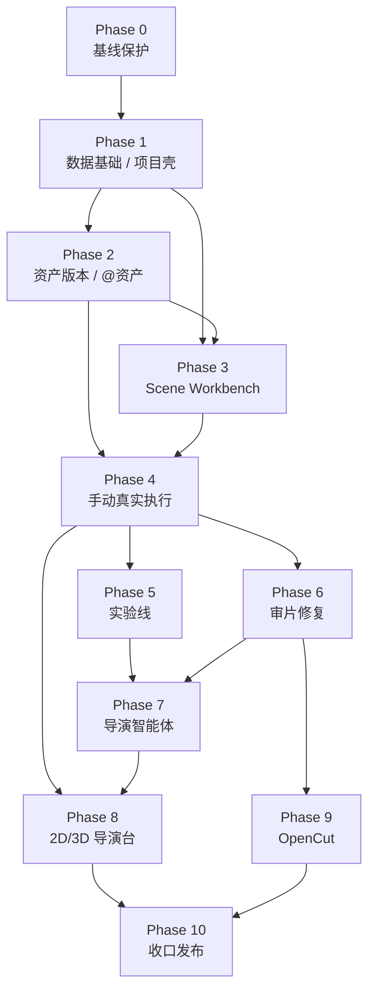

# DramaForge Professional 分阶段实施方案

> **状态：IMPLEMENTATION PLAN / Codex 可执行拆解**
>
> **上位文档 1：** `DramaForge_专业版产品与开发最终方案_完整交互版.md`
>
> **上位文档 2：** `DRAMAFORGE_PRO_DESIGN.md`
>
> **仓库：** `zwb2002-yjy/dramaforge-p0`
>
> **实施基线：** `dev@9e0b27fb6fbf2413ea27859ea463380be0f5051d`
>
> **基线提交：** `docs: record unified golden sample completion`
>
> **实施原则：** 不重写底层；先建立可独立工作的专业手动制作闭环，再接导演智能体、3D 导演台和剪辑。
>
> **本文用途：** 将技术设计拆成能够逐阶段交给 Codex 执行的 Task Contract。每一阶段必须能够独立验收、独立回滚，禁止把所有阶段合并成一次“大重构”。

---

# 1. 总体实施策略

专业版升级分为三条主线，但不能同时无序推进：

```text
A. 专业制作事实与执行链
B. 专业工作台 UI
C. 导演智能体 / 高级导演控制 / 剪辑
```

正确顺序是：

```text
事实模型
↓
手动工作台
↓
真实生成闭环
↓
实验 / 审片
↓
导演智能体
↓
2D / 3D 导演台增强
↓
OpenCut 剪辑
↓
Legacy 收口
```

核心原因：

> **必须先证明用户完全关闭导演智能体时，也能完成“场景 → 镜头 → 关键帧 → 视频 → 审片”的正式生产。**

如果反过来先重做 Agent：

- Agent 会成为事实源；
- UI 会围着 Agent 状态设计；
- 手动工作台再次退化成“高级参数页”；
- 最终仍然不是专业导演系统。

---

# 2. 阶段总览

| 阶段 | 名称 | 核心产出 | 是否形成用户闭环 |
|---|---|---|---|
| Phase 0 | 基线保护与实施护栏 | Drift 检查、测试基线、Feature Flag、文档约束 | 否 |
| Phase 1 | Professional 数据基础与项目壳 | Scene/Shot 专业字段、workspace state、新导航骨架 | 否 |
| Phase 2 | 结构化资产与版本系统 | AssetVersion、Tag、`@资产` UUID Binding | 部分 |
| Phase 3 | 场景中心专业工作台 | Scene Wall、Scene Workspace、Shot Design、中央画布 | 可编辑但未形成真实生成闭环 |
| Phase 4 | 专业手动执行链 | ExecutionPlan、Manifest 驱动模型 UI、关键帧→视频真实生成 | **是：Professional Alpha** |
| Phase 5 | 实验线与模型验证 | A/B 实验、模型切换、Formal/Experiment 隔离、采纳 | 是 |
| Phase 6 | 审片与修复 | 图片/视频批注、整镜重跑、重做关键帧后整段重跑 | 是：Production Review Alpha |
| Phase 7 | 导演智能体 Copilot | 对话、Proposal、逐项接受、Stale、防越权 | 是：Director Alpha |
| Phase 8 | 2D/3D 导演台 | 2D blocking、粗 3D、摄影机/人物摆位、控制翻译 | 是：Virtual Production Alpha |
| Phase 9 | OpenCut 剪辑接入 | Editing Adapter、时间线交接、一站式剪辑入口 | 是：端到端 V1 |
| Phase 10 | 兼容收口与 V1 发布门 | Legacy 降级、迁移检查、真实 Golden Project、发布验收 | **V1 Release Candidate** |

---

# 3. 依赖关系



可以并行的只有：

```text
Phase 2 后半段资产 UI
       与
Phase 3 前半段 Scene UI

Phase 5 实验
       与
Phase 6 审片
```

其余阶段不建议并行。

---

# 4. 每个 Codex Task 的固定工作协议

任何 Task 开始前，Codex 必须先输出：

```text
Current Evidence
Target
Dependencies
Files to change
Files explicitly not changing
Data migration
API contract
Tests
Risks
Rollback
```

然后才能修改代码。

每个 Task 结束必须输出：

```text
Changed files
Migration impact
API changes
Tests executed
Test results
Known limitations
Follow-up dependencies
```

禁止：

> 只说“实现完成”。

---

# 5. 当前 CI 作为最低验证标准

当前仓库已经固定：

## Backend Static

```bash
cd backend
uv sync --locked --extra dev
uv run ruff check app tests
uv run mypy app
```

## Backend Unit

```bash
cd backend
uv run pytest tests/unit -q
```

## PostgreSQL Integration

```bash
cd backend
uv run alembic upgrade head
uv run pytest tests/integration -q -rs --fail-on-skip
```

## Frontend

```bash
cd frontend
npm ci
npm run lint
npm run typecheck
npm run test
npm run build
```

## Frontend Smoke

```bash
cd frontend
npx playwright install chromium
npm run test:e2e -- tests/e2e/smoke.spec.ts
```

每一个合并到 `dev` 的阶段至少满足当前 CI。

涉及：

- RLS；
- Migration；
- Production Graph；
- Provider；
- Workbench Execution；

的 Task 不能只跑 unit。

---

# 6. Branch / PR 规则

当前 CI 对 `dev` 的 PR 要求：

```text
agent/*
```

因此 Codex Task 推荐：

```text
agent/pro-p1-workspace-foundation
agent/pro-p2-asset-version
agent/pro-p4-workbench-execution
...
```

不要开一个：

```text
agent/professional-rewrite
```

连续几十个提交跨所有阶段。

---

# 7. Phase 0 — 基线保护与实施护栏

## 7.1 目标

在真正改 Schema / UI 之前，先建立：

> **“什么东西绝对不能被 Professional 重构破坏”的自动保护。**

这一阶段不做产品功能。

---

## 7.2 Task P0-01 — HEAD Drift 检查

### 目标

确认执行时 `dev` 是否仍与技术设计基线一致。

### 读取

```text
git rev-parse HEAD
git log --oneline -20

DRAMAFORGE_PRO_DESIGN.md
docs/current/01-产品与发布契约.md
docs/current/02-运行时与领域架构.md
docs/current/03-质量与验证体系.md
```

### 如果 HEAD 已变化

必须输出：

```text
Design Baseline
Current HEAD
Changed architecture-sensitive files
Whether design assumptions still hold
Required design amendment
```

禁止：

> 无视 Drift 继续按旧文件位置修改。

---

## 7.3 Task P0-02 — Professional Feature Flag

### 建议新增

```text
PROFESSIONAL_WORKBENCH_ENABLED
```

如果现有 Feature Flag 基础设施可复用：

> 复用现有机制。

不要自己另造 `feature_flags_pro.py`。

### 用途

允许：

- 新 Route 先进入 dev；
- Legacy `/quick` 不受影响；
- 可逐阶段开启新功能；
- 回滚 UI 不需要回滚数据库。

---

## 7.4 Task P0-03 — 架构 Guard Tests

新增单元 / policy test，最低覆盖：

### 不能新增第二套事实模型

静态约束：

```text
ProfessionalProject
ProfessionalScene
ProfessionalShot
ProfessionalArtifact
```

不得进入正式 ORM。

### 新 Professional API 不使用旧 Guard

检查：

```text
workbench / scenes / assets / review
```

不能 import：

```python
require_legacy_execution_allowed
```

### Model UI 不允许硬编码供应商名称

先对新目录设置测试 / lint 规则：

```text
frontend/src/features/model-controls
```

不得以具体 model ID 做能力判断。

---

## 7.5 Phase 0 验收

- 当前 CI 全绿；
- 新 Feature Flag 默认为 off 或只在 dev 开；
- Legacy 路径行为无变化；
- Architecture guard tests 已存在；
- 未新增业务表。

---

# 8. Phase 1 — Professional 数据基础与项目工作区壳

这是第一阶段真正修改产品骨架。

---

# 9. Task P1-01 — Workspace State

## Backend

修改：

```text
backend/app/access/models.py
```

为：

```text
UserProjectPreference
```

新增：

```text
workspace_state JSON NOT NULL DEFAULT {}
```

---

## 新 Service

```text
backend/app/workbench/workspace_state_service.py
```

---

## 新 API

```text
GET   /projects/{project_id}/workspace-state
PATCH /projects/{project_id}/workspace-state
```

PATCH 允许：

```text
last_view
scene_id
shot_id
shot_stage
director_panel_open
director_mode
advanced_panel_open
```

---

## 限制

workspace state：

> 不是制作事实。

不需要创建 NodeRun、Proposal 或 Artifact。

---

## Frontend

新增：

```text
useProjectWorkspaceState
```

路由进入项目时：

```text
有效 last route → 恢复
无效/对象已删 → /scenes
```

---

## 测试

```text
test_workspace_state.py
```

覆盖：

- 写入；
- 项目隔离；
- 非法 scene/shot fallback；
- 不影响 Project version；
- RLS。

---

# 10. Task P1-02 — Scene / Shot 专业字段

## Migration A

修改 ORM：

```text
backend/app/assets/models.py
```

### Scene

新增：

```text
design_state JSON NOT NULL DEFAULT {}
```

### Shot

新增：

```text
director_state JSON NOT NULL DEFAULT {}
image_prompt TEXT NOT NULL DEFAULT ''
video_prompt TEXT NOT NULL DEFAULT ''

formal_keyframe_artifact_id UUID NULL
formal_video_artifact_id UUID NULL
formal_composite_artifact_id UUID NULL
```

---

## FK

Formal Artifact：

```text
ON DELETE RESTRICT
```

---

## 不做

本 Task 不：

- 自动 backfill “正式关键帧”；
- 猜哪个历史 Artifact 是正式；
- 创建实验；
- 改 Shot Pipeline。

---

## Pydantic Schema

新增：

```text
SceneDesignState
ShotDirectorState
```

不要让 API 直接接受任意 JSON。

---

## 测试

```text
test_scene_design_state.py
test_shot_director_state.py
```

---

# 11. Task P1-03 — Shot Design API

新增：

```text
backend/app/workbench/shot_service.py
backend/app/api/v1/workbench.py
```

API：

```text
PATCH /projects/{project_id}/shots/{shot_id}/design
```

Request：

```json
{
  "expected_version": 7,
  "visual_description": "...",
  "dialogue": "...",
  "duration_seconds": 4.5,
  "director_state": {},
  "image_prompt": "...",
  "video_prompt": "..."
}
```

---

## 必须实现 Optimistic Concurrency

如果版本不同：

```text
409
```

并返回：

```text
current_version
current_shot
```

禁止：

> Last-write-wins。

---

## 测试

```text
test_shot_design_concurrency.py
```

必须覆盖：

- v7 → v8；
- 用旧 v7 再提交 → 409；
- Agent / user 后续并发将依赖此规则。

---

# 12. Task P1-04 — Professional Project Shell

## 修改

当前：

```text
frontend/src/features/creation-preview/ProjectWorkspaceShell.tsx
frontend/src/routes/projects.$projectId.tsx
```

---

## 目标导航

```text
剧本
资产
场景
制作
剪辑
```

---

## 新 Route 骨架

```text
/projects/$projectId/script
/projects/$projectId/assets
/projects/$projectId/scenes
/projects/$projectId/production
/projects/$projectId/edit
```

---

## Legacy

仍保留：

```text
/projects/$projectId/quick
```

但不再放新专业主导航。

---

## StageStepper

新 Shell 不显示：

```text
创作方案 → 拍摄方案 → 试拍 → 正式生产
```

旧 Quick 页面继续保留。

---

## 本 Task 不做

- Scene Wall；
- 生成；
- Asset Card；
- Agent；
- 3D。

这里只完成：

> 新壳 + 路由 + workspace state 恢复。

---

# 13. Phase 1 Gate

进入 Phase 2 前必须满足：

1. 新 Shell 能进入；
2. `/quick` 仍能访问；
3. Project 重新打开可恢复 last view；
4. Scene/Shot 新字段正常迁移；
5. Shot optimistic locking 可用；
6. 当前所有 legacy tests 仍通过。

---

# 14. Phase 2 — 结构化资产、版本与 `@资产`

该阶段建立整个一致性系统的事实基础。

---

# 15. Task P2-01 — AssetVersion

## 新 ORM

建议仍放：

```text
backend/app/assets/models.py
```

首轮减少注册风险。

新增：

```text
AssetVersion
AssetVersionReference
```

并给：

```text
Asset.current_version_id
```

---

## 状态

```text
candidate
formal
historical
rejected
```

---

## Service

```text
backend/app/assets/version_service.py
```

核心方法：

```text
create_candidate
promote
reject
list_history
resolve_current
```

---

## promote 事务

必须原子：

```text
old formal -> historical
candidate -> formal
Asset.current_version_id -> candidate
Asset.version + 1
```

---

## 测试

```text
test_asset_version_promotion.py
```

必须覆盖：

- 同时只能一个 current formal；
- 旧版本不删除；
- rejected 不能 promote；
- cross-project 禁止；
- concurrent promote 不能出现两个 formal。

---

# 16. Task P2-02 — CharacterReference 兼容迁移

不能直接删：

```text
CharacterReference
```

---

## Backfill

现有 Character：

```text
AssetVersion v1
```

现有 CharacterReference：

```text
AssetVersionReference
```

---

## 兼容读取

新增：

```text
AssetCardReadService
```

在迁移期：

```text
新 Version Reference
+
旧 CharacterReference（只在尚未迁移时）
```

---

## 禁止

- 双重返回同一 Artifact；
- 自动把未知 reference kind 猜成 profile/front/fullbody。

无法确定：

> 使用 `primary`。

---

# 17. Task P2-03 — Asset Tag / Recycle

新增：

```text
AssetTag
AssetTagLink
```

API：

```text
GET  /projects/{project_id}/assets
POST /projects/{project_id}/asset-tags
PUT  /projects/{project_id}/assets/{asset_id}/tags

POST /projects/{project_id}/assets/{asset_id}/recycle
POST /projects/{project_id}/assets/{asset_id}/restore
```

---

## 分类

继续：

```text
Asset.kind
```

不要 Category 表。

---

## V1 Filter

支持：

- kind；
- tags；
- status；
- name substring。

不做：

- embedding；
- semantic search；
- auto recommendation。

---

# 18. Task P2-04 — Asset API / Asset Cards

新：

```text
backend/app/api/v1/assets.py
frontend/src/features/assets/
```

支持：

```text
角色
场景
服装
道具
动作
表情
音频
提示词方案
```

---

## “加入资产”

生成结果必须显式：

```text
POST /projects/{project_id}/assets/from-artifact
```

禁止：

> 所有生成结果自动成为 Asset。

---

# 19. Task P2-05 — ShotReferenceBinding

新增 ORM：

```text
ShotReferenceBinding
```

建议放：

```text
backend/app/production/models.py
```

---

## 字段

```text
shot_id
shot_experiment_id
stage
asset_id
asset_version_id
artifact_id
resolution_mode
purpose
sort_order
metadata
version
```

---

## XOR 约束

Binding 最终必须满足一种来源：

```text
asset
pinned asset version
direct artifact
```

不能：

> 三个都没有。

---

## Purpose

V1：

```text
identity
clothing
scene_layout
scene_lighting
style
action
pose
camera_language
audio_rhythm
first_frame
last_frame
generic_reference
```

---

# 20. Task P2-06 — `@资产` 前端引用

新增：

```text
AssetMentionInput.tsx
AssetReferencePicker.tsx
```

用户输入：

```text
@林墨
```

必须：

> 从 autocomplete 选择后才建立 Binding。

---

## UI

Prompt 中显示：

```text
@林墨
```

实际数据：

```text
asset_id = UUID
```

---

## 重命名测试

Asset：

```text
林墨 → 林墨·成年
```

已有 Shot Binding：

> 不失效。

---

# 21. Phase 2 Gate

必须能完成：

```text
创建角色资产
→ 创建多个版本
→ candidate promote
→ Shot 引用当前 formal
→ pinned old version
→ Asset 改名引用仍有效
```

此时还不要求真实调用模型。

---

# 22. Phase 3 — 场景中心专业工作台

这一阶段只做：

> “像影视软件一样操作对象”。

仍不把 Provider 生成作为主要目标。

---

# 23. Task P3-01 — Scene Summary API

新增：

```text
GET /projects/{project_id}/scenes
```

不要只返回原始 Scene。

返回：

```text
SceneSummary
```

包含：

```text
shot_count
formal_keyframe_count
formal_video_count
risk_count
representative_artifact
```

---

## 性能

不得：

> 对每个 Scene 分别 N+1 查询所有 NodeRun。

使用批量聚合。

---

# 24. Task P3-02 — Scene Storyboard Wall

新增：

```text
frontend/src/features/workbench/SceneStoryboardWall.tsx
```

每张卡：

```text
代表图
场景名称
时间
shot count
少量状态
```

不做：

> 生产 KPI dashboard。

---

## 操作

支持：

```text
进入
拖拽排序
复制
```

---

# 25. Task P3-03 — Scene Structural Commands

后端：

```text
SceneService
```

支持：

```text
reorder
copy
split preview
split
merge preview
merge
```

---

## Split / Merge

必须 preview first。

Preview 返回：

```text
affected shots
affected experiments
affected formal media
```

用户确认：

> 才执行。

---

# 26. Task P3-04 — Scene Workspace Snapshot

新增：

```text
GET /projects/{project_id}/scenes/{scene_id}/workspace
```

只包含当前 Scene 所需数据。

不返回：

> 全项目完整 NodeRun 历史。

---

# 27. Task P3-05 — Scene Workspace UI

新增：

```text
SceneWorkspace.tsx
CinematicCanvas.tsx
ShotStrip.tsx
ShotProductionTrace.tsx
ShotDesignPanel.tsx
```

---

## 默认 Layout

```text
左 / 下：镜头序列
中：大画布
右：导演面板位置（此阶段可为空/占位）
底部：生产链轨迹
```

---

## 中央区域状态

### 未生成

显示：

> 导演构图预览 / Placeholder。

### 有关键帧

显示：

> 关键帧。

### 有视频

显示：

> 视频 Player。

---

# 28. Task P3-06 — Shot Workbench Snapshot

新增：

```text
GET /projects/{project_id}/shots/{shot_id}/workbench
```

后端聚合：

- Shot；
- Scene；
- Prompt；
- Director State；
- References；
- Formal Artifact；
- Candidates；
- Production Trace summary；
- Asset old-version warnings。

---

## 关键约束

停止让新 UI 像当前 ProductionPage 一样：

```ts
runs.filter(
  run => run.input_snapshot.shot_id === shot.id
)
```

自己解析 runtime JSON。

---

# 29. Phase 3 Gate

用户可以：

```text
项目
→ 场景墙
→ 场景
→ Shot
→ 修改画面描述
→ 修改 image/video prompt
→ 选择 Asset Reference
→ 保存
→ 切换 Shot
→ 重新打开项目继续
```

还没生成也没关系。

---

# 30. Phase 4 — Professional 手动真实执行链

**这是整个重构最关键阶段。**

Phase 4 完成后：

> 用户不需要 Director Workflow、Budget Authorization、Quick 页面，就能真实生成关键帧和视频。

这才代表 Professional Alpha 成立。

---

# 31. Task P4-01 — WorkbenchExecutionPlan

新增：

```text
backend/app/production/execution_plan.py
```

纯 Pydantic：

```text
WorkbenchExecutionPlan
ResolvedReference
CapabilityGap
ControlTranslation
```

---

## Plan 输入

```text
Project
Shot / Experiment
Project.style_bible
Shot references
Project Model Profile
Shot model override
ModelManifest
```

---

## Plan 输出

```text
stage
prompt
semantic intent
resolved references
resolved model
capability
exact controls
approximate controls
unsupported controls
semantic request preview
```

---

# 32. Task P4-02 — ReferencePlanCompiler

新增：

```text
backend/app/production/reference_intents.py
```

负责：

```text
identity
clothing
action
camera_language
...
```

到：

```text
ModelManifest input slots
```

之间的翻译。

---

## 必须区分

```text
exact
approximate
unsupported
```

禁止：

> 当前模型不支持，却静默丢掉引用。

---

## Unit Tests

```text
test_reference_plan_compiler.py
```

覆盖：

- generic image ref；
- first/last；
- multi reference；
- unsupported video reference；
- purpose approximate；
- ref count exceed；
- mutually exclusive。

---

# 33. Task P4-03 — Manifest Driven Model Controls

Frontend：

```text
frontend/src/features/model-controls/
```

新增：

```text
ModelPicker
DynamicCapabilityForm
AdvancedModelOptions
ReferencePurposeEditor
```

---

## 数据

直接使用现有：

```text
GET /models
GET /models/{model_id}
```

---

## 禁止

```ts
if (model === "seedance") ...
if (provider === "agnes") ...
```

---

## Test

给模拟 Manifest：

```text
enum
slider
boolean
conditional
mutually exclusive
```

UI 必须正确变化。

---

# 34. Task P4-04 — Model Profile 简化

现有：

```text
SimpleModeSelection
```

补：

```text
voice_model_id
```

Professional 项目设置只显示：

```text
默认语言模型
默认图片模型
默认视频模型
默认声音模型
```

底层仍映射当前 Model Slot。

---

# 35. Task P4-05 — WorkbenchExecutionService

新增：

```text
backend/app/production/workbench_execution.py
```

职责：

```text
Build Plan
Freeze inputs
Resolve graph
Create NodeRun
Persist snapshot
Dispatch worker
```

---

## 禁止

- direct Provider HTTP；
- `require_legacy_execution_allowed`；
- BudgetAuthorization；
- 自动 Model fallback；
- Agent approval。

---

# 36. Task P4-06 — Workbench Graph

扩：

```text
GraphService
```

此阶段只需要：

```text
scope_type = shot
```

继续使用现有 Shot Pipeline。

不要重写：

```text
shot_pipeline.py
```

除非当前 Node contract 不足以执行真实业务。

---

# 37. Task P4-07 — New Execution API

新增：

```text
POST /projects/{project_id}/shots/{shot_id}/execution-plan
POST /projects/{project_id}/shots/{shot_id}/executions
```

---

## Flow

### Preview

```text
execution-plan
```

不调用 Provider。

### Execute

带：

```text
Idempotency-Key
```

body 要引用：

```text
plan fingerprint / expected shot version
accepted approximations
```

服务器必须重校验。

---

# 38. Task P4-08 — Keyframe Formal Selection

Candidate：

> 来自 NodeRun + Artifact。

不建 Candidate 表。

API：

```text
POST /projects/{project_id}/shots/{shot_id}/formal-keyframe
```

设置：

```text
formal_keyframe_artifact_id
```

---

## 规则

视频生成：

> 默认使用正式关键帧。

如果没有正式关键帧：

> 不允许默认随便拿“最新图”生成视频。

---

# 39. Task P4-09 — Video Execution

标准链：

```text
formal keyframe
+ video prompt
+ references
+ director state
+ visual standard
↓
video execution plan
↓
video NodeRun
```

---

## Video Formal Selection

```text
POST /projects/{project_id}/shots/{shot_id}/formal-video
```

---

# 40. Task P4-10 — Execution Trace

新增：

```text
GET /projects/{project_id}/runs/{run_id}/trace
```

展示：

```text
Director Intent
Prompt
Resolved Asset Versions
Model Binding
Capability
Approximation
Actual Provider
Actual Model
Redacted Effective Request
Artifact
```

---

# 41. Task P4-11 — ProviderOperation Summary 标准化

不改 ProviderOperation 表。

统一：

```text
request_summary
```

结构。

---

## 必须包含

```text
translation_report
effective_request_redacted
reference_delivery
semantic_fingerprint
```

---

## 必须排除

```text
API key
authorization header
secret URL parameter
credential
```

---

# 42. Phase 4 E2E Gate — Professional Alpha

必须通过一条真实 Production Vertical Slice：

```text
创建项目
→ 导入/创建 Scene + Shot
→ 角色资产 formal
→ Shot 引用角色
→ 设置默认图片模型
→ 写 image prompt
→ 预览 ExecutionPlan
→ 真实生成关键帧
→ 选正式关键帧
→ 设置默认视频模型
→ 写 video prompt
→ 预览 ExecutionPlan
→ 真实生成视频
→ 选正式视频
→ 重新打开项目
→ 所有结果仍正确
```

并且：

> Director Assistant 全程不存在或关闭。

---

# 43. Phase 4 阻断条件

如果不能满足以下任一项：

- 不依赖 Quick；
- 不依赖 DirectorWorkflow；
- 不依赖 Budget；
- 不静默丢 Capability；
- 真实 Provider lineage 正确；

则：

> 不进入 Phase 5。

---

# 44. Phase 5 — Experiment / A-B / 换模型验证

---

# 45. Task P5-01 — Experiment ORM

新增：

```text
ProductionExperiment
ShotExperiment
```

Migration 同步 RLS。

---

# 46. Task P5-02 — `shot_experiment` Graph Scope

扩：

```text
GraphService
```

允许：

```text
shot_experiment
```

---

## 测试

必须证明：

```text
Formal graph version A
Experiment graph version B
```

完全独立。

发布 B：

> 不修改 A.current_version。

---

# 47. Task P5-03 — Create Experiment

API：

```text
POST /projects/{project_id}/experiments
```

### 单 Shot

复制：

- shot version；
- director state；
- prompts；
- references；
- common model settings。

### 场景

为 Scene 下所有指定 Shot：

> 创建 ShotExperiment。

---

# 48. Task P5-04 — Model Swap Experiment

点击：

> 换模型验证。

本质：

```text
create ShotExperiment
+
model_overrides
```

---

## 参数迁移

保留：

```text
semantic prompt
asset refs
common controls
```

丢弃：

```text
model A native options
```

按 Model B Manifest 重新编译。

---

# 49. Task P5-05 — Experiment Compare UI

新增：

```text
ExperimentCompare.tsx
```

默认：

```text
正式
实验 A
实验 B
```

可比较：

- image；
- video；
- model；
- prompt；
- translation warning；
- references。

---

# 50. Task P5-06 — Adopt Experiment

API：

```text
POST /projects/{project_id}/experiments/{id}/adopt
```

支持：

```text
current_result_only
keyframe_only
keyframe_and_rerun_video
design_only
full_shot
```

---

## 关键 E2E

### Keyframe only

正式：

```text
keyframe B
video A
```

UI 明确：

> 当前正式视频仍基于旧关键帧。

---

# 51. Phase 5 Gate

必须证明：

1. 实验不覆盖正式；
2. 换模型不复制 raw payload；
3. A/B 可以并存；
4. 用户可只采纳一部分；
5. 旧正式结果保留历史血缘；
6. 场景实验可只采纳某些 Shot。

---

# 52. Phase 6 — 审片、批注、修复

---

# 53. Task P6-01 — ReviewAnnotation ORM

新增：

```text
ReviewAnnotation
```

支持：

```text
image_region
video_time
video_range
```

---

# 54. Task P6-02 — Image Review

前端：

```text
MediaReviewCanvas.tsx
```

矩形 / 点：

> 使用归一化坐标。

---

# 55. Task P6-03 — Video Review Timeline

前端：

```text
VideoReviewTimeline.tsx
```

支持：

```text
时间点
时间范围
文字说明
```

---

# 56. Task P6-04 — Manual Repair

V1 只提供：

```text
rerun_video
regenerate_keyframe_then_video
```

不做：

- 视频局部 inpaint；
- 几秒替换；
- smart continuation；
- 自动 splice。

---

# 57. Task P6-05 — Repair Plan

API：

```text
POST /projects/{project_id}/shots/{shot_id}/repair-plan
```

可以不依赖 Agent。

根据 annotations 返回：

```text
repair option
affected nodes
retained assets
expected rerun scope
```

---

# 58. Task P6-06 — Repair Execute

```text
POST /projects/{project_id}/shots/{shot_id}/repair
```

同样：

> Idempotency-Key。

---

# 59. Phase 6 Gate

必须完成：

```text
视频 2.3–3.1 秒标记人物漂移
→ 创建 Repair Plan
→ 选择重做关键帧后整段视频
→ 新 Keyframe candidate
→ 用户确认
→ 新视频
→ 旧正式结果仍在历史
```

---

# 60. Phase 7 — 导演智能体 Copilot

只有 Phase 4 手动闭环已经稳定后才允许进入。

---

# 61. Task P7-01 — AgentRun Compatibility

当前：

```text
planning_authorization_id
```

需要：

> nullable。

并新增 operation：

```text
director_assist
```

---

## 旧路径

仍要求 Planning Authorization。

---

## 新 Assistant

不要求：

> Budget Authorization。

---

# 62. Task P7-02 — DirectorThread / DirectorMessage

新增：

```text
DirectorThread
DirectorMessage
```

---

## Scope

允许：

```text
project
scene
shot
```

---

# 63. Task P7-03 — Assistant Context Builder

新增：

```text
backend/app/director/assistant_context.py
```

每轮必须重读：

```text
Project
Visual Standard
Scene
Shot
Formal Assets
References
Current Model Capability
Current Experiments
Open Annotations
```

然后加：

```text
recent messages
current user message
```

---

## 规则

当前数据库事实：

> 永远优先于旧聊天。

---

# 64. Task P7-04 — Proposal ORM

新增：

```text
DirectorProposal
DirectorProposalItem
```

---

# 65. Task P7-05 — Typed Proposal Commands

新增：

```text
ProposalCommandRegistry
```

白名单：

```text
shot.update_director_state
shot.update_image_prompt
shot.update_video_prompt
shot.set_model_override
shot_reference.add
shot_reference.remove
asset_version.promote
scene.update_design
experiment.create
```

---

## 禁止

```text
raw SQL
arbitrary JSON Patch
table / column writes
```

---

# 66. Task P7-06 — Proposal Preview

前端：

```text
ProposalPreview.tsx
ProposalItem.tsx
```

每一项显示：

```text
建议
原因
收益
创作代价
风险
影响范围
```

---

# 67. Task P7-07 — Partial Apply

用户逐项：

```text
接受
拒绝
```

只 Accepted 执行。

---

# 68. Task P7-08 — Proposal Stale

每 Item 带：

```text
expected_target_version
```

如果用户手改：

```text
v12 -> v13
```

旧 Proposal：

> stale。

---

# 69. Task P7-09 — Director Panel Close

右侧导演面板关闭时：

- 已提交的真实 Provider Run 继续；
- Agent 不主动提交新 Proposal；
- 未确认 Proposal 不执行；
- 用户可继续手动生产。

---

# 70. Phase 7 Gate — Director Alpha

E2E：

```text
Agent：建议改低机位 + 换模型 + 补前脸参考
用户：接受低机位，接受补参考，拒绝换模型
系统：
- 只改两项
- model 不变
- shot version 正确增加
```

然后：

```text
Agent 再建议
用户先自己改 Shot
再接受旧建议
→ stale
```

---

# 71. Phase 8 — 2D / 3D 导演台

---

# 72. Task P8-01 — 2D Director Canvas

首选：

> SVG。

不先引入重 Canvas Framework。

---

## 支持

```text
角色
摄影机
场景对象
朝向
简单动作路径
视线
构图边界
```

---

## 数据

写：

```text
Scene.design_state.blocking_2d
Shot.director_state
```

---

# 73. Task P8-02 — Camera Controls

默认：

```text
close / medium / wide
high / low
static / dolly / pan / ...
```

高级：

```text
focal length
camera height
pitch
yaw
distance
```

---

# 74. Task P8-03 — Pose / Expression / Gaze

V1：

```text
动作语义
有限骨骼拖动
表情类型 / 强度
视线目标
头部方向
眼睛 / 嘴状态
```

不做：

> 完整 facial rig 曲线编辑器。

---

# 75. Task P8-04 — DirectorControlPackage

建立稳定语义输出：

```text
composition
camera
pose
gaze
blocking
```

交给：

```text
WorkbenchExecutionPlan
```

模型支持：

> exact。

不完全支持：

> approximate。

---

# 76. Task P8-05 — 3D Dependencies

到此 Task 才允许新增：

```text
three
@react-three/fiber
@react-three/drei
```

---

# 77. Task P8-06 — Rough Scene 3D

支持：

```text
墙
门
窗
桌椅
基础物件
角色 proxy
camera
```

不支持：

- 高精材质；
- 外部 3D Asset Import；
- Digital Human；
- Unreal 级 scene graph。

---

# 78. Task P8-07 — Scene Assembler

LLM 只给：

```text
semantic SceneLayoutSpec
```

例如：

```text
门在北侧
桌子居中偏东
人物 A 从南侧进入
```

确定性：

```text
SceneAssembler
```

生成 coordinates。

---

## 禁止

> LLM 直接自由生成最终坐标并作为真值。

---

# 79. Phase 8 Gate

选择一个多人复杂场景：

```text
2 人
桌
门
双机位
转头动作
```

要求：

1. 2D 可以摆；
2. 可切 3D；
3. 2D/3D 状态一致；
4. 转换成 DirectorControlPackage；
5. 模型不支持的控制有 warning；
6. 用户仍可直接跳过导演台生成。

---

# 80. Phase 9 — OpenCut 剪辑

进入本阶段前：

> 必须先单独审计 OpenCut 当前代码。

不允许基于旧印象直接实现 iframe。

---

# 81. Task P9-00 — OpenCut Integration ADR

必须先输出：

```text
OpenCut current architecture
Data model
Embedding options
Build system
Persistence model
API / package boundaries
License constraints
Recommended integration
Rejected approaches
```

然后选择：

```text
workspace package
embedded app
iframe
source integration
```

---

# 82. Task P9-01 — EditingAdapter

后端：

```text
backend/app/editing/
```

接口：

```text
create_session
load_timeline
save_timeline
export
```

---

# 83. Task P9-02 — Production → Edit Timeline

输入：

```text
Shot ID
formal video artifact
audio
subtitle
shot order
duration
```

生成：

> edit session。

---

# 84. Task P9-03 — Editing Workspace

Route：

```text
/projects/$projectId/edit
```

---

## 边界

剪辑可以：

```text
trim
reorder
subtitle
audio
transition
basic effects
```

不能直接改变：

```text
Shot.formal_video_artifact_id
Asset.current_version_id
ProductionGraph
```

---

# 85. Task P9-04 — Director Editing Suggestions

Agent 可以建议：

```text
镜头顺序
停顿
节奏
转场
音乐
需要补拍
```

但：

> 仍先 Proposal。

---

# 86. Phase 9 Gate

从 Professional 正式 Shot：

```text
自动建立 edit timeline
→ 手动剪辑
→ 保存
→ 重新打开
→ export
```

Production lineage：

> 保持不变。

---

# 87. Phase 10 — Legacy 收口、迁移与 V1 发布门

---

# 88. Task P10-01 — Legacy UI 降级

`/quick`：

- 不删除；
- 不做默认入口；
- 添加 Legacy 说明；
- 不再开发新功能。

---

# 89. Task P10-02 — Old Professional Production Page 收口

`projects.$projectId.production.tsx`：

最终定位：

> 跨场景 Production Monitor。

不再有：

- Script Import；
- 预算证据主面板；
- 旧大 Storyboard 主工作区。

这些能力：

> 已迁移到新 Scene Workbench。

---

# 90. Task P10-03 — Historical Project Migration Audit

选择多个旧 Project：

检查：

```text
script
scene
shot
character
canonical
node run
provider operation
artifact
export
```

新 Workbench：

> 均可读取。

---

# 91. Task P10-04 — No Guess Backfill Audit

验证：

> 没有因为 Migration 自动猜 Formal Keyframe / Video。

NULL：

> 可以存在。

UI 应显示：

> 尚未选择正式结果。

---

# 92. Task P10-05 — RLS Audit

所有新表：

```text
workspace state
asset version
tag
binding
experiment
annotation
director assistant
proposal
```

必须：

- tenant isolation；
- FORCE RLS；
- Worker context；
- cross-project negative test。

---

# 93. Task P10-06 — Golden Professional Project

建立一套稳定真实验收项目。

必须覆盖：

```text
脚本
2+ Scene
同一主角
2+角色参考角度
场景资产
多 Shot
关键帧
视频
实验
审片修复
Director Proposal
2D/3D 导演台
剪辑
导出
```

---

# 94. Task P10-07 — V1 E2E 套件

最终新增：

```text
frontend/tests/e2e/professional-manual.spec.ts
frontend/tests/e2e/professional-experiment.spec.ts
frontend/tests/e2e/professional-review.spec.ts
frontend/tests/e2e/director-assistant.spec.ts
frontend/tests/e2e/professional-edit.spec.ts
```

---

# 95. V1 Release Gate

全部必须成立：

## 架构

- Project / Scene / Shot 仍一套；
- Model Capability 仍一套；
- Runtime 仍一套；
- Artifact 仍一套。

## 手动生产

- Director Assistant 关闭也能完成；
- 不依赖旧 Budget Gate；
- 不依赖 Quick。

## 资产

- 多版本；
- Formal / Candidate；
- `@资产`；
- 历史执行冻结；
- old-version warning。

## 模型

- Manifest 动态 UI；
- local override；
- 模型切换实验；
- unsupported 不静默。

## 实验

- 正式/实验完全隔离；
- 可局部采纳。

## 审片

- 图片 Region；
- 视频时间范围；
- 两种 V1 Repair。

## 导演智能体

- Proposal first；
- Partial apply；
- Stale；
- 用户手改优先。

## 导演台

- 2D；
- 粗 3D；
- Camera / Pose / Gaze；
- 可跳过。

## 剪辑

- OpenCut / Editing Adapter；
- Production fact 不被 Timeline 覆盖。

## 验证

- Backend static；
- Backend unit；
- PostgreSQL integration；
- Frontend lint/type/test/build；
- Playwright；
- Golden real provider run。

---

# 96. Codex Task 大小约束

一个 Task 最好只包含一个核心领域改变。

推荐：

```text
Schema + Service + API + Unit Test
```

或者：

```text
Frontend Feature + API Consumption + UI Test
```

不要一个 Task 同时：

```text
创建 5 张表
重写项目 Shell
改 Provider
接 Agent
加 3D
```

---

# 97. 每阶段提交原则

推荐保持：

```text
Commit 1: migration / models
Commit 2: domain service / API
Commit 3: frontend
Commit 4: tests / docs
```

不是硬性要求。

硬要求是：

> 每个 commit/PR 能说明自己的职责。

---

# 98. 数据库迁移回滚原则

Professional Schema 首轮都采用：

> Additive Migration。

因此 UI / Feature 回滚时：

> 不需要立刻 downgrade database。

禁止 Phase 1–9：

- destructive column rename；
- drop legacy table；
- drop legacy enum value；
- 批量不可逆删除历史。

---

# 99. API 兼容策略

旧 API：

> 保留。

新 UI：

> 只使用新 Workbench API。

避免：

> 新 UI 一半调旧 shot_ops，一半调新 WorkbenchExecution。

---

# 100. 新旧执行链边界

## Legacy

```text
Quick
→ Director Workflow
→ Approval / Budget
→ ProductionBatch
→ NodeRun
```

## Professional

```text
Workbench
→ ExecutionPlan
→ User Execute
→ ProductionGraph
→ NodeRun
```

二者底部复用：

```text
NodeRun
ProviderOperation
Artifact
Worker
```

这就是兼容期间正确的“双入口、单执行内核”。

---

# 101. 实施阶段中不能提前做的 V2 能力

以下全部进入 Backlog，不得因为“顺手”加到 V1：

```text
语义资产搜索
历史成功方案自动推荐
自动 Production Memory
局部几秒视频重生成
智能视频续写
视频 temporal inpaint
自动 splice
跨项目资产推荐
多人权限
复杂审批链
外部 3D 资产
高精数字人
复杂模型排行榜
全自动能力 benchmark
```

---

# 102. 阶段性产品里程碑

## Milestone A — Professional Workspace Skeleton

完成：

> Phase 1–3。

能像专业工具一样管理：

```text
Scene / Shot / Assets / Prompt / Reference
```

但不作为可发布产品。

---

## Milestone B — Professional Manual Alpha

完成：

> Phase 4。

这是第一个真正值得拿真实短剧验证的节点。

核心验收：

> 不开 Agent，跑一条真实作品链。

---

## Milestone C — Production Alpha

完成：

> Phase 5–6。

具备：

- 多方案；
- 换模型；
- 审片；
- 返工。

此时才开始像真正生产系统。

---

## Milestone D — Director Alpha

完成：

> Phase 7。

Director Agent 从：

> 流程控制器

变成：

> 专业 Copilot。

---

## Milestone E — Virtual Production Alpha

完成：

> Phase 8。

复杂镜头具备导演台。

---

## Milestone F — V1 Release Candidate

完成：

> Phase 9–10。

端到端：

```text
剧本
→ 资产
→ 场景
→ 镜头
→ 关键帧
→ 视频
→ 审片
→ 剪辑
→ 导出
```

---

# 103. 实施优先级判断规则

如果开发过程中资源不足，优先级：

```text
P0 真实作品能否完成
>
P1 用户能否控制
>
P2 执行是否透明可追溯
>
P3 一致性
>
P4 实验 / 审片效率
>
P5 Agent 智能程度
>
P6 视觉炫技
```

因此：

> 3D 比真实生成链低优先级。

Agent：

> 比手动 Production 闭环低优先级。

---

# 104. 遇到旧代码冲突时怎么判断

## 情况 A

旧代码只是 UI 心智过时。

例如：

```text
StageStepper
```

处理：

> 替换 UI，不动执行内核。

---

## 情况 B

旧代码的业务 Gate 与新产品冲突。

例如：

```text
Budget Authorization
Legacy Guard
```

处理：

> 新入口绕开，旧入口保留。

不要：

> 为新功能制造 fake authorization。

---

## 情况 C

旧代码底层能力已经正确。

例如：

```text
ModelManifest
NodeRun
ProviderOperation
ProductionGraph
```

处理：

> 必须复用。

---

## 情况 D

旧数据结构无法表达新语义。

例如：

```text
Asset 没有正式版本
```

处理：

> Additive 新实体。

---

# 105. Drift Stop Conditions

Codex 发现以下任意情况时：

> 停止当前 Task 的写代码部分，先报告。

### 1

当前 HEAD 已删除 / 大改：

```text
ModelManifest
NodeRun
ProductionGraph
```

### 2

已有其他分支已经实现：

```text
AssetVersion
Experiment
Professional Workbench
```

### 3

当前 Migration head 与计划冲突。

### 4

OpenCut 实际架构与预设 Adapter 无法匹配。

### 5

Provider Manifest 实际不能表达产品需要的输入约束。

停止：

> 只针对这个冲突重新设计。

不要：

> 顺手重构全系统。

---

# 106. Phase 4 之前的禁止项

Phase 4 手动闭环完成前：

不得：

- 大规模改 Director LLM；
- 做自动 Production Memory；
- 做 3D；
- 做 OpenCut；
- 删除 Quick；
- 改 Worker 架构；
- 重写 Provider；
- 添加复杂费用系统。

---

# 107. Phase 7 之前的 Agent 原则

直到：

> 手动 Production Alpha 稳定。

Director Agent：

> 只保留 Legacy 行为。

不要半途中：

> 让新 Scene Workbench 又调用旧 Director Workflow。

---

# 108. 代码所有权建议

按领域：

```text
access
  workspace preference

assets
  scene / shot / asset version / tags

workbench
  UI-oriented snapshot / command orchestration

production
  graph / experiment / execution plan / reference intent

execution
  NodeRun / Artifact / ProviderOperation

providers
  capability / manifest / compiler / runtime

director
  assistant / proposal

review
  annotations / repair plan

editing
  OpenCut adapter
```

---

# 109. 最终 Codex 总 Prompt 不应该长什么样

禁止：

> “请根据两份文档一次性把 DramaForge 改成专业导演系统，完成所有功能并保证测试通过。”

这几乎必然导致：

- 猜逻辑；
- 大量新增 parallel abstraction；
- 跳过 migration；
- UI 假数据；
- 测试被改弱。

---

# 110. 正确 Codex 输入方式

每次只给：

```text
Phase
Task ID
上位文档
Target
Current Evidence
Allowed files
Forbidden changes
Acceptance
Test commands
```

---

# 111. Codex Task 模板

```markdown
# Task: P4-02 ReferencePlanCompiler

## Read first
- DRAMAFORGE_PRO_DESIGN.md
- DRAMAFORGE_PRO_IMPLEMENTATION_PLAN.md
- backend/app/providers/manifest.py
- backend/app/providers/contracts/
- backend/app/providers/router.py

## Target
Implement the model-independent ReferencePurpose → Manifest input-slot
planning layer.

## Required
- exact / approximate / unsupported
- no provider-name branching
- validate cardinality and exclusivity
- typed Pydantic output
- unit tests

## Forbidden
- do not modify Provider HTTP adapters unless a test proves it is required
- do not add a second capability registry
- do not silently omit unsupported controls
- do not change legacy director flow

## Acceptance
...
```

每个后续 Task 都按这个模板执行。

---

# 112. 推荐第一批实际 Task

如果现在马上开始开发，严格按照：

```text
P0-01 HEAD Drift
P0-02 Feature Flag
P0-03 Guard Tests

P1-01 Workspace State
P1-02 Scene / Shot Fields
P1-03 Shot Design API
P1-04 Project Shell
```

完成 Phase 1 后：

> 再开始资产系统。

不建议第一步：

> 直接重画 Scene Workbench。

因为没有后端专业事实模型时：

> 新 UI 只能再次依赖临时前端状态。

---

# 113. 第一轮真正作品验证点

不要等 V1 全完成再跑作品。

第一次必须在：

> **Phase 4 完成时。**

使用真实：

- 角色；
- 场景；
- 图片模型；
- 视频模型。

验证：

```text
一致性
实际输入
模型能力翻译
关键帧确认
视频生成
历史追踪
失败恢复
```

如果 Phase 4 的真实作品不行：

> 优先修 Production Path。

不要继续堆 Agent / 3D / 编辑器。

---

# 114. 第二轮真实作品验证点

Phase 6 完成后。

重点：

```text
模型 A/B
资产升级
关键帧重做
视频漂移
审片标记
整镜返工
旧版本保留
```

---

# 115. 第三轮真实作品验证点

Phase 8 完成后。

重点：

```text
多人
走位
特殊机位
角色转头
视线
复杂动作
2D/3D 控制是否真正帮助最终生成
```

如果 3D 对最终模型没有实际增益：

> 不扩大 3D 系统。

---

# 116. 最终实施原则

整个 Professional 重构只允许沿着以下方向增加复杂度：

```text
用户导演语义
↓
结构化事实
↓
可解释执行计划
↓
已有 Production Graph
↓
已有 Runtime
```

不允许：

```text
新 UI
↓
临时 JSON
↓
Agent 猜
↓
Provider 私有逻辑
```

---

# 117. 最终实施顺序一句话

> **先保住内核，再建立专业事实；先完成手动真实生产，再增加实验审片；先证明用户有最终控制权，再让导演智能体参与；最后才上 3D 和剪辑。**

这份顺序不得因为“某个高级功能看起来更酷”而倒置。
